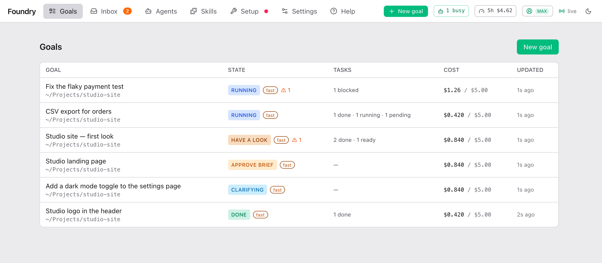

<div align="center">

# Foundry

**Write the goal in one sentence. Get back finished, checked, reviewed work.**

Foundry runs on your own computer and drives your Claude Code from a web page:<br>
it asks what only you can decide, shows you the plan once, then builds, tests, reviews and delivers on its own.

English · [中文](./README.zh.md)

[Quick start](#quick-start) · [How it works](#how-it-works) · [User guide](docs/guide/) · [Docs](docs/)

<br>



</div>

## Why Foundry

Claude Code is great at doing what you ask. Keeping a real piece of work on track is the part left to you: saying what
you actually mean, splitting it up, checking every step, noticing when it drifts, and not letting it burn your plan.
Foundry does that part.

- **One sentence in**  
  *"Add CSV export to the orders page."* *"A landing page for our studio."* *"Posters for the new drink."*
- **It asks before it plans**  
  It reads your repository first and asks only what the code can't answer — each question with a recommended answer.
- **One plan to approve**  
  The Brief: what it understood, the tasks, how the result will be checked, what it may cost. Edit anything, then approve.
- **You see it before it's done**  
  At milestones it pauses, starts a live preview and waits for your look.
- **Checked, not guessed**  
  Every task has acceptance checks; the whole result is reviewed against them before it is handed over.
- **Your code stays yours**  
  It all runs on your machine, on your Claude subscription (Pro or Max) — no API key. Work happens on its own branch; your checkout is never touched.
- **You control the spend**  
  Model presets pick which model does each job; every goal has a budget and stops before it overspends.

## How it works

<table>
<tr>
<td width="50%" valign="top">

**1 · Describe it**<br>
Press **New goal**, pick the project folder and write what you want. Code, documents, research, images or video.


</td>
<td width="50%" valign="top">

**2 · Answer a few questions**<br>
Only what the repository can't settle, each with the reason and a recommendation. Or press **Accept all recommended**.


</td>
</tr>
<tr>
<td width="50%" valign="top">

**3 · Approve the Brief**<br>
One page with the plan in plain words. Change what you want, then **Approve & run**.


</td>
<td width="50%" valign="top">

**4 · Have a look at milestones**<br>
The goal pauses, the preview is already running. Press **Continue**, or say what to change.


</td>
</tr>
<tr>
<td width="50%" valign="top">

**5 · Let it run**<br>
Tasks run in parallel when they can, each one checked before it joins the rest. Watch it live, or walk away.


</td>
<td width="50%" valign="top">

**6 · Only interrupted when it matters**<br>
A blocked task, a conflict, a budget reached: it lands in the **Inbox** with the buttons to fix it — also on Telegram or Discord.


</td>
</tr>
</table>

When it is done you get the work on its own branch, and — if you chose it — pushed, or as a pull request.

## Quick start

You need a Claude subscription (Pro or Max) and git.

**With Docker** — every tool is in the image:

```bash
mkdir -p ~/foundry && cd ~/foundry
docker run --rm imlouiskhenghao/foundry cat /app/docker-compose.yml > docker-compose.yml
FOUNDRY_REPOS=~/code docker compose up -d      # your repositories, mounted at /repos
```

**From source** — needs [Bun](https://bun.sh), [Claude Code](https://docs.anthropic.com/en/docs/claude-code) signed in
(`claude` on your PATH) and [graphify](https://github.com/safishamsi/graphify):

```bash
git clone https://github.com/louiskhenghao/Foundry.git foundry && cd foundry
bun install && bun run web:build
bun run serve                 # then open http://127.0.0.1:4111
```

Open <http://127.0.0.1:4111>, press **New goal**, point it at a repository and describe what you want. The
[Setup](docs/guide/your-first-goal.md#check-the-setup-page) page checks that everything is in place. Full steps, Claude sign-in in Docker and
remote access from your phone: [Install](docs/operate/install.md).

## Learn more

| I want to… | Read |
|---|---|
| **use Foundry** — goals, the interview, the Brief, the Inbox, costs | [User guide](docs/guide/) · [中文](docs/guide/README.zh.md) |
| **install and run it** — Docker, remote access, notifications, updates, every setting | [Operator docs](docs/operate/) |
| **change its code** — architecture, roles, testing, releasing, design decisions | [Contributor docs](docs/develop/) · [CONTRIBUTING](CONTRIBUTING.md) |

The words Foundry uses (Goal, Brief, Milestone, Model Preset …) are defined in the [glossary](CONTEXT.md).
