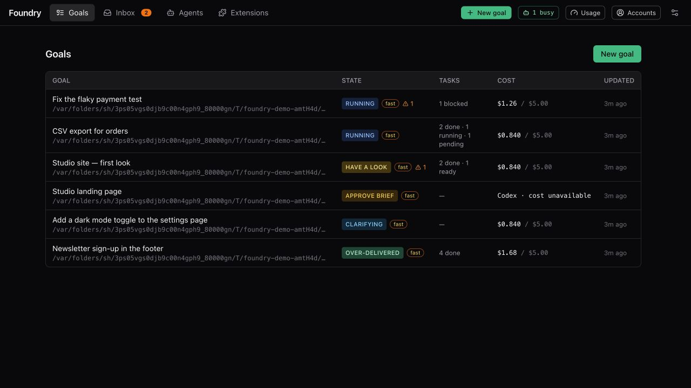
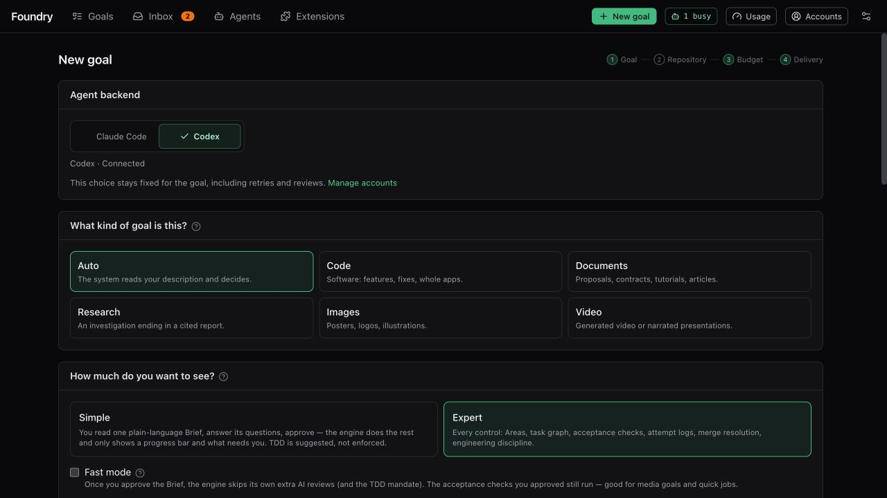
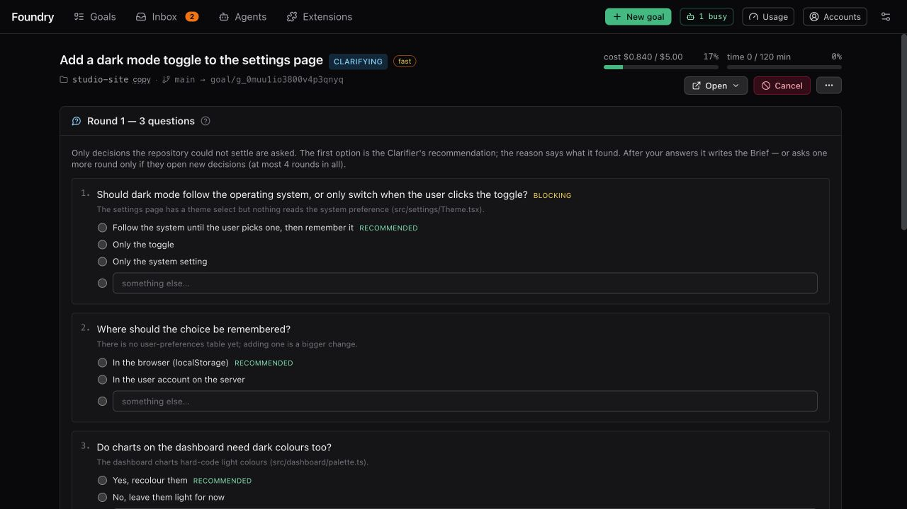
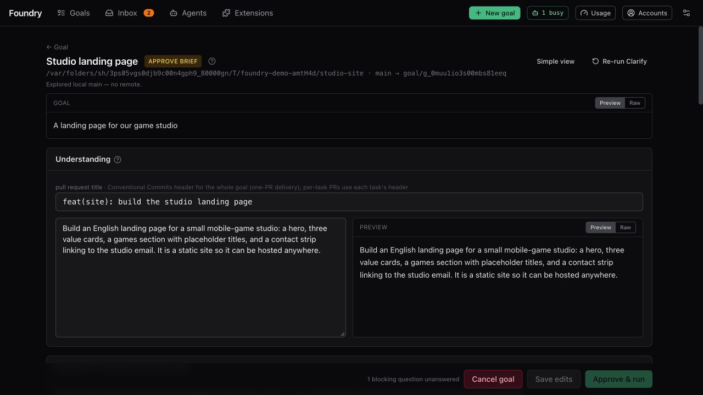
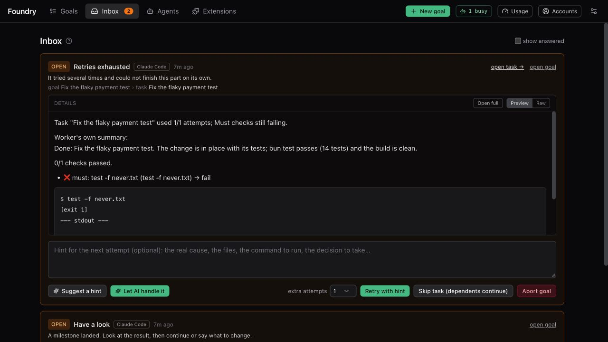

<div align="center">

# Foundry

**一句话写下目标，拿回做完、检查过、审查过的成果。**

Foundry 在你自己的电脑上运行，从网页驱动你的 Claude Code 或 Codex CLI：<br>
先问只有你能决定的事，给你看一次计划，然后自己去做、测试、审查、交付。

[English](./README.md) · 中文

[快速开始](#快速开始) · [怎么运作](#怎么运作) · [用户指南](docs/guide/README.zh.md) · [文档](docs/)

<br>



</div>

## Codex 后端

现在也可使用 Codex CLI + ChatGPT 登录运行同一套 Foundry 流程：

```sh
codex login
bun install --frozen-lockfile && bun run web:build
bun run serve:codex
```

Codex 启动配置默认使用 `data-codex/`，Claude 启动配置默认使用 `data/`。两种实例都可以运行两种后端：创建 goal 时选择 **Agent backend**。数据目录属于整个实例，不按每个 goal 分开；账户、预设和 MCP 权限则保持独立。Codex 只支持 ChatGPT 登录，用量窗口按账户实际返回显示，包括只有 weekly limit 的账户。

先安装支持 hooks 的 Codex CLI，再运行上述命令；Docker 构建固定使用 0.160.0。[完整安装、Docker 与能力限制](docs/operate/codex.md)。升级现有实例前，请阅读[备份与回退](docs/operate/updates-and-backup.md#upgrading-to-mixed-provider-goals)（英文）。


## 为什么用 Foundry

Claude Code 和 Codex 都能执行你的请求。可要让一件真正的工作不跑偏，剩下的活都落在你身上：把真正的意思说清楚、拆开、每一步都检查、发现它跑偏、别让它把额度烧光。
Foundry 做的就是这部分。

- **一句话就开始**  
  *"给订单页加 CSV 导出。"* *"给我们工作室做个官网。"* *"新饮品的海报。"*
- **先问再规划**  
  它先读你的仓库，只问代码里查不到的事——每个问题都附一个推荐答案。
- **只批准一份计划**  
  Brief：它理解了什么、有哪些任务、结果怎么检查、大概花多少。想改哪里都行，改完再批准。
- **做完之前你就能看**  
  到了里程碑，它会暂停、启动实时预览，等你看过。
- **靠检查，不靠猜**  
  每个任务都有验收检查；交付前会按这些检查把整体结果再审查一遍。
- **代码始终是你的**  
  Foundry 在本机运行，使用所选 CLI 的账户：Claude 登录，或 Codex 的 ChatGPT 登录。执行任务不需要 API key。工作在独立分支上进行，运行期间不改动你自己的 checkout。
- **花多少由你定**  
  两种后端各有独立模型预设。时间、尝试次数和并发限制对两者都有效；美元费用上限只适用于 Claude。

## 怎么运作

**Claude Code 与 Codex 共用同一套流程**。先在 **Accounts** 分别连接原生账户，再为每个新目标选择后端。以下截图均使用演示数据。

<table>
<tr>
<td width="50%" valign="top">

**[1 · 说出来](docs/guide/your-first-goal.zh.md#the-new-goal-form)**<br>
按 **New goal**，选择 **Claude Code** 或 **Codex** 及对应模型预设，描述想要的结果。准备开始时选好项目文件夹。



</td>
<td width="50%" valign="top">

**[2 · 回答几个问题](docs/guide/answering-the-interview.zh.md)**<br>
只问仓库里定不下来的事，每题附理由和推荐答案。也可以直接按 **Accept all recommended**。



</td>
</tr>
<tr>
<td width="50%" valign="top">

**[3 · 批准 Brief](docs/guide/approving-the-brief.zh.md)**<br>
查看计划、任务和验收检查。想改就改，然后按 **Approve & run**。Codex 使用时间和尝试次数限制；Claude 还支持美元预算。



</td>
<td width="50%" valign="top">

**[4 · 在里程碑看一眼](docs/guide/while-it-runs.zh.md#milestones)**<br>
goal 暂停，预览已经跑起来了。按 **Continue**，或者说要改什么。


</td>
</tr>
<tr>
<td width="50%" valign="top">

**[5 · 让它跑](docs/guide/while-it-runs.zh.md)**<br>
能并行的任务就并行，每个任务检查通过才合进来。**Agents** 汇集两种引擎的会话；**Usage** 分别展示各自的额度。


</td>
<td width="50%" valign="top">

**[6 · 只在要紧时打扰你](docs/guide/when-foundry-needs-you.zh.md)**<br>
任务受阻、改动冲突、预算到顶：都会进 **Inbox**，带着处理按钮——也可以推送到 Telegram 或 Discord。



</td>
</tr>
</table>

做完后，成果在独立分支上；如果你选了，还会帮你推送，或者开一个 pull request。见[拿到结果](docs/guide/getting-the-result.zh.md)。

## 快速开始

以下命令使用 Claude 登录和 git；使用 ChatGPT 登录请看 [Codex 安装说明](docs/operate/codex.md)。包含本分支改动的版本发布前，Codex 支持需要从源码构建，现有 `latest` 镜像不一定包含这些功能。

**用 Docker** —— 所有工具都在镜像里：

```bash
mkdir -p ~/foundry && cd ~/foundry
docker run --rm imlouiskhenghao/foundry cat /app/docker-compose.yml > docker-compose.yml
FOUNDRY_REPOS=~/code docker compose up -d      # 你的仓库，挂载到 /repos
```

**从源码运行** —— 需要 [Bun](https://bun.sh)、已登录的 [Claude Code](https://docs.anthropic.com/en/docs/claude-code)
（`claude` 在 PATH 上）和 [graphify](https://github.com/safishamsi/graphify)：

```bash
git clone https://github.com/louiskhenghao/Foundry.git foundry && cd foundry
bun install && bun run web:build
bun run serve                 # 然后打开 http://127.0.0.1:4111
```

打开 <http://127.0.0.1:4111>，按 **New goal**，选一个仓库，写下你想要的。[Setup](docs/guide/your-first-goal.zh.md#检查-setup-页面)
页面会检查东西是否都装好了。完整步骤、在 Docker 里登录 Claude、用手机远程访问：见 [安装](docs/operate/install.md)（英文）。

## 了解更多

| 我想要…… | 去看 |
|---|---|
| **使用 Foundry** —— goal、访谈、Brief、Inbox、花费 | [用户指南](docs/guide/README.zh.md) |
| **安装和运行** —— Docker、远程访问、通知、更新、所有设置 | [运维文档](docs/operate/)（英文） |
| **修改代码** —— 架构、角色、测试、发布、设计决策 | [开发文档](docs/develop/) · [CONTRIBUTING](CONTRIBUTING.md)（英文） |

Foundry 用到的词（Goal、Brief、Milestone、Model Preset……）在 [术语表](CONTEXT.md)（英文）里有定义。
