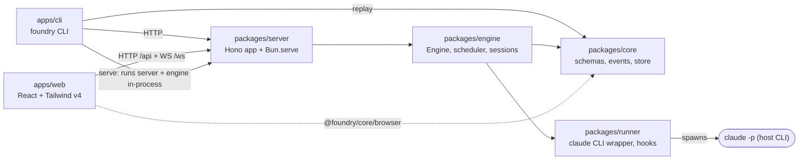
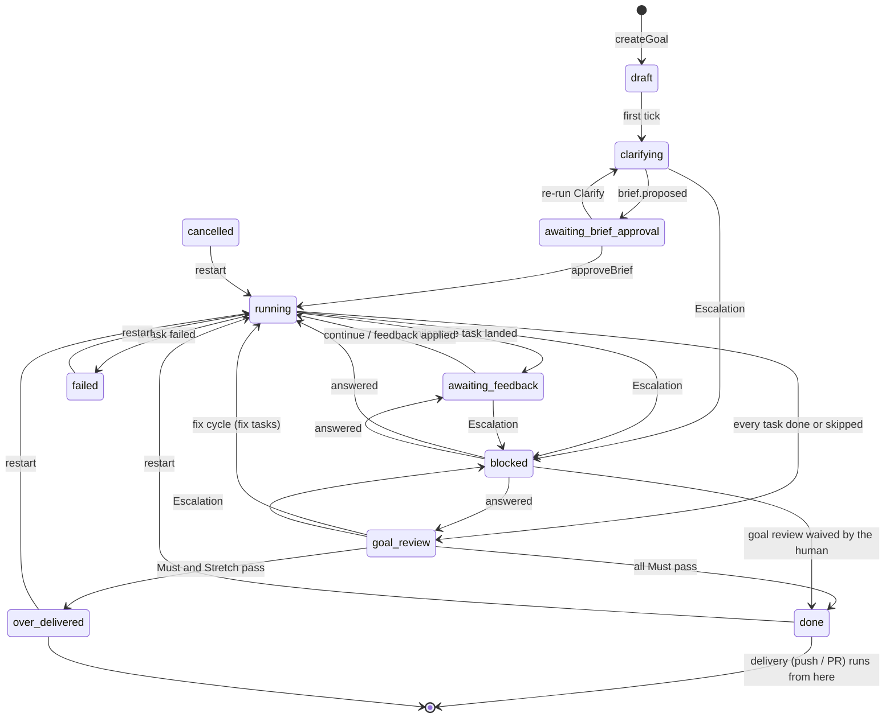
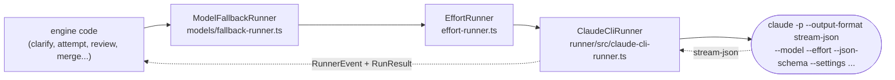

# Architecture

Foundry is a Bun/TypeScript monorepo. It drives the host's Claude Code CLI (`claude -p --output-format stream-json`) to turn a Goal into a Brief, the Brief into a Task DAG, and each Task into Attempts. Attempts are checked, reviewed and squashed onto a Goal branch, and the finished branch can be delivered as a push or pull request. This page explains how the pieces fit together, so you know where to make a change. Terms in **bold** or Capitalised are defined in [CONTEXT.md](../../CONTEXT.md).

## Packages



| Workspace | Owns | Entry points |
|---|---|---|
| `packages/core` | Zod schemas for every entity (`src/schema/*`), the event union (`src/events.ts`), the SQLite event store and its projections (`src/store/*`), and pure domain helpers (`src/machine/*`: DAG sort and depths, Brief coverage, Decisions, transition tables). No I/O apart from SQLite. | `src/index.ts`; `src/browser.ts` is the browser-safe subset the web app imports |
| `packages/runner` | `ClaudeCliRunner`, which spawns `claude -p` and turns stream-json into typed `RunnerEvent`s (`stream-codec.ts`). Also the concurrency semaphore, the `--settings` builder and the hook scripts in `hooks/` (`canary.sh`, `boundary-guard.sh`, `rm-guard.ts`). | `src/index.ts` |
| `packages/engine` | The `Engine` class and everything that decides what happens next: the tick, scheduler, attempt loop, Clarify/Interview, Draft/Revise, reviews, merges and catch-up, milestones, delivery, preview and self-check, notifications, models and presets, skills, settings, self-update, the agents monitor and the usage ledger. | `src/engine.ts`, `src/index.ts`, `src/config.ts` (`defaultConfig`) |
| `packages/server` | The Hono HTTP API (`src/app.ts`) and the `Bun.serve` wrapper with the `/ws` WebSocket (`src/index.ts`). It also serves `apps/web/dist`. | `startServer(engine)` |
| `apps/web` | The UI: React 18, react-router, zustand, Tailwind v4, built by Vite into `apps/web/dist`. | `src/App.tsx` (routes), `src/store.ts` (WS client + live store), `src/api.ts` |
| `apps/cli` | The `foundry` CLI. Most commands are a thin HTTP client of the server. `serve` builds `Engine` + server in-process, `replay` opens the store directly, and `doctor`/`skills` work without a server. | `src/main.ts` |

Around them: `roles/*.md` are the role prompts (see [roles.md](roles.md)). `catalog/skills.json` is the curated skill catalog. `scripts/` holds `dev.ts`, `release.ts`, `gen-docs.ts` (the generated references), `demo.ts` and `screenshots.ts` (the seeded demo and the guide's screenshots), `e2e-conflict.ts` and fixture helpers. `data/` (git-ignored) is the engine's state directory. `defaultConfig` always resolves it to `<repo root>/data` (`packages/engine/src/config.ts`).

### What lives in `data/`

| Path | Written by |
|---|---|
| `engine.db` (+ WAL) | the event log and read models (`core/src/store/db.ts`) |
| `settings.json` | Settings (`engine/src/settings.ts`): a saved value beats an env var, which beats the default |
| `models.json` | the Model Registry (`engine/src/models/registry.ts`) |
| `transcripts/*.jsonl`, `*.prompt.md` | every session's raw stream-json, plus the worker prompt beside it |
| `check-output/` | full output of command Checks |
| `attachments/` | Attachments and their markdown renditions (`engine/src/attachments.ts`) |
| `skills-*` | skills cache, trash and update state (`engine/src/skills/*`) |
| `worktrees/<goal>/` | the **legacy** workspace layout, from before progress folders (ADR-0011) |

## The event log is the source of truth

Every state change is an event appended to one SQLite table ([ADR-0002](adr/0002-event-log-as-source-of-truth.md)). Nothing writes the read-model tables directly.

- **`EventStore.append(e)`** (`core/src/store/event-store.ts`) validates the event against the `EngineEvent` discriminated union (`core/src/events.ts`). In **one transaction** it inserts the row and calls `applyEvent`. Listeners are notified only after the commit.
- **`applyEvent`** (`core/src/store/projections.ts`) is a reducer from one event to the read-model tables: `goals`, `tasks`, `attempts`, `checks`, `check_results`, `briefs`, `observations`, `escalations`, `usage_ledger`, `rate_limit_state`. Entities are stored as JSON in a `data` column. Read them with the getters in the same file (`getGoal`, `listTasks`, `listAttempts`, `getBrief`, `listEscalations`, ...).
- **`EventStore.replay()`** drops the read models and rebuilds them from the log. `bun run cli replay --verify` snapshots the tables, replays, and exits non-zero if anything differs. Use it after touching a reducer. (The CLI opens `<root>/data/engine.db`.)
- Schema changes to the tables go in `core/src/store/migrations.ts`.

**Adding or changing an event.** Add it to `EngineEvent` in `core/src/events.ts`, handle it in `applyEvent`, and emit it from the engine. Old events are never rewritten, so a new field on an entity needs a Zod `.default(...)` that keeps older payloads parseable. Look for the "default keeps pre-X events replayable" comments in `core/src/schema/goal.ts`. `replay --verify` against a real `data/engine.db` is the check.

**State machines.** `core/src/machine/transitions.ts` holds the transition tables for Goal, Task and Attempt states. Nothing calls `assertGoalTransition` / `assertTaskTransition` / `assertAttemptTransition` at the moment, and projections apply whatever `to` an event carries. Treat the tables as documentation of the intended machine, and keep them in step when you add a transition.

## The engine tick

`Engine` (`engine/src/engine.ts`) subscribes to the store. **Every event that carries a `goalId` schedules a tick for that goal.**

- `tick(goalId)` chains ticks per goal, so they never run concurrently for one goal, and coalesces bursts: a tick already pending is not queued twice.
- `runTick` returns early when the engine is stopped, usage-paused (`isRateLimited`, see Usage Pause) or draining for a self-update. Then it switches on `goal.state`:

| State | What the tick does |
|---|---|
| `draft` | appends `draft → clarifying` |
| `clarifying` | starts `runClarify` (`clarify.ts`), or `continueInterview` when a round was answered but no session picked it up (engine restart). Does nothing while an interview round awaits answers. |
| `awaiting_brief_approval` | nothing. The human edits and approves (`Engine.approveBrief`) |
| `running` | `schedule(engine, goal)` (`scheduler.ts`) |
| `awaiting_feedback` | nothing. The goal is paused at a Milestone |
| `goal_review` | `runGoalReview` (`goal-review.ts`) |
| `done` / `over_delivered` | copies media Artifacts to the Output Folder, runs the Graph Refresh, and starts `runDelivery` (`delivery/pipeline.ts`) unless the policy is `local` |
| `blocked`, `failed`, `cancelled` | nothing. Answering an Escalation or restarting moves the goal on |

Long-running work (Clarify, attempts, reviews, delivery) is started with `void` and tracked in in-memory sets (`clarifying`, `inFlight`, `reviewing`, `delivering`). A tick never awaits a whole session. The work appends events as it goes, and those events tick the goal again. `Engine.busy()` counts all of it; drains and `stop()` rely on that count.

**Startup** (`Engine.start`): sweep stale uploads, `reconcile()`, `relocateLegacyWorkspaces` (`workspace-migrate.ts`), `migrateModelTiersToPresets`, a background model sync if the Claude Code version changed, start the preview sweeper, then tick every goal. `reconcile()` handles work that was cut off by the restart. It kills orphaned `claude` processes. Work attempts with a session become `interrupted` and are resumed as a **Continuation**; anything else becomes an `error` and gets its attempt budget back. Deliveries that were `running` become `failed` (every step is idempotent, so a re-run is safe).

### The scheduler

`schedule()` in `engine/src/scheduler.ts` is one idempotent pass over a running goal's tasks:

1. **Cascade failures.** A pending task whose dependency failed becomes `failed`.
2. **Promote** pending tasks whose dependencies are all `done` or `skipped` to `ready`.
3. **Milestone.** If a milestone task landed (`dueCheckpoint`, `checkpoint.ts`), start nothing new. Once nothing is in flight, `openCheckpoint` moves the goal to `awaiting_feedback`, starts the Preview and raises a `milestone` Escalation.
4. **All terminal?** If every task is done or skipped, the goal goes to `goal_review`. If any task failed, the goal goes to `failed`.
5. **Budget.** An exceeded cost or time budget raises a `budget_exceeded` Escalation and blocks the goal.
6. **Start ready tasks** within `budgets.maxConcurrent`. A task runs in the goal workspace only when it is alone. Otherwise it gets its own worktree, which it keeps for its lifetime. Non-parallelizable tasks wait for quiet. Two tasks whose `relevantFiles` overlap never run together (`filesOverlap`, `catchup.ts`).

`startTask` then does the work: reserve the in-flight slot, await autoskills, optionally refresh the base, record `task.base_ref`, and assign a worktree. It runs **Catch-up**, which merges the goal branch into the task branch. Then it calls `runAttempt` and loops on Continuations while `decideNext` says so. On success it catches up once more, calls `integrateTask`, drops the task worktree, restarts the Preview and runs the Self-check. On failure it retries within the budget, or raises `retries_exhausted` / `permission_denial`. An engine-side crash (not the model's failure) sends the task back to `ready` without using an attempt; the third consecutive crash blocks it with an Escalation.

## Life of a goal



Any non-terminal state can also go to `cancelled` (`Engine.cancelGoal`) or `failed` (a Clarify crash, or `abort_goal`). `blocked` remembers `stateBeforeBlock` (projected in `projections.ts`), and `answerEscalation` (`escalation.ts`) returns the goal there once no goal-level Escalation is still open.

### 1. Creation: `draft`

`Engine.createGoal` checks that the repo is a git repository, assigns `goal/<id>` as the branch, and fixes the **Progress folder** path (`defaultWorkspaceDir`, `workspace.ts`). It snapshots the Budget Preset, mode, nature, pace, TDD discipline, effort, `modelPreset` and delivery policy, claims staged Attachments, and appends `goal.created`. `autoBrief` or `brief` inputs skip Clarify: the engine proposes and approves the Brief itself.

A **Follow-up** (`follows` input, `follow-up.ts`) is validated here (the earlier goal is finished and in the same repository) and snapshotted into `Goal.follows`: the rendered `# Previous goal` section Clarify receives, the kept style, and the start point. `previousWorkOnBase` compares content, so a squash-merged goal counts as on the base; otherwise `ensureSyncedWorkspace` starts the goal branch from the earlier goal branch (`baseSync.startedFrom: 'previous'`). Its attachments are copied under new ids. "Followed by" is derived (`listFollowUps`), and `goal.follow_up_linked` records a link made afterwards.

### 2. Clarify and the Interview: `clarifying`

`runClarify` (`clarify.ts`):

1. `prepareClarify` adds an engine-made blocking question when the user's checkout is dirty. Then it creates the goal worktree through `Engine.ensureSyncedWorkspace`, which does the **Base Sync**: it fetches the base (remote-tracking refs only) and starts the goal branch from `<remote>/<base>` when the local base is behind. An `auto` nature goal gets a single-turn classification first (`classifyNature`). The context provider prepares an overview, and the clarifier and planner skill hints are loaded.
2. One Clarify session runs read-only (`READONLY_TOOLS`) with `roles/clarifier.md` appended and the Planner available as a sub-agent (`--agents`). Its JSON schema is `InterviewOutput` when the goal has an interview and `BriefOutput` otherwise (`core/src/schema/interview.ts`, `brief.ts`).
3. `settle()` interprets the output. **Questions** become `interview.round_asked`, and the goal waits for `Engine.answerInterview`, which resumes the same session with the answers (`continueInterview`). The limits are 8 questions per round and 4 rounds (`INTERVIEW_MAX_*`). A lost session starts over with the interview so far. A **Brief** gets one coverage repair turn if an Area has no task. Then `toBrief` turns it into the stored Brief, with the interview answers as applied Decisions, and the goal moves to `awaiting_brief_approval`.

### 3. The Brief: `awaiting_brief_approval`

The Brief page edits (`Engine.editBrief`, `brief.edited`), drafts and revises (`runDraft`, `brief-draft.ts`), generates Style Samples (`style-sample.ts`), and can re-run Clarify (`Engine.reclarify`, which rebuilds the worktree and keeps the Decisions). `Engine.approveBrief`:

- rejects unanswered blocking questions, a cyclic DAG (`topoSort`) or an empty task list
- starts autoskills and records the Completion Actions (`inferCompletion`, `completion.ts`)
- applies the confirmed Budget, which is how the Auto preset gets its numbers
- creates one Task per Brief task (commit scope defaults to the Area slug; TDD is off for docs/infra/research/media scenarios) and one Check per Brief check, adds the Self-check if it is enabled, and moves the goal to `running`

### 4. Work: `running`

An **Attempt** (`runAttempt`, `attempt-loop.ts`) goes through Plan → Act → Observe:

- **Plan/Act.** A worker session runs in the task's workspace with `roles/worker.md`, the prompt from `buildAttemptPrompt` (`attempt-prompt.ts`), `WORKER_TOOLS`, and the boundary hooks (`guards/boundary.ts`). Its model comes from `workerModelFor` (see below). A Continuation resumes the same session with a short message (`continuationMessage`) instead of a full prompt. If the hook canary is not seen before `init`, the run is killed: it fails closed.
- **Snapshot.** The engine commits whatever the session changed (`commitAll`). The model never commits.
- **Observe.** Task-level command Checks run (`checks/command.ts`), and large outputs are distilled (`distill/`). If every Must command check passes and the task has reviewer checks (or `alwaysReviewTasks` is on and the pace is not `fast`), the **Task reviewer** runs (`checks/reviewer.ts`). The result is an `ObservationReport`, which the next Attempt receives.
- **Regression fallback.** If two consecutive attempts are worse than the best one, the workspace is reset to the best attempt's end ref (`workspace.rolled_back`).

**Integrate** (`integrateTask`, `merge.ts`) squashes the task into exactly one Conventional Commit on the goal branch (`git/conventional.ts`). This happens under a per-goal lock (`Engine.withGoalWsLock`). A task that ran in its own worktree is squash-merged. A task that ran in the goal workspace has its snapshots squashed with `reset --soft <baseRef>`. Conflicts go to **Merge Attempts** (`resolveConflicts`, 2 per conflict, the second one resuming the first session). When those give up, the task is blocked with a `retries_exhausted` Escalation (`payload.kind: 'merge'`), and the human can use **Manual Resolution** (`merge-resolve.ts`, UI at `/goals/:id/resolve/:taskId`).

**Milestones** (`checkpoint.ts`, `feedback.ts`): at a checkpoint the human continues or writes feedback. `classifyFeedback` runs the triage session, and `applyFeedback` applies the confirmed plan as a hint, fix tasks or a Decision.

### 5. Goal review: `goal_review`

`runGoalReview` (`goal-review.ts`) re-runs every goal-level command Check and the Self-check on the merged tree, plus task-level Stretch command checks. If the goal has reviewer checks, or `alwaysReviewTasks` is on outside `fast` pace, the **Goal reviewer** judges the whole diff against `baseBranch`. Diffs longer than 1500 lines are written to a file under the internal workspace instead of being pasted in. If all Must checks pass, `runDocsGeneration` (`docs-generate.ts`) runs the Documenter and commits one `docs:` commit, and the goal moves to `done`, or `over_delivered` if every Stretch check passed too. A failing Must check creates fix tasks, bounded by `maxFixCycles` (`fix-tasks.ts`), and sends the goal back to `running`. When the fix cycles are spent, it escalates.

### 6. Completion and Delivery: `done` / `over_delivered`

The tick copies media Artifacts (`deliverArtifacts`), runs the Graph Refresh (`runGraphRefresh`, `completion.ts`), and, unless the policy is `local`, runs `runDelivery` (`delivery/pipeline.ts`). Its steps are the `DeliveryStep` enum in `core/src/schema/delivery.ts`: `preflight → ensure-remote → sync-base → build-stack → push → open-pr → wait-checks → fix-ci → merge → cleanup`. `sync-base` merges the moved base into the goal branch, resolving conflicts through Merge Attempts. `build-stack` builds the PR Stack for `task`-unit delivery. `fix-ci` runs worker attempts on `delivery-fix` tasks. Every remote action goes through the `GhClient` interface (`delivery/gh.ts`; `FakeGh` in tests) and is recorded as an event. Only the engine pushes, and never with force ([ADR-0003](adr/0003-engine-only-remote-actions-under-human-policy.md)).

**After a merge** (`delivery/after-merge.ts`, [ADR-0015](adr/0015-bring-merged-work-to-the-local-checkout.md)): once the delivery ends `merged`, `afterMerge` fast-forwards the user's local base branch with `pullFastForward` when `delivery.updateLocalBase` is on and that is safe, then records `delivery.local_synced`. If the local base now contains the goal branch's content (`contentInBase`, a `git merge-tree` against the base, so squash merges count) and the progress folder is clean, it removes the progress folder, the task and delivery worktrees and the local goal and stack branches, and records `delivery.cleaned`. PRs that merge or close after the delivery finished are noticed by `delivery/pr-watch.ts`: `checkOpenPrs` runs every `delivery.prWatchMs` (5 min) for 14 days, and `Engine.refreshDelivery` runs when a goal page opens (`POST /api/goals/:id/delivery/refresh`). `POST /api/goals/:id/delivery/after-merge` backs the **Pull into my checkout** and **Clean up anyway** buttons.

## Sessions and how a model is picked

Every session goes through one runner stack, built in the `Engine` constructor:



- **`ClaudeCliRunner`** maps a `RunSpec` to CLI flags (`--model`, `--effort`, `--fallback-model`, `--max-turns`, `--max-budget-usd`, `--permission-mode`, `--allowedTools`, `--append-system-prompt-file`, `--agents`, `--json-schema`, `--settings`, `--setting-sources`, `--add-dir`, `--resume`). It limits concurrency with a semaphore, tees stdout to the transcript, and decodes events with `stream-codec.ts`. Every session gets `FOUNDRY_CALLBACK` in its environment, which is how the boundary hook reaches `POST /internal/boundary`.
- **`EffortRunner`** fills in `--effort` from the goal (`Goal.effort`) or from Settings.
- **`ModelFallbackRunner`** re-runs a session on the next model in `modelFallbacks` when the requested model is unavailable **before anything happened** (`failureClass === 'model_unavailable'`, 0 turns, $0). It records the swap as `goal.models_changed`. The projection stores that as `Goal.modelSubstitutions`, so later sessions of the goal skip the dead model. It also feeds the Model Registry. ([ADR-0006](adr/0006-model-registry-and-fallback.md))

**Model Presets** ([ADR-0014](adr/0014-model-presets-per-goal-nature.md)) choose the model. `core/src/schema/model-presets.ts` defines the actions (`MODEL_ACTIONS`: `clarifier`, `planner`, `simple`, `standard`, `complex`, `merger`, `goalReviewer`, `taskReviewer`, `documenter`, `feedback`, `suggest`, `styleSample`), the three nature tables (`code`, `docs` for docs and research, `media` for image and video, via `natureKey`) and the shipped presets `max`, `production`, `balanced` and `economy`. `engine/src/models/roles.ts` resolves them:

- `tableFor(config, goal)` uses the goal's own `modelPreset`, then the preset Settings picks for the goal's nature, then the shipped default for that nature. Presets are read **when each session starts**, so an edit in Settings reaches goals that are already running. Any `modelSubstitutions` are applied on top.
- `modelFor(config, goal, action)` returns the model for any action except the three worker rows.
- `workerModelFor(config, goal, task, attemptIndex)` picks the task's **Difficulty** row. The last attempt of a budget of two or more, and every attempt the human grants beyond the budget, run on the `complex` row (`escalateLastAttempt`). A Continuation keeps the model its Attempt started with.

A few sessions still read the older `Goal.models` / `config.models` fields (`strong` / `worker` / `cheap`) instead of a preset: the pre-Clarify nature classification (`classifyNature` in `clarify.ts`), check-output distillation (`Engine.summarizer`), and the usage probe. [roles.md](roles.md) has the full table of which session uses which action.

## Workspaces

`engine/src/workspace.ts` owns every path ([ADR-0011](adr/0011-progress-folders-next-to-the-repo.md)):

```text
<parent of repo>/
  my-app/                              # the user's checkout: never modified
  my-app-foundry/                      # or <Settings → workspaces root>/my-app/
    Add login page-a1b2c3/             # progress folder = goal worktree on goal/<id>
    .foundry/
      Add login page-a1b2c3/
        tasks/<taskId>/                # task worktrees on task/<taskId>
        delivery/                      # scratch worktree for PR Stacks
        resolve/<taskId>/              # Manual Resolution worktrees
        baseline/                      # baseline must checks (checks/baseline.ts)
        screenshots/  review/          # self-check screenshots, long goal-review diffs
```

- `goalWorkspacePath` returns `goal.workspaceDir`, or `<data>/worktrees/<id>/_goal` for legacy goals. `internalWorkspaceDir` is the hidden sibling. Engine worktrees never live inside the progress folder, because docs generation and merges run `git add -A` there.
- `ensureGoalWorkspace` / `ensureTaskWorkspace` / `dropTaskWorkspace` create and remove worktrees. Task worktrees branch from the goal branch's current HEAD.
- `artifacts/` is git-excluded in every media workspace (`excludeFromGit`), and `copyArtifacts` rescues Artifacts from a task worktree before it is dropped. Project skills from autoskills live in the workspace's `.claude/skills` and are also git-excluded.
- The **Boundary** is enforced by hooks, not by prompts. `boundary-guard.sh` (PreToolUse on Bash) denies push, publish, deploy and remote edits, and calls back to the engine, which raises a `boundary_action` Escalation. `rm-guard.ts` auto-approves an `rm` only when it provably stays inside the workspace. `canary.sh` proves the hooks loaded.

## Server and web

**HTTP.** `createApp` in `packages/server/src/app.ts` is one Hono app. The route groups are:

| Prefix | Purpose |
|---|---|
| `/api/goals`, `/api/goals/:id/...` | create, read, follow-up draft and link (`/follow-up-draft`, `/follows`), brief edit/draft/approve, style samples, reclarify, interview answer, feedback classify, cancel/restart/delete, diff, deliver and delivery plan, preview, self-check, attachments, screenshots, artifacts, workspace, open-in-editor, manual resolve (`/tasks/:taskId/resolve/*`) |
| `/api/escalations` | list, `:id/suggest`, `:id/answer` |
| `/api/stream/:id/history` | decoded transcript tail for a live channel (the Live log after a page refresh) |
| `/api/attempts/:id/transcript`, `/prompt` | raw session transcript and worker prompt |
| `/api/skills/*`, `/api/tools/*` | skills view, catalog, install/uninstall/update, packs; markitdown, playwright and CLI tool installs |
| `/api/models`, `/api/settings`, `/api/notifications/*` | model list/sync/probe, settings get/put/reset, notification tests |
| `/api/agents`, `/api/usage`, `/api/auth`, `/api/github`, `/api/update`, `/api/doctor`, `/api/health` | Agents monitor, usage and probe, Claude sign-in, gh status/login, self-update, environment report |
| `/api/fs/*`, `/api/repos/*`, `/api/uploads`, `/api/validate-repo`, `/api/open/targets` | folder picker, repo init/upstream/pull, staged uploads, repository check for the New goal form, the editors and file managers a goal folder can be opened in |
| `/api/guide`, `/api/guide/page/:slug`, `/api/guide/images/:file` | the user guide for the Help page (`packages/server/src/guide.ts`) |
| `/internal/boundary` | the boundary hook's callback |
| `*` | static files from `apps/web/dist` (`index.html` revalidated, `/assets/*` immutable) |

**WebSocket.** `startServer` (`packages/server/src/index.ts`) upgrades `/ws` and broadcasts two kinds of message to every client:

- `{ kind: 'event', event }` for every appended engine event
- `{ kind: 'stream', stream }` for every live session event from `Engine.broadcast`, slimmed down: thinking truncated to 300 characters, tool results to 1500, unknown events dropped

`apps/web/src/store.ts` (`connectWs`, zustand `useLive`) reconnects on close, bumps a per-goal revision on events so pages refetch, and buffers stream events per channel.

**Live log channels.** A `StreamEvent` carries an `attemptId`, which is really a channel id. `LiveLog` (`apps/web/src/pages/LiveLog.tsx`) renders one channel, and seeds it from `/api/stream/:id/history` when the store has nothing buffered. The channels are:

| Channel | Emitted by |
|---|---|
| `<attemptId>` | a work Attempt's worker segments and its Task reviewer (tagged `role: 'reviewer'`); a Merge Attempt has its own attempt id and is tagged `role: 'merger'` |
| `clarify-<goalId>` | nature classification, Clarify, interview rounds |
| `draft-<goalId>` | Draft and Revise on the Brief page |
| `goal-review-<goalId>-<fixCycles>` | the Goal reviewer, one channel per review round |
| `docs-<goalId>`, `feedback-<goalId>`, `suggest-<escalationId>`, `style-sample-<goalId>` | Documenter, feedback triage, Suggestion, Style Samples |
| `autoskills-<goalId>`, `preview-<goalId>` | autoskills install output, preview server output |

The history endpoint looks up an attempt's transcript first, and otherwise the channel's own file, `data/transcripts/<channel>.jsonl` (`channelTranscript` in `packages/server/src/transcripts.ts`). The `draft-<goalId>` channel carries every Draft and Revise session, saved as `draft-<goal>-<n>` / `revise-<goal>-<n>`, so its history is the newest of those.

**Web pages** (`apps/web/src/App.tsx`): Goals `/`, New goal `/goals/new`, Brief `/goals/:id/brief` (`pages/brief/*`), Goal `/goals/:id` (`pages/goal/*`: overview, DAG, diff, delivery, activity, interview, milestone, preview), Manual Resolution, Agents, Inbox, Skills, Setup, Usage, Settings (`pages/settings/ModelPresets.tsx` for presets) and Help `/help`, `/help/:slug` (`pages/HelpPage.tsx`, the user guide).

## Where does X live?

| Feature | Main files |
|---|---|
| Goal creation, restart, cancel, delete | `engine/src/engine.ts` (`createGoal`, `restartGoal`, `cancelGoal`, `deleteGoal`) |
| Follow-ups (start point, Previous goal section, links) | `engine/src/follow-up.ts`, `core/src/schema/goal.ts` (`GoalFollows`) |
| Tick and per-state dispatch | `engine/src/engine.ts` (`tick`, `runTick`) |
| Scheduling, parallelism, file-overlap waits | `engine/src/scheduler.ts`, `engine/src/catchup.ts` |
| Attempt loop, Continuations, Observation Report | `engine/src/attempt-loop.ts`, `engine/src/attempt-prompt.ts` |
| Command checks, Task reviewer, baseline, Self-check | `engine/src/checks/{command,reviewer,baseline,selfcheck}.ts` |
| Clarify, Interview, Brief output schema | `engine/src/clarify.ts`, `core/src/schema/{brief,interview}.ts` |
| Draft / Revise on the Brief page | `engine/src/brief-draft.ts`, `core/src/machine/brief-decisions.ts` |
| Brief coverage (every Area has a task) | `core/src/machine/brief-coverage.ts` |
| Style Proposals and Samples | `engine/src/style-sample.ts`, `attempt-prompt.ts` (`renderStyle`) |
| Integrate, Merge Attempts, Task Commit | `engine/src/merge.ts`, `engine/src/git/conventional.ts` |
| Manual Resolution | `engine/src/merge-resolve.ts`, `apps/web/src/pages/MergeResolvePage.tsx` |
| Base Sync and refresh between tasks | `engine/src/git/sync.ts`, `Engine.ensureSyncedWorkspace` / `refreshBase` |
| Milestones, Checkpoints, feedback triage | `engine/src/checkpoint.ts`, `engine/src/feedback.ts`, `core/src/schema/feedback.ts` |
| Preview | `engine/src/preview/{manager,detect}.ts` |
| Goal review, fix tasks | `engine/src/goal-review.ts`, `engine/src/fix-tasks.ts` |
| Completion Actions (docs, graph refresh, artifacts) | `engine/src/docs-generate.ts`, `engine/src/completion.ts` |
| Delivery, PR Stack, CI fixing | `engine/src/delivery/{pipeline,policy,gh}.ts`, `core/src/schema/delivery.ts` |
| Escalations, Suggestions | `engine/src/escalation.ts`, `engine/src/escalation-suggest.ts`, `core/src/schema/escalation.ts` |
| Budgets | `engine/src/budget.ts`, `core/src/schema/goal.ts` (`BUDGET_PRESETS`) |
| Usage Pause, usage ledger | `Engine.observeRateLimit` / `pauseUntil`, `engine/src/usage/ledger.ts` |
| Model Presets, worker routing | `core/src/schema/model-presets.ts`, `engine/src/models/roles.ts` |
| Model Registry, Fallback, model sync | `engine/src/models/{registry,fallback-runner,discover}.ts` |
| Effort | `engine/src/effort-runner.ts` |
| Role prompts | `roles/*.md`, `engine/src/roles.ts` (see [roles.md](roles.md)) |
| Skills: catalog, hints, workflow, packs, autoskills, updates | `engine/src/skills/*`, `catalog/skills.json` |
| Boundary, rm guard, hook canary | `engine/src/guards/*`, `packages/runner/hooks/*`, `packages/runner/src/settings-builder.ts` |
| Claude CLI process and stream decoding | `packages/runner/src/{claude-cli-runner,stream-codec}.ts` |
| Attachments and markdown renditions | `engine/src/attachments.ts`, `engine/src/convert/markitdown.ts` |
| Context providers (grep, graphify) | `engine/src/context/*` |
| Workspaces, progress folders, legacy migration | `engine/src/workspace.ts`, `engine/src/workspace-migrate.ts` |
| Settings | `engine/src/settings.ts`, `core/src/schema/settings.ts`, `apps/web/src/pages/SettingsPage.tsx` |
| Notifications (Telegram, Discord) | `engine/src/notify/{dispatcher,channels}.ts` |
| Self-update, Update Check, Drain | `engine/src/update/updater.ts`, `Engine.beginUpdateDrain` |
| Agents monitor | `engine/src/agents/*`, `apps/web/src/pages/AgentsPage.tsx` |
| Claude Sign-in | `engine/src/auth/claude-auth.ts` |
| Folder picker, open in editor | `engine/src/fs/*` |
| HTTP routes, WebSocket | `packages/server/src/{app,index}.ts` |
| Live log | `apps/web/src/pages/LiveLog.tsx`, `apps/web/src/store.ts` |
| CLI | `apps/cli/src/main.ts` |
| Event types, reducers, replay | `core/src/events.ts`, `core/src/store/*` |
| Release | `scripts/release.ts` (see [release.md](release.md)) |

## Conventions

- **Commits.** Conventional Commits (`feat(engine): ...`, `fix(web): ...`, `docs: ...`). Keep each one small and focused on one logical change, and write the message as one short paragraph: what changed and why. Foundry holds its own Task Commits to the same standard (`git/conventional.ts`).
- **No AI attribution** in commits or pull requests: no assistant `Co-Authored-By` trailer, no "generated with" footer, no session trailers.
- **Impact analysis before editing symbols.** The repository is indexed by GitNexus. The local `CLAUDE.md` / `AGENTS.md` (git-ignored, so they never reach goal worktrees) describe the workflow: run `impact` on a function, class or method before editing it, and report its blast radius; run `detect_changes` before committing; use `rename` rather than find-and-replace for renames. Rebuild the index with `node .gitnexus/run.cjs analyze` when it is stale.
- **Replayability.** New entity fields get Zod defaults, and events are never rewritten (see above).
- **Language.** Use the glossary's terms in code, UI copy and docs. New concepts go into `CONTEXT.md`, and hard-to-reverse decisions go into an ADR.
