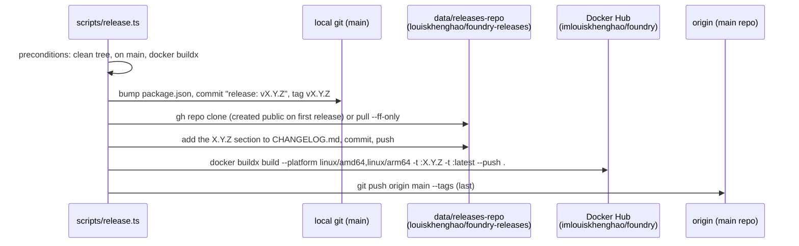

# Releasing

A **Release** is one stable semver shared by every package: the `version` in the root `package.json`. Deployed instances learn about it from two public places ([ADR-0010](adr/0010-self-update-via-docker-hub-and-watchtower.md)):

- the Docker Hub image **`imlouiskhenghao/foundry`**, which is the version source
- the changelog in the public repo **`louiskhenghao/foundry-releases`**, which instances read without authentication because the main repo is private

One command does the whole thing. It lives in `scripts/release.ts`:

```sh
bun run release patch|minor|major|x.y.z [--notes "..."] [--dry-run]
```

- `patch` / `minor` / `major` bump the current version. `x.y.z` sets it explicitly, which is also how you resume (below).
- `--notes "..."` replaces the default notes. The default is the commit subjects (`- <subject>`, merges excluded) since the last `v*` tag.
- `--dry-run` checks the preconditions, prints the version and the changelog section, and stops. Nothing is written, tagged or pushed.

## Before you run it

- **The local engine is idle.** No goal should be running on your own instance. The bump rewrites `package.json`, which restarts a `bun --watch` dev server, and a restart mid-goal interrupts sessions (see [testing.md](testing.md#manual-qa-against-a-throwaway-server)). Check the Agents page, or `bun run cli status`.
- **Clean tree, on `main`.** The script refuses to run otherwise.
- **Docker Desktop is running and signed in to Docker Hub** with push rights to `imlouiskhenghao/foundry`. `docker buildx` must be available (the script checks). To confirm the credential is there:

  ```sh
  printf 'https://index.docker.io/v1/' | docker-credential-desktop get
  ```

  This should print JSON with your `Username`. An error means you are not signed in: sign in through Docker Desktop and check again.
- **`gh` is authenticated** (`gh auth status`) as an account that can create, clone and push `louiskhenghao/foundry-releases`.
- `git push` to `origin` works.
- **The guide's screenshots are current.** If a screen the user guide shows changed since the last release, run `bun scripts/screenshots.ts` and commit the new images first (see [testing.md](testing.md#the-seeded-demo-and-the-guides-screenshots)).

## What it does, in order



1. **Bump and tag.** Write the new version to `package.json`, commit `release: vX.Y.Z`, and tag `vX.Y.Z`. All of this is local.
2. **Changelog.** Make sure `data/releases-repo` is a clone of `louiskhenghao/foundry-releases`. On the very first release, the repo is created public with `gh repo create`. Add the new section to the top of `CHANGELOG.md` with exactly one blank line around it, then commit and push. The notes go out before the image, so they are readable when the version appears. If the section already exists it is left alone.
3. **Image.** Run `docker buildx build --platform linux/amd64,linux/arm64 -t imlouiskhenghao/foundry:X.Y.Z -t imlouiskhenghao/foundry:latest --push .`. **This is the moment the release becomes real**: instances find it on their next Update Check.
4. **Main repo last.** Run `git push origin main --tags`. It goes last so that a failed image push never leaves a pushed tag without an image.

## When something fails

The script stops at the first failing command and prints it.

**The image push failed** (Docker not signed in, network, a builder problem). The version commit and tag exist locally, the changelog is published, and nothing has been pushed to `origin`. Fix the cause and run the release again with the **version you are already at**:

```sh
bun run release 0.4.1        # package.json already says 0.4.1 and tag v0.4.1 exists
```

When the requested version equals the current one **and** its tag exists, the script resumes. It skips the bump and tag, finds the changelog section already there and leaves it, and then rebuilds and pushes the image and pushes `main` with its tags. (Passing the current version without an existing tag is refused: there is nothing to bump.)

**The changelog push failed** (for example `gh` not authenticated). Fix the access problem and resume as above. The section is already committed in `data/releases-repo`, so the script leaves it as it is and pushes whatever that clone has not pushed yet before it builds the image.

**The final `git push` failed.** The image is already published. Fix the access problem and run `git push origin main --tags` by hand. Don't run the release again: that would rebuild and re-push the same image, which is harmless but slow.

**Something failed before the bump** (dirty tree, wrong branch, no buildx). Nothing has happened yet. Fix it and run the original command again.
