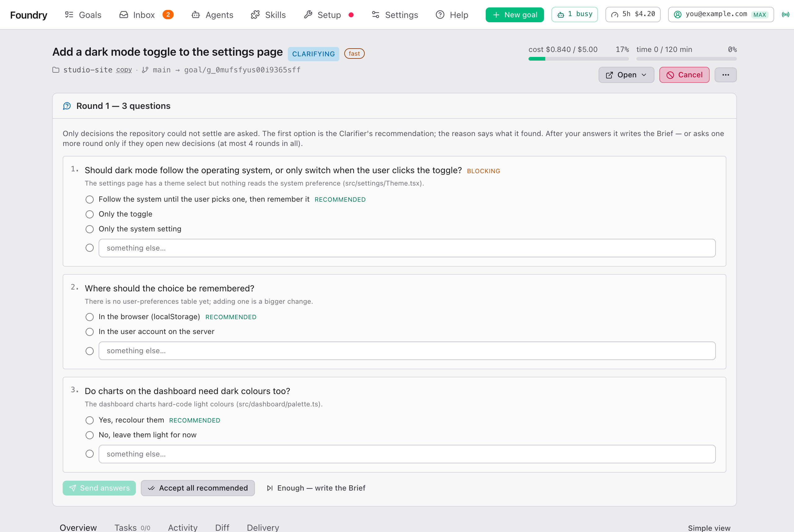

# Answering the interview

> English · [中文](./answering-the-interview.zh.md)

## What the interview is

Before Foundry writes the Brief, it reads your project and your attachments. Most questions it can answer itself. What it cannot answer, only you can decide: which of two designs, who the users are, whether an old feature should stay. Those it asks you, in short rounds.

You answer in the browser. It takes a minute or two per round.

## When you get one

- A small, clear goal usually gets no interview. Foundry goes straight to the Brief.
- A bigger or vaguer goal gets one or more rounds when something is worth asking.
- If you ticked **Interview me before planning** on the New goal form, you always get at least one round.
- Settings can turn the interview off entirely, or on for every goal: [Settings → New goal defaults](./settings.md#new-goal-defaults).

The interview appears on the goal's page and on its Brief page, as a card titled **Round N — K questions**. If you set up notifications, you also get a message (the **Interview round** switch).

## A round

A round holds every question Foundry can ask right now, at most eight, the most important first. Each question looks like this:

### The question

The numbered text at the top. Read it as a colleague asking you one thing.

### The options and the recommended answer

Up to four answers to pick from. The first one carries the word **recommended**: it is what Foundry would choose. Picking it is always a safe answer.

None fits? Click **something else…** and type your own answer.

### The reason

The small grey text under the question. It says what Foundry found in your project that leaves the question open, for example "the app has both a web and a mobile login".

### Follows from

Some questions say **follows from …**, followed by a short name for an earlier question. That question only makes sense because of how you answered the earlier one. Questions that depend on answers you have not given yet wait for the next round.

### Blocking questions

A question marked **blocking** must be answered before **Send answers** works. Hover over the greyed-out button to see which are still open. **Accept all recommended** and **Enough — write the Brief** work even with blocking questions open.

## The three buttons

### Send answers

Sends what you picked. Questions you left empty are not recorded as your decisions; Foundry makes an assumption for them instead, which you can see and reject on the Brief.

After you send, Foundry either asks one more round (only if your answers opened new questions) or writes the Brief.

### Accept all recommended

Answers the whole round in one click. Questions you already answered keep your answer; every empty one takes its recommended option. Use it when you have no strong opinion.

### Enough — write the Brief

Stops the questions. Foundry writes the Brief with the answers you gave so far, and makes assumptions for the rest. Use it when the questions are getting too detailed.

## How many rounds

At most four rounds in total. Usually it is one or two. After the fourth round Foundry writes the Brief whatever is left open.

Earlier rounds fold up under the current one: **▸ N earlier rounds** shows what was asked and what you answered.

## While it plans

After you send a round, the card title changes to **Thinking about your answers…** and a line reads **Planning with your answers · 3m 20s**, with the time counting up. This is the time since you answered. Foundry is reading your answers, looking at the project again, and either preparing the next round or planning the tasks.

This usually takes 2 to 8 minutes. The live log under the line keeps moving while it works. Long pauses in the log with a line like `⏱ sub-agent still working · 3m 30s` are normal: the planner is busy. You can close the page; the goal keeps going and the page updates when you come back.

Before the first round the card says **Reading the repository…** instead, for the same reason.

## What happens to your answers

Every answer becomes a **Decision**. Decisions belong to the whole goal:

- They appear on the Brief page in the **Decisions** card, already applied to the plan.
- Every worker, every reviewer and the pull request receive them word for word, and must follow them.
- If you later run Clarify again, it starts from your decisions instead of asking again.

You can still change your mind on the Brief page: see [Approving the Brief](./approving-the-brief.md#decisions).

## Tips

- Short answers are fine. "Yes, keep it" is a complete answer.
- If a question shows Foundry misunderstood the goal, say so in **something else…**. It will correct its understanding.
- If you do not know, take the recommended option. You can reject assumptions and change answers on the Brief before anything is built.
