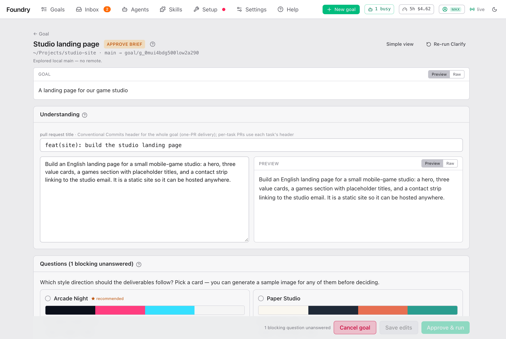

# 批准 Brief

> [English](./approving-the-brief.md) · 中文

Brief 就是计划。Foundry 读完你的项目、听完你的回答后写出它。你批准之前什么都不会开始做；你批准之后，Foundry 就自己往下做。

Brief 上几乎所有东西你都能改。花五分钟看看：这是改主意成本最低的时候。

## Simple view and Expert view

Brief 会以你在 New goal 表单上选的视图打开。用顶部的 **Expert view** 或 **Simple view** 切换；这个浏览器会为这个 goal 记住你的选择。

- **Simple view** 只显示需要你决定的内容：Foundry 理解了什么、它的问题、它的假设、你会得到什么，以及价格。见本页末尾的 [Brief 的 Simple view](#brief-的-simple-view)。
- **Expert view** 显示全部内容，顺序是：页头、**Understanding**、**Questions**、**Assumptions**、**Decisions**、**Areas**、**Plan**、**Goal acceptance**、**How to run it**、**Completion**、估算和预算，以及按钮。本页剩下的部分就按这个顺序讲。

## 页面顶部

- **← Goal** 跳到 goal 的页面。
- Brief 等你处理时，标题旁边的徽标显示 **approve brief**。
- 标题下面：项目文件夹、goal 从哪个分支开始，以及 goal 自己的分支。
- 有一行小字说明 Foundry 读的是你项目的哪个版本，比如 "Explored origin/main (your local main was 3 behind)"。如果它提示没有拉取远端（remote），而你知道之后别人改过项目，就按 **Re-run Clarify**。
- **Re-run Clarify** 会丢掉这份 Brief，拉取你项目的最新版本，然后重新规划。附件、预算和交付设置都会保留。你的决定会以文字形式交给新的 Clarify：它会按这些决定来规划，不会再问一遍，但它们不会作为条目回到 **Decisions** 卡片里。它工作期间，你会回到 goal 页面。
- **goal** 面板显示你最初的描述。

## Understanding

Foundry 用自己的话说它理解了什么。先读这个：如果这里错了，后面的全都会错。

- **pull request title**：一行概括整个 goal 的文字，格式是 `feat(scope): what this goal adds`。如果你要交付 pull request，它就是 pull request 的标题。可以不管它。
- 左边的文本框可以编辑；右边显示它读起来的样子。

## Questions

**Questions (N blocking unanswered)** 列出 Foundry 无法从你的项目或访谈中确定的事。对每一个问题：

- 点一个建议答案。第一个标着 **★**，是 Foundry 的推荐。
- 或者在框里输入你自己的答案。
- 标着 **blocking** 的问题必须回答，你才能批准。

回答一个问题，它就变成一个决定（见下面的 [Decisions](#decisions)）。

### Style directions

对于讲究外观的 goal（网页、应用、海报、视频），有一个问题可能会显示**风格卡片**，而不是普通的答案。每张卡片是一个视觉方向：一条色带、字体、几个关键词和一段简短说明。第一张标着 **★ recommended**。

- 点一张卡片就**选中**它。这就是你对这个问题的回答。

### Generate a sample

选中卡片后，**Generate a sample (~$1)** 会按这个风格生成一张真实的图片，让你在花大钱之前先看看效果。要一两分钟。按 **Regenerate (~$1) — earlier ones are kept** 再生成一张；所有样图都会保留。一个方向最多 8 张样图。

### Set the reference image

点一张样图放大查看，然后按 **Use as the reference image**。之后每个执行者都必须和这张图保持一致。**Unpick reference image** 撤销这一步。卡片上会显示 **reference image set — workers will match it**。

你选的方向对每个产出可见内容的任务都有约束力。没有外观的任务（服务端代码、数据、文档）会忽略它。

## Assumptions

**Assumptions (accepted unless you uncheck)**：除非你另有说法，否则 Foundry 会当作事实的事情，比如"现有的登录保持不变"。保持勾选就表示你同意。把不对的那条取消勾选；它会被划掉，并变成一个决定（"assumption rejected"）。

## Decisions

**Decisions (N)** 列出你给出的每一个答案和否决的每一个假设，包括你在访谈中的回答。每个执行者、审查员和 pull request 都会一字不差地收到它们。

绿点表示计划已经考虑了这个决定。琥珀色点表示你是在计划写好之后才做的决定，所以下面的任务和检查可能还没反映它。卡片会写明有多少个 **not yet applied to the plan**。

### Revise with answers

按 **Revise with answers**，让 Foundry 根据你的决定重新读一遍 Brief 和你的项目。它会提出修改：新增、修改或删除的任务，检查，Area，新的理解。这要几分钟，最多花 $3。你可以先填 **notes for the AI (optional)**。

提议会以列表形式出现。用 ✓ 接受单项，用 ✗ 放弃，或者按 **Accept all**。你接受之前什么都不会变。如果 Foundry 找不到要改的地方，按 **OK, mark applied**。

### No changes needed

如果计划已经符合你的决定，按 **No changes needed** 消除琥珀色提示。

你也可以在决定还没应用时直接批准。执行者仍然会收到这些决定；只是计划没有为它们重写。

## Areas

**Areas (N)** 是这个 goal 涉及的产品部分：一个角色或应用（"学生端""教师端"），或者它们都需要的公共基础。每个任务都属于一个 Area。

- 直接在原处改 Area 的名字或它的一行说明。
- **Add Area** 新增一个。
- 垃圾桶图标删除一个。它的任务会变成未分配，它的问题会被删掉。
- 没有任务的 Area 会用红框标出：这部分将不会被做出来。按 **Draft tasks for this Area**，让 Foundry 为它提议一到六个任务，或者删掉这个 Area。

## Plan

**Plan (N tasks · M stages)** 是具体的工作，一个任务一个任务列出来。

### 阶段和任务图

最上面是任务图，按 Area 着色，箭头表示"这个要等那个"。下面按 **Stage** 列出任务。同一阶段的任务互不依赖，可以同时跑（**Stage 2 · 3 in parallel · after the previous stage**）。阶段只是方便你阅读计划：实际上，一个任务等的那些任务一完成，它就会开始，只受 goal 并行上限的限制。

有多个 Area 时，列表上方的标签可以筛选（**all Areas** 显示全部）。非常大的 goal 会出现一条黄色提示，建议你按 Area 拆成多个 goal。

### 单个任务

每一行显示任务的编号和标题、表示类型和场景的小标签（难度不是 standard 时也会显示难度）、所属 Area，以及它有多少个检查。**After** 和 **Next** 显示它要等哪些任务、哪些任务在等它。点一行打开任务；**Add task** 新增一个；垃圾桶图标删除任务及其检查。

在任务里你可以改：

| 字段 | 是什么 |
|---|---|
| Title | 任务做什么，写成一句简短的指令（"add teacher dashboard"）。 |
| **Area** | 它属于产品的哪一部分。 |
| **Kind** | 见下文。 |
| **Scenario** | 见下文。 |
| **difficulty** | 见下文。 |
| **TDD** | **inherit** 跟随 goal 的设置；**off** 为这个任务关掉先写测试。 |
| **Commit scope** | 提交信息括号里的那个词，`feat(scope): …`。留空就用 Area 的简称。 |
| **Spec** | 改什么、在哪里改，以及怎么判断做完了。 |
| start files | 执行者应该先看的文件，用逗号分隔。可选。 |

### Kind

| Kind | 用于 |
|---|---|
| **feature** | 新东西。 |
| **bug** | 修复。执行者会先复现问题。 |
| **refactor** | 调整结构，不改变行为。 |
| **research** | 查清楚某件事。 |
| **chore** | 环境搭建、依赖、日常维护。 |

类型决定执行者遵循哪种工作方法（比如做功能时先写测试）。

### Scenario

工作发生在哪里：**frontend**、**backend**、**fullstack**、**data**、**mobile**、**infra**、**docs**、**research**、**image**、**video** 或 **general**。它决定执行者能拿到哪些专门技能：前端和全栈工作有设计技能，图片工作有图片技能，依此类推。

### Difficulty

难度决定由 goal 的 [模型预设](./settings.zh.md#presets) 里的哪个模型来做这个任务。Foundry 会给每个任务评级；你可以改。

| 难度 | 例子 | 使用的模型 |
|---|---|---|
| **simple — config, copy, small component** | 一个设置项、文字修改、按模板生成的文件、一个小组件 | 预设里的 **Simple tasks** 模型（通常最便宜） |
| **standard — typical feature work** | 一个带表单的新页面、一个带测试的 API 接口、大多数任务 | **Standard tasks** 模型 |
| **complex — cross-cutting, risky** | 跨很多部分的改动、架构、数据迁移、并发、大型重构 | **Complex tasks** 模型（通常最强） |

把任务调到 complex，第一次就成功的可能性更大，也更贵。一个任务老是失败时，只要它允许两次或更多尝试，最后一次尝试无论如何都会用 Complex 模型来跑（见 [设置说明](./settings.zh.md#最后一次尝试换用-complex-tasks-模型)）。

### Milestones

在某个任务上勾选 **milestone**，表示这个任务做完后第一次有东西可以看或可以试：第一个能打开的界面、第一局能玩的游戏。Foundry 每个 goal 会标一到三个；你可以增加或去掉。

会出现一个文本框，填 **what to look at**：这个任务完成时要打开什么、试什么、判断什么，比如"打开游戏，玩一局，试试复活按钮"。goal 暂停时会把这段文字显示给你。

里程碑任务完成时，Foundry 不再启动新任务，让正在跑的任务跑完，启动预览，然后等你。那时该做什么，见 [Foundry 什么时候需要你](./when-foundry-needs-you.zh.md#里程碑可以看了)。

### 并行和先后顺序

- **runs after …**（或 **runs first (no dependencies)**）会打开一个列表：勾选这个任务必须等待的任务。循环（"A 在 B 之后，B 在 A 之后"）不会被拒绝，但任务图会标出来，而且在你去掉它之前，**Approve & run** 一直是灰的（"task graph has a cycle"）。
- **parallel**：勾上表示这个任务可以和其它就绪的任务同时跑。如果某个任务不能在别的任务运行时开始，就取消勾选：它会等到这个 goal 没有别的任务在运行时才开始。它开始之后，勾了 parallel 的任务仍可以和它同时跑。

### Draft with AI

只写了标题？按 **Spec** 旁边的 **Draft with AI**。Foundry 会根据标题、Brief 和你的项目写出 spec、填好各字段，并提议验收检查。如果任务已经有 spec，按钮就变成 **Suggest acceptance**，只提议检查；你的文字永远不会被覆盖。两种情况最多都花 $2，你可以用 ✓ 逐项接受提议，或者用 **Accept all** 一次全部接受。

### 单个任务的验收

**Acceptance for this task** 列出每次尝试这个任务后都要运行的检查。它的 Must 检查通过，任务就算完成。**Add check** 新增一个命令检查或审查员检查（下面会解释）。箭头图标把检查上移到 goal 级别，在那里它会对合并后的整体结果做判断。

## Goal acceptance

**Goal acceptance (N)** 列出在所有任务完成后，对整体结果做判断的检查。"完成"就是这样定义的。

### Must and Stretch

每个检查都有一个徽标。点它来切换。

- **must**：你要求的东西。所有 must 检查通过 → goal **done**。
- **stretch**：Foundry 提议的额外内容。must 和 stretch 都通过 → **over-delivered**。

Foundry 从不自作主张扩大范围：stretch 检查存在，只是因为它写在你批准的 Brief 里。不想要的就删掉。

### Command 检查和 Reviewer 检查

| 类型 | 怎么判断 | 适合 |
|---|---|---|
| **Command** | 在项目里运行一条命令；命令成功就算通过。例如：`bun test`。 | 任何测试或构建能证明的东西。 |
| **Reviewer** | 一个 Claude 会话读改动，按你写的规则来判断。例如："设置页面有一个会记住状态的深色模式开关"。 | 测试不容易证明的东西：措辞、布局、完整性。 |

有多个 Area 时，goal 级别的检查可以属于某一个 Area，或者属于 **all Areas**。**whole goal** 表示它对合并后的整体结果做判断；改选某个任务，就会把检查移到那个任务里。没有名字、命令或规则的检查会用红框标出，并且会阻止批准。

## How to run it

**How to run it** 告诉 Foundry 怎么启动结果，用于里程碑的预览和自检。大多数项目留空就行：Foundry 会从 `package.json` 读启动脚本。最后一行是这个 goal 的 **Self-check after each task** 开关，所以在工作开始前就可以打开自检。

| 字段 | 是什么 |
|---|---|
| **Platform** | **nothing to start**、**web (browser)** 或 **expo (React Native via Expo web)**。 |
| **Install** | 安装命令，例如 `npm install`。 |
| **Start command** | 例如 `npm run dev -- --port {port}`。`{port}` 是 Foundry 填入端口的位置。 |
| **URL** | 结果在哪里打开，例如 `http://localhost:{port}`。 |

**Use package.json** 会清掉这些字段，回到从 `package.json` 读取。

## Completion

**Completion**（只在 Expert 视图里有）说明 goal 完成时会自动运行什么。默认值取决于工作的类型；你可以在这里改。

- **Refresh the knowledge graph**：交付之后，更新一些工具使用的代码地图。
- 文档标签：**PRD**（要求了什么、做出了什么）、**README update**、**Changelog**、**Confirmation sheet**（给别人确认各项决定用）。点一个标签来打开或关闭它。

文档会在最终审查通过后写出，保存在 goal 的分支上，所以会和工作一起交付。最多花 $3。更多内容见 [拿到结果](./getting-the-result.zh.md#完成后的附加项)。

## 估算和预算

卡片显示 **Estimated cost** 和 **Estimated time**，旁边是你的预算。

用 **Auto** 预算时，卡片标题是 **Estimate → proposed budget**：Foundry 提议把估算的两倍作为上限，向上取整，而且不少于 $3 和 30 分钟。你可以改 **max cost $** 和 **max minutes**，按 **Keep unlimited** 表示不设上限，或者按 **Use estimate ×2** 回到提议值。如果是你自己设的预算，而估算比它高，卡片会用黄色提醒。改动在你批准时生效。

碰到上限从不会毁掉已做的工作：goal 会暂停并问你。见 [Foundry 什么时候需要你](./when-foundry-needs-you.zh.md#预算用完了)。

## Delivery 不在这一页

结果怎么处理（留在本地、推送、开 pull request）是在 New goal 表单上选的。要改的话，在 goal 结束之前或之后，用 goal 页面的 **Delivery** 标签页。见 [拿到结果](./getting-the-result.zh.md)。

## Approve

在页面底部：

- **Approve & run** 开始干活。如果你改了预算，按钮上会显示新预算。有东西阻止批准时它是灰的；旁边的灰色文字会说明是什么（比如 "1 blocking question unanswered"、"task graph has a cycle"、"2 incomplete checks"）。
- **Save edits** 保存你的修改但不批准，方便你之后再回来。
- **Cancel goal** 放弃这个 goal。

黄色文字会提醒没有任务的 Area 和还没应用的决定。你照样可以批准。

批准之后，Brief 就不能再编辑了，你会进入 goal 页面：[运行期间](./while-it-runs.zh.md)。

## Brief 的 Simple view

Simple view 用大白话显示同一份 Brief：

| 卡片 | 要做什么 |
|---|---|
| **What I understood** | 读一读。如果不对，就在回答问题时相应地纠正，或者切到 Expert view 去编辑。 |
| **Please answer (N)** 或 **Questions** | 选一个答案（★ 是推荐）或者输入你自己的。标着 **needed** 的问题必须回答。风格卡片的用法和上面一样。 |
| **I will assume… (untick anything that is wrong)** | 把不对的取消勾选。 |
| **What you will get (N pieces of work)** | 各项任务，按 Area 分组。要改它们，就打开 **Expert view**。 |
| **Price** | 估算。输入一个金额，花到这个数时 Foundry 会停下来问你（留空表示不设上限）。 |

然后按 **Looks good — go** 批准，按 **Save** 之后再回来，或者按 **Cancel** 放弃。如果你的回答改变了该做的东西，先打开 **Expert view** 按 **Revise with answers**。
