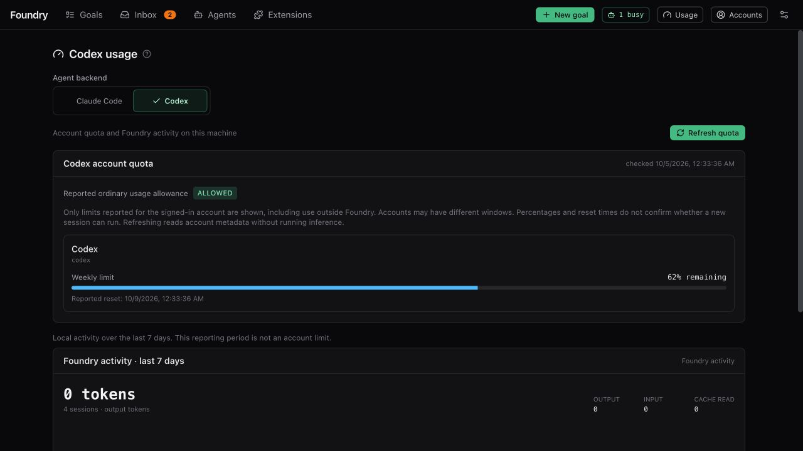

# Costs and usage

> English · [中文](./costs-and-usage.zh.md)

## Codex accounting

**Codex account quota** reads the signed-in ChatGPT account through the native CLI, separately from local activity totals. It shows every returned quota group with **remaining percentage**, window duration and reported reset time. The blue bar is the remaining allowance: 25% used means 75% remaining. Unknown usage is labelled unknown, never a full allowance. **Refresh quota** reads metadata without inference; ordinary polling uses a 60-second cache. **Reported ordinary usage allowance** is the CLI's explicit allowed/blocked/unknown signal. Percentages and past reset times do not prove recovery. Missing quota or reset data stays unknown; a read failure is shown rather than replaced with zero. Accounts also shows the email and plan when the native CLI supplies them.

There is no fixed five-hour/weekly pair. A weekly-only account shows only **Weekly limit**; accounts that report both windows show **5-hour limit** and **Weekly limit**. Names come from the reported duration, regardless of whether Codex calls the slot primary or secondary. Other durations are shown as returned; unknown duration stays unknown. Absent windows are not shown or filled with zero. Multiple quota groups remain separate. The top bar always shows **Usage** for both coding agents. Its tooltip lists Claude activity and Codex account limits separately; several weekly groups appear as **2 weekly limits**, for example. An amber dot flags a paused/blocked coding agent or low MiniMax quota. Open Usage to inspect each coding agent.

The page opens with the shared **Foundry activity · last 7 days** section, then **Account limits**, whose coding agent selector switches only what is below it: that agent's account limits (and, for Codex, its own **Foundry activity · last 7 days** card), so switching moves nothing above. A paused coding agent shows a banner at the top either way. The shared section covers both coding agents together, because it comes from Foundry's own session records rather than either account: cache hit rate, average Claude cost per session, average session length, sessions not successful, and three lists side by side, **By goal**, **By session kind** and **By model**. Each row shows, on its first line, the coding agents it involves (their icons), its name and its cost; on its second, the goal's state, the time spent in sessions, the number of sessions and the tokens processed (hover for input, cache and output). Time and tokens exist for both coding agents, so rows are listed by time; each list shows its first 8, and **Show all** the rest. Cost is estimated for Claude Code only: a Codex-only row shows —, and a row with both shows the Claude Code part, marked *. Counts include only Foundry sessions. The Codex activity card is a local reporting period, separate from the account limits. It has no quota status or reset countdown. Dollar cost, turn count and skill-invocation telemetry are unavailable in this adapter; unavailable never means free or unused.

Codex USD caps are removed on creation, Brief approval and budget increases. Timeouts, tool-call allowance, attempts and concurrency remain effective. Its turn-cap setting counts tool calls, not model turns. A detected usage-limit error pauses only that provider; without a reset signal Foundry retries after five minutes, which is not a claim that the account quota has reset.

The dollar figures below apply only to Claude sessions and are usage estimates, not a separate bill from Foundry. Local git operations and checks do not themselves invoke an agent model; commands or media tools that call paid services have their own costs.

## What costs money

| Session | Limit per session |
|---|---|
| Clarify (exploring your repository, the interview, writing the Brief) | $6 per Clarify session. Each interview round, and each repair of the Brief, is its own session. |
| Draft with AI (one task or area) | $2 |
| Revise with answers | $3 |
| Task attempt | $10 by default (Settings → Models & limits), and never more than what is left of the goal's budget |
| Task review | $0.80, plus up to $0.20 when its verdict has to be asked for again |
| Merge attempt (combining two tasks that touched the same lines) | $2 |
| Final goal review | at least $6, up to the task-attempt limit, plus up to $2 when its verdict has to be asked for again |
| Completion docs (only if you turned them on) | $3 |
| Style sample (one image) | $2 per click, at most 8 per direction |
| Suggest a hint (Inbox) | $1 |
| Milestone feedback ("Turn into a plan") | $0.50 |
| Housekeeping: deciding what kind of goal it is (when set to **Auto**), or summarising a very long check output | $0.10 each |
| **Sync models** and **Test** in Settings (one tiny session per model) | $0.50 per model |
| **Refresh signal** on the Usage page | $0.05 |

Which model each of these uses — and so how much it really costs — is set by the goal's **model preset**. See [Settings explained](./settings.md#models--limits).

## Ways to spend less

- **Pick a cheaper preset.** Compare the selected models and efforts; preset names do not guarantee a price or quota saving. You can choose per goal on the New goal form, or per goal type in Settings.
- **Use fast pace** for routine goals. It skips Foundry's own extra reviews; the checks you approved still run.
- **Lower the effort** on the New goal form for simple goals.
- **Set a budget.** A goal stops and asks when it reaches its time limit, or its USD limit for Claude. Codex uses time, attempts and concurrency instead of dollar caps. Time counts while Foundry works on the goal, Clarify included; waiting for you (interview answers, Brief approval, the Inbox, a milestone pause) does not count.
- Foundry resumes interrupted sessions before starting fresh attempts when possible, preserving context. Actual quota use depends on the coding agent and the work.

## Where to see what was spent

- **Claude goals** show running cost estimates and task totals. Codex marks dollar cost unavailable.
- **Usage → Claude Code** shows spending estimates over time. For each of your plan's usage windows it shows its status — **within limit**, **nearing limit** (still allowed, but Claude warns the window is close to its limit) or **limit reached** — and when it resets, not a percentage. Claude sends a window's status only now and then (a weekly one mostly when that week gets close to its limit), so once the reset time of the last signal has passed the card shows **no current signal** instead of repeating an old warning; for exact percentages, run `/usage` in Claude Code. **Refresh signal** runs one tiny session to update that status.
- When a usage limit is reached, Foundry pauses new sessions only on that coding agent and retries later. A banner shows the retry time; it is not proof of recovered quota.
- **MiniMax** (video and narration through mmx) has its own card at the bottom of **Usage**, read when the page opens: what is left of each model's window and week on a Token Plan, or the balance of a pay-as-you-go key. **Refresh** reads it again. When under 10% of a window is left, or the balance is under 1, the usage pill in the top bar shows an amber dot. The card only appears when mmx is installed.

## Image goals need an image key

The configured image skills use a separate media-service API key: an OpenAI-compatible key, or a Gemini key. This key does not enable Codex API-key inference or replace ChatGPT sign-in. Add it in **Settings → Tools & keys**; it applies to the next session, no restart. Without a key, image tasks produce hand-drawn SVG or HTML renders of much lower quality — the Brief tells you so before you approve.
