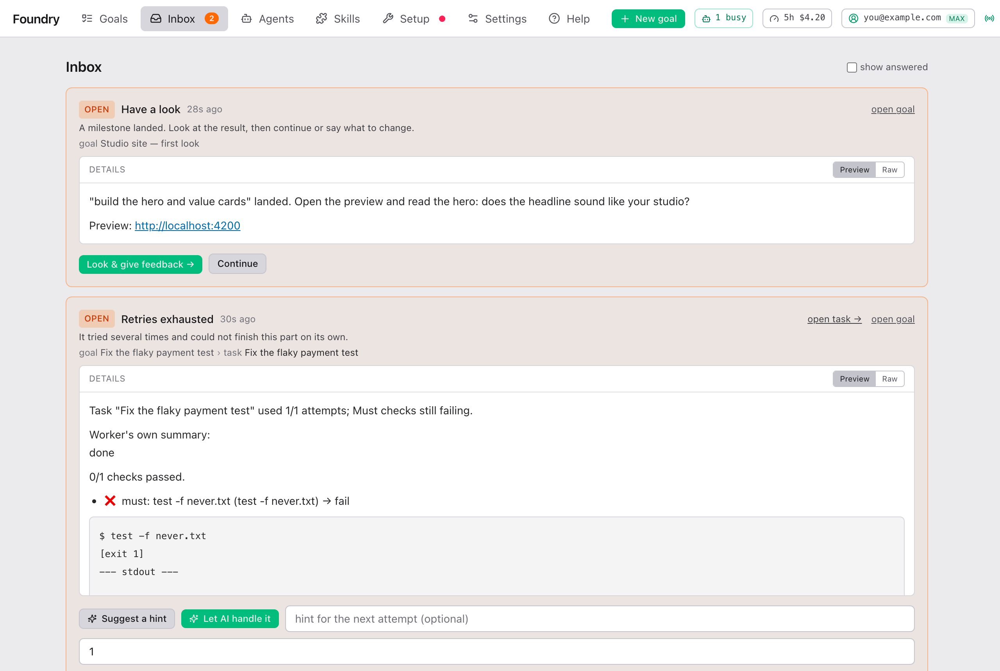

# FAQ

> English · [中文](./faq.zh.md)

## Why did it stop?

Once the goal runs, Foundry stops and asks you only for a short list of reasons: a task that failed several times, two tasks that changed the same lines, a failed final review, a command that would leave your computer, a tool that was denied, a budget reached, or a milestone to look at. Each one appears in the **Inbox** (the number in the top bar) with the buttons to continue. Questions only you can answer come earlier, on the Brief page.

What each one means and what to press: [When Foundry needs you](./when-foundry-needs-you.md). If the goal is not in the Inbox but nothing moves, see the next question.

## It looks stuck. Is it?

Probably not. Check in this order:

1. **A yellow banner "Usage limit reached"?** Your Claude plan's limit was reached. Everything resumes by itself when it resets; the banner says when.
2. **The Inbox.** A number in the top bar means something waits for you.
3. **The task's live log** (goal page → **Tasks** → click the running task). A line like `⏱ sub-agent still working · 5m 10s` that keeps counting means it is working. Planning often takes 2 to 8 minutes with little output.
4. **The Agents page.** A session marked working is working.
5. **The top bar** says **live**. If it says **reconnecting…**, the page lost contact with Foundry; reload it, and check that Foundry is still running.

A task attempt that seems stuck is stopped after 20 minutes by default (**Attempt timeout** in Settings) and resumed, so a real hang does not last. A Clarify session stops after 15 minutes, the final review after 30.

## Can I change the plan after approving?

Not the Brief itself: it is fixed once approved. But you can steer:

- **At a milestone**, write what you want changed and press **Turn into a plan**. It becomes a hint, fix tasks or a new decision.
- **When a task is blocked**, **Retry with hint** tells it what to do differently.
- **Add attachments** on the Overview tab; new sessions receive them.
- **Restart…** a stopped goal from a chosen task.
- For a real change of direction, cancel the goal and create a new one. The work already done stays on its branch.

Before approving, everything is editable: [Approving the Brief](./approving-the-brief.md).

## How do I make it cheaper?

- Pick the **Economy** or **Balanced** model preset (**Models** on the New goal form, or [Settings → Models & limits](./settings.md#preset-per-goal-type)).
- Tick **Fast mode** for routine goals.
- Set **Effort** to **low** for small goals.
- Mark easy tasks **simple** on the Brief; they run on the preset's **Simple tasks** model (Sonnet instead of Opus in Production; for code goals in Balanced it is the same model as Standard).
- Set a budget; the goal stops and asks when it is reached.

More in [Costs and usage](./costs-and-usage.md#ways-to-spend-less).

## Where are my files?

- **Your own project folder** is never changed while a goal runs. After a pull request of the goal merges, Foundry brings the work into it (when that is safe) and removes the progress folder.
- **The work** is in the progress folder next to it, `<project>-foundry/<goal>/`, and on a branch named `goal/…` in your project. Open it with **Open ▾** on the goal page.
- **Images and videos** go to the output folder you chose, or stay in the progress folder's `artifacts` folder.
- **Attachments** are kept by Foundry itself, never in your project.

See [Getting the result](./getting-the-result.md).

## What if I don't know git?

You do not need to. Foundry does all of the git work. What you need to know:

- Your folder stays as it was. The result is a separate folder you can open, use and copy from.
- If Foundry asks to **Initialize git here**, say yes. It only starts keeping history for the folder.
- Leave delivery on **Local only** until someone who uses GitHub sets it up with you.

## Does it push without asking?

No. With the default **Local only**, nothing leaves your computer. It pushes or opens a pull request only if you chose **Push branch**, **Open a PR** or **PR + auto-merge**, and then exactly the steps shown on the Delivery tab. The AI working on tasks cannot push or deploy at all: if it tries, Foundry blocks it and asks you in the Inbox. See [Getting the result](./getting-the-result.md#delivery-modes).

## How do I undo?

- **Before approving**: **Cancel goal**. Nothing was built.
- **While it runs or after**: your own folder was never changed, so there is nothing to undo there. Delete the goal (**⋯ → Delete goal…**) and tick **Also delete the branch** to throw the work away.
- **After you merged it into your project** (yourself, or through a pull request): undo it like any other change, for example with **Revert** on the pull request in GitHub.
- **One task went wrong**: open it and press **Restart from here**, or restart the goal from that task.

## Why is a task "standard"?

Foundry rates each task **simple**, **standard** or **complex** when it writes the plan, and **standard** is the normal case: typical feature work. The rating picks the model: simple tasks run on the preset's **Simple tasks** model (Sonnet in Production; for code goals in Balanced it is the same as Standard), complex ones on its **Complex tasks** model. You can change it on the Brief before approving. See [Difficulty](./approving-the-brief.md#difficulty).

## Can I use it from my phone?

Yes, if Foundry's computer stays on and you make it reachable, for example over Tailscale: see [remote-access.md](../operate/remote-access.md). The pages work at phone width. Set **Link base URL** in Settings so notifications link straight to the goal ([Notifications](./settings.md#notifications)).

## Can I close the browser or turn off the computer?

Close the browser any time: the work continues. The computer must stay on and awake, since the work runs there. If Foundry is restarted, interrupted work resumes by itself without using up a retry.

## Can I run several goals at once?

Yes. They share the limit **Concurrent Claude sessions** (3 by default, in [Settings → Models & limits](./settings.md#limits)), so more goals at once means each one moves slower. Two goals on the same project do not see each other's work until you merge it.

## What does "over-delivered" mean?

All the **must** checks passed (what you asked for) and the **stretch** checks too (extras you accepted on the Brief). "Done" means only the must checks passed.

## Can I add information after the goal started?

Yes. Add files or links under **Attachments** on the goal's Overview tab; every new session receives them. To change what gets built, use a milestone or a hint (see [Can I change the plan after approving?](#can-i-change-the-plan-after-approving)).
