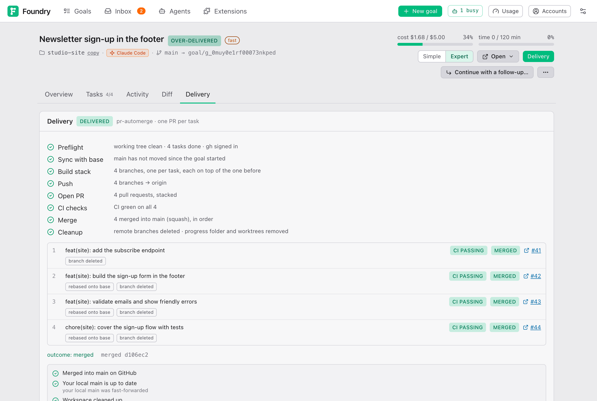

# Getting the result

> English · [中文](./getting-the-result.zh.md)

## Where the result is

When a goal is done, its work is in two places on your computer:

- **On a branch in your project**, named like `goal/…`. A branch is a separate line of history: your own files are untouched until you choose to bring the work in. The goal page shows the branch name at the top (for example `main → goal/abc123`).
- **In the progress folder**, next to your project: `<project>-foundry/<goal>/`. It is that branch, checked out, ready to open and run. See [While it runs](./while-it-runs.md#the-progress-folder).

The goal page says so in plain words: "The work is on branch … in your repository. Nothing has left your machine." What happens next depends on the delivery you chose.

## Delivery modes

You pick the delivery on the New goal form (**4 · Delivery**), and can change it any time on the goal's **Delivery** tab.

| Mode | What Foundry does when the goal is done |
|---|---|
| **Local only** | Nothing. The work stays on a local branch. You push when you want. This is the default in [Settings → New goal defaults](./settings.md#new-goal-defaults), which the New goal form starts from. |
| **Push branch** | Brings in any new work from the base branch, then pushes the goal's branch to the online copy (for example GitHub). No pull request. |
| **Open a PR** | Pushes, then opens a pull request with the Brief and the check results as its description. You review and merge it. |
| **PR + auto-merge** | Opens the pull request, waits for its automatic checks (CI), fixes CI if needed, merges when everything is green, and deletes the pushed branch. |

With **PR + auto-merge**, if branch protection on GitHub blocks the merge, Foundry turns on GitHub's own auto-merge (`gh pr merge --auto`) and waits a while ([Settings → Git & delivery](./settings.md#git--delivery)). If GitHub has not merged by then, it merges later by itself, and Foundry does not delete the branch.

Two rules hold for every mode:

- It is Foundry itself that pushes, opens and merges, exactly as the plan on the Delivery tab lists. The AI working on your tasks cannot push; if it tries, Foundry blocks it and asks you (see [When Foundry needs you](./when-foundry-needs-you.md#it-wants-to-do-something-outside-your-computer)).
- Foundry never pushes to your base branch (for example `main`) directly. Changes reach `main` only through a merge. It never force-pushes the goal's branch. The one exception is a task's branch under **One PR per task**: after the pull request below it merges, that branch's own commits are replayed on top of `main` and the branch is replaced, but only if nobody else pushed to it since (`--force-with-lease`). If someone did, Foundry keeps their commits and merges `main` in instead.

The pull request modes need the GitHub CLI and a connected account: see [Connecting GitHub](#connecting-github).

## One PR for the whole goal or one per task

Under **Granularity** (shown once you pick a mode other than Local only):

- **One PR for the whole goal** (the default): everything in a single pull request, titled with the Brief's pull request title. For **Push branch** this reads **One branch for the whole goal**.
- **One PR per task — stacked**: one pull request per task, each built on the one below it, titled with that task's commit message. With auto-merge they are merged bottom-up. For **Push branch** this reads **One branch per task**.

One PR per task gives smaller pull requests to review, but each is its own push, wait and merge cycle, so it takes longer. A goal with a single task always gets one. If a task cannot be split out cleanly, Foundry falls back to one pull request for the whole goal and says so.

## The other delivery options

Once you pick a mode other than **Local only**, more options appear.

### Target

**remote** is the online copy's name (almost always `origin`, filled in from your project). **base branch** is the branch the pull request goes into; blank means the branch the goal started from. **merge method** (only for auto-merge) is **squash** (the default: one commit on the base branch), **merge commit** or **rebase**.

### No remote yet

If your project has no online copy yet, the form says **No remote yet** and offers two ways:

- **existing remote URL**: paste the address of an empty repository you created, for example `git@github.com:you/repo.git`.
- **or create a GitHub repo**: pick the owner (you or one of your organisations), a name, and **private** or **public**. Foundry creates it at delivery time. When you are connected to GitHub, this is filled in for you: your account, the folder's name, private.

### Once the PR is open

Only for **PR + auto-merge**. The four switches are on by default.

| Option | Meaning |
|---|---|
| **Wait for CI checks** | Merge only after every automatic check reports. Off: merge as soon as GitHub allows it. |
| **Merge when no checks are configured** | Off: a repository without CI stops at the open pull request. |
| **Auto-resolve conflicts with the base branch** | If `main` moved on and conflicts, Foundry resolves it. Off: a conflict stops the delivery. |
| **Delete the remote branch after merging** | Only the branch this goal pushed, never the base branch. |
| **Fix failing CI** | **don't fix**, **up to once** (default) or **up to twice**. See [When CI fails](#when-ci-fails). |

## Connecting GitHub

At the bottom of the delivery choices is a GitHub line:

- **GitHub: yourname** means you are connected.
- **gh installed, not logged in** comes with a **Connect GitHub** button. Press it, copy the one-time code shown, open the link, approve in GitHub, then press **Done**.
- **GitHub CLI not installed** means the GitHub CLI is missing on this computer. Whoever installed Foundry can add it; the Setup page shows the command under **GitHub CLI (optional)**.

**Push branch** does not need the GitHub CLI (unless Foundry should create the GitHub repository for you); it only needs the online copy to accept your pushes.

## The Delivery tab

On the goal page, open the **Delivery** tab (in Simple view, **Deliver…** on the Result card switches to Expert view and opens it).



**Before the goal is done**, it says **Will deliver automatically when the goal is done** (unless the mode is Local only). You can change the delivery and press **Save (runs when the goal is done)**.

**While it delivers**, the card shows each step with a tick, a spinner or a cross: **Preflight**, **Remote**, **Sync with base**, **Build stack**, **Push**, **Open PR**, **CI checks**, **Fix CI**, **Merge**, **Cleanup** (only the steps your mode needs). **Cancel** stops it.

**The pull requests** appear in a list with their title, their CI result (**CI passing**, **CI failing**, **CI pending**, **no CI**, or **CI skipped** when it merged without waiting for checks), their state (**open**, **merged** …) and a link **#123** to open them on GitHub. Under a pull request, small labels say what is happening to it:

- the step running on it now, for example **CI checks** or **Merge**, with a spinner
- **waiting for #41**: with one PR per task, a pull request merges only after the one below it
- **rebased onto base**: after the pull request below merged, this one's own commits were replayed on top of `main`
- **base merged in** or **conflict resolved**: `main` was merged into it, and in the second case a Merge Attempt resolved a conflict
- **branch deleted**: its branch was removed from the online copy after the merge

The Overview tab's timeline also shows **Deliver · mode · N PRs · N merged**.

**After a merge**, three lines show whether the work is merged on GitHub, in your own folder, and whether the goal's folders were cleaned up. See [After a pull request merged](#after-a-pull-request-merged).

**N remote command(s) — full audit** lists every command Foundry ran against the online copy, with its result.

**Delivery settings** (or **Deliver this goal** for a Local only goal) is where you pick a mode and see the exact plan: every command Foundry will run, in order. Nothing else runs. For a first delivery the button says what it will do: **Push now**, **Open PR now**, **Open PRs now**, **Open PR and merge when green** or **Open PRs and merge when green**.

Once a delivery has started, the settings stay editable:

- **Save** stores them and starts nothing. While a delivery runs, the switches under **Once the PR is open** apply from its next step. For example, turning **Wait for CI checks** off lets a pull request that is waiting on CI merge without it, marked **CI skipped**.
- **Resume delivery** carries on from where the delivery stands. Open pull requests are kept, merged ones are skipped, and missing ones are added, such as the documentation written when the goal finished. Unsaved changes are saved first.
- **Start over…** asks first. It closes the open pull requests with a comment, deletes the task branches here and online, and delivers again with the settings on screen. Pull requests that already merged stay merged.

While pull requests are open, the remote, base branch, merge method and granularity are locked, and so are the modes without pull requests: changing them would leave the open pull requests behind. Switching between **Open a PR** and **PR + auto-merge** stays possible. While a delivery runs, only the switches can change.

With **One PR per task**, the documentation Foundry writes when the goal finishes (see [Completion extras](#completion-extras)) is delivered as the last pull request.

## When CI fails

CI is the set of automatic checks your online repository runs on every pull request. Foundry's own checks passed before delivery, but CI may test more.

- With **Open a PR**, Foundry does not wait for CI. You see the result on the pull request and decide.
- With **PR + auto-merge**, Foundry waits. If CI fails and **Fix failing CI** allows it, a small fix task reads the failed log, fixes the goal's branch and pushes again. A failing check with no CI log Foundry can read (a deploy integration's status, for example) is not handed to a fix task, and a fix task that finds nothing to change does not push the same commit again: in both cases, and whenever CI still fails, the delivery stops as **failed**.

When it stops, the Delivery tab lists each failing check under its pull request, with the check's own description (for example "Deployment was blocked") and a **details** link, and a *Delivery stopped* item appears in the Inbox with the same reason. Fix the cause, then:

- **Resume delivery** carries on from the first pull request that is not merged, keeping the open ones, with a fresh budget for fixing CI.
- **Re-check** on a pull request reads it on GitHub again; if it passes now, the delivery carries on and merges.
- **Mark as delivered** if you finished it yourself (merged pull requests are recognised; see [When Foundry needs you](./when-foundry-needs-you.md#the-delivery-stopped)).

If you merge the pull request on GitHub yourself, Foundry notices and finishes the delivery; with one pull request per task, the rest wait for **Resume delivery**.

With one pull request per task, a fix for CI is committed on the branch of the pull request that failed and pushed there. The other pull requests are not touched.

## Changing delivery later

You can change the mode at any time on the Delivery tab:

- A **Local only** goal that is done: pick **Push branch** or **Open a PR** and press the button. Nothing else about the goal changes.
- A goal that is still running: pick the new mode and press **Save (runs when the goal is done)**.
- A goal whose delivery already started: see [Delivery settings](#the-delivery-tab) above (**Save**, **Resume delivery**, **Start over…**).

## Media goals and the output folder

Image and video goals produce files, not code. Those files are never added to git; the branch only records a list of them (what each file shows and how it was made).

- If you chose an **Output folder** on the New goal form, the finished files are copied there when the goal is done. The Result card says "N file(s) are in … — open the folder and have a look."
- Without an output folder they stay in the `artifacts` folder inside the progress folder. Use **Open ▾** to get there.

While the goal runs, milestone cards show the files produced so far.

## Completion extras

On the Brief you chose what runs by itself at the end (see [Approving the Brief](./approving-the-brief.md#completion)):

- **Documents** (PRD, README update, Changelog, Confirmation sheet) are written after the final review passes, or after you accept the goal as-is when it did not, and saved on the goal's branch as one commit, so they ship with the work in the same pull request.
- **Refresh the knowledge graph** updates the code map after delivery: in the progress folder for a Local only goal, in your own folder for a delivered one. It only refreshes the index: GitNexus runs with `--index-only`, and anything a tool still writes into `CLAUDE.md`, `AGENTS.md` or `.claude/` is put back, so the folder is left without uncommitted changes. A GitNexus section or skill folder that appears while a task works (a global hook of yours can run GitNexus) is kept out of the task's commit too.

The Overview tab's **Completion** card has one row for each, with a tick, a warning or a cross and how it went in one line. Click a row's name for the details:

- **Docs**: the documents chosen, the files written (click one to read it), the commit, what it cost, and the pull request it went out in.
- **Graph refresh**: each tool (updating your checkout, graphify, GitNexus) with its result; a failed one shows why, for example a missing program.

A failure here never fails the goal; it is only noted. **Re-run** on a failed row runs it again; documents that were never written show **Generate** instead. New documents land on the goal's branch; after a delivery, **Resume delivery** ships them. Once the work merged and Foundry cleaned up the goal's folder, the documents are written on a new branch from the base branch (the goal's branch name with `-docs`), pushed, and opened as a pull request of their own, which the Docs row links to.

## Getting the result into your own folder

### Without git

You do not have to touch git. The progress folder *is* the finished project: open it with **Open ▾ → Goal workspace** (or **The result** in Simple view), use it, or copy what you need. It stays there after the goal finishes, until a pull request of the goal merges and the work has reached your own folder (see below).

### After a pull request merged

Foundry brings the merged work into your own folder by itself: it fetches and fast-forwards your base branch (for example `main`). It only does this when nothing of yours can be touched: no unsaved changes in your folder, and no commits of your own on that branch that are not online. Once your folder has the work, Foundry removes what the goal left behind: the progress folder, its worktrees and the local `goal/…` branches. Screenshots and the goal's page and history stay.

The goal page shows where things stand, on the Delivery tab and on the Simple view's Result card:

| Line | Meaning |
|---|---|
| **Merged into main on GitHub** | The pull request merged. Before that it says **Waiting for the pull request to merge**; if it was closed instead, **closed without merging** (nothing is changed or removed). |
| **Your local main is up to date** | Your own folder has the work. If Foundry could not update it, the line says why, with a button **Pull into my checkout** that tries again (for example after you committed or stashed your changes). You can also run `git pull` yourself. |
| **Workspace cleaned up** | The progress folder and local branches are gone. If they stay, the line says why (your folder does not have the work yet, or the progress folder has unsaved changes) with a button **Clean up anyway**. |

A pull request that merges later — auto-merge that took longer than Foundry waits, or one you merged yourself on GitHub — is noticed within a few minutes, or as soon as you open the goal page, and the same steps run. You can turn all of this off in [Settings → Git & delivery](./settings.md#git--delivery); then your folder only changes when you press **Pull into my checkout**, and the folders stay until you delete the goal.

### A Local only goal

The work is on the goal's branch in your project. Your own folder cannot switch to that branch (the progress folder has it), but you can merge it: in your folder, on your base branch, run

```
git merge goal/abc123
```

with the branch name shown at the top of the goal page. Or change the delivery to **Push branch** or **Open a PR** and let Foundry do it through GitHub.

When you no longer need the goal, **⋯ → Delete goal…** removes it and its progress folder; tick **Also delete the branch** only once the work is merged or pushed.

## Continue with a follow-up

For Codex, an explicitly selected all-role model override is prefilled in the follow-up, even after the default model changes in Settings. Without an explicit override, the selected preset keeps its separate role assignments. The follow-up is a new goal and captures the preset’s current tables at creation; it does not copy the earlier goal’s frozen table.

A goal is rarely the last word. When a goal has finished (done, over-delivered, failed or cancelled), its page shows **Continue with a follow-up…**. It opens the New goal form with a **Follows: …** chip and the earlier goal's repository, goal type, models, effort, Fast mode, view and delivery already filled in. You write what should happen next; remove the chip if you change your mind. The form's [Follows](./your-first-goal.md#follows) section says where the new goal starts and lets you leave the attachments or the style direction behind.

What the follow-up gets from the earlier goal:

- **Background for the Clarifier:** what you asked for then, the approved Brief's understanding and decisions, how each task ended, the final review and any Stretch checks it did not meet. This is copied when the follow-up is created, so deleting the earlier goal later changes nothing.
- **Where it starts:** from your base branch when the earlier work is already there, otherwise from the earlier goal's branch. In that case the Delivery tab says that the earlier goal's changes go along in this goal's pull request. The pull request still targets your base branch.
- **Attachments and style,** unless you unticked them: copies of the attachments, and the chosen style direction with its reference sample, already picked on the new Brief.

The goal page then shows **Follows: …** and, on the earlier goal, **Followed by: …**, as links. If the earlier goal was deleted, the follow-up says "follows a deleted goal" with its title. In the goals list, a follow-up has a small "↳ follows …" line under its title.

From the command line: `foundry goal new "<prompt>" --follows <goal id>`.

### Mark as follow-up of…

If you started a goal on its own and it really continues an earlier one, open **⋯ → Mark as follow-up of…** on its page and pick an earlier goal of the same repository. This only records the link: nothing about the code, the branch or the Brief changes.
