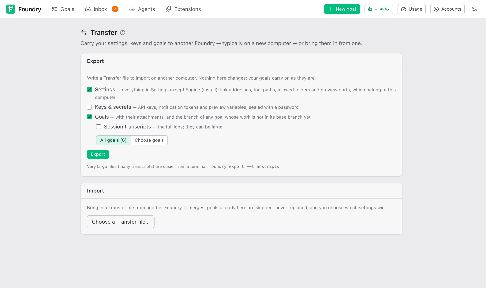
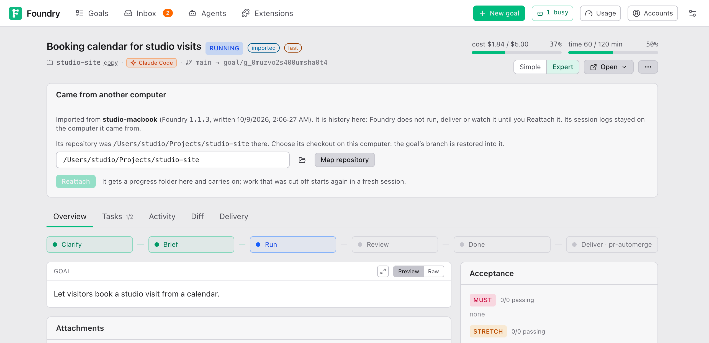

# Moving to a new computer

**Transfer** carries what one Foundry knows to another one, typically on a new computer: your settings, your keys and your goals. You export a file on the old computer and import it on the new one. Open it from the ⚙ menu at the right of the top bar: **Transfer — move to another computer**.

## Export

Tick what goes into the file, then press **Export**. The file downloads; nothing on this computer changes, and goals carry on as they are.

- **Settings**: everything in Settings, except what belongs to this computer: the **Engine (install)** section, the link address and tailnet name of **Notifications**, the markitdown path, the **Folder browser roots** and the preview ports.
- **Keys & secrets**: the API keys, the notification tokens and the variables you entered on goals' Preview cards. They are sealed with a password you type twice. Without it they cannot be read, and Foundry cannot recover it.
- **Goals**: **All goals**, or **Choose goals** one by one. A goal that follows one you left out says so, with a link to add it. Each goal brings its history, attachments and screenshots. When a goal's branch has work the base branch lacks, finished or not, the branch comes too. An unfinished goal also brings the files Git ignores in its progress folder, such as generated images and style samples.
- **Session transcripts**: the full session logs of those goals. They can be large; `foundry export --transcripts` in a terminal suits a big file better.

## Import

On the new computer, open **Transfer** and press **Choose a Transfer file…**. Foundry reads it and shows:

- **Goals**: each one new, *already here* or *deleted here*. Only new goals can be ticked. A goal already here is never replaced.
- **Repositories**: for each project the goals named, its folder on this computer. A folder at the same path with the same remote is filled in. Leave one empty to choose it later on the goal's page.
- **Settings that differ**: **Use imported** or **Keep mine**, section by section. Imported is preselected.
- **Keys & secrets**: tick **Bring Keys & secrets in**, type the password and press **Unlock** to see each key masked next to yours. Tick **keep mine** on any key you want to keep. Preview variables are added next to the ones already set here.

**Import** brings them in and lists what came, what was skipped and why.

## Imported goals

An imported goal is history: you can read everything about it and start a Follow-up from it, but Foundry does not run, deliver or watch it. Its page has an **imported** badge and a **Came from another computer** card:

- **Map repository** points it at its project folder here and puts its branch back.
- **Reattach** (unfinished goals only, once mapped) gives it a progress folder here and carries it on. Work that was cut off when the file was written starts again in a fresh session, and the attempt it lost is given back. If the goal is still running on the other computer, the two copies now go separate ways: stop it there first.

## What does not travel

Sign-ins, skills, MCP servers and plugins belong to each coding agent's own setup: sign in and install them on the new computer. For a complete copy of everything instead, see backup in [updates-and-backup.md](../operate/updates-and-backup.md).
