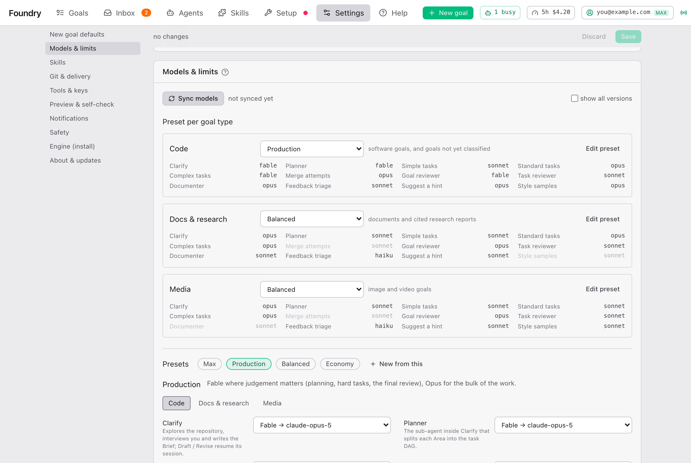

# 设置说明

> [English](./settings.md) · 中文

打开顶栏上的 **Settings**。各个部分列在左侧；本页按顺序介绍，用大白话讲你可能想动的控件，以及什么时候动。确切的键名、默认值和环境变量在运维参考 [configuration.md](../operate/configuration.md) 里。

## Settings 怎么用

- 改你想改的，然后按顶部栏里的 **Save**（它会显示 **N unsaved**）。**Discard** 放弃你的改动。有一个例外：在 [Skills](#skills) 下选择 skill 包，一点就立即保存。
- 大多数改动立即生效。少数标着 **restart**：Foundry 重启后才生效。
- 每个设置都有个小标记：**default**（从没改过）、**saved**（你在这里改过）或 **env**（由安装 Foundry 的人设定）。已保存的值旁边的 ↺ 箭头会忘掉它，回到默认值。

## New goal defaults

新 goal 一开始用什么。大多数都可以在 New goal 表单里针对单个 goal 修改。

| 设置 | 默认 | 作用 |
|---|---|---|
| **Default goal view** | expert | goal 打开时用哪个视图：simple 或 expert。 |
| **Pace for new goals** | thorough | **thorough — engine reviews the work** 或 **fast — approved checks only**。图片和视频 goal 总是以 fast 开始。 |
| **Interview before the Brief** | auto | **auto** 只在有值得问的事时才问；**always** 至少问一轮；**never** 直接写 Brief。 |
| **Effort for new goals** | CLI default | 会话思考得多用力，从 **low** 到 **max**。 |
| **TDD for new Expert goals** | required | 测试先行：**required**、**preferred** 或 **off**。 |
| **Goal-level fix cycles** | 1 | 最终审查在问你之前，最多可以派几轮修复任务。只用于 thorough 节奏。 |
| **Small goal (diff lines)** | 400 | 改动行数不超过这个数的 goal，最终审查更轻、更便宜。0 = 从不。 |
| **Review every task** | on | 对每个任务做一次简短审查，即使 Brief 没要求。只用于 thorough 节奏。 |

在 **Delivery — what happens to the branch when a goal finishes** 下：**Mode for new goals**（local only）、**Granularity**（one PR per goal）和 **Remote**（origin）。见 [拿到结果](./getting-the-result.zh.md)。

值得知道：New goal 表单会在这个浏览器里记住你上次的选择，并随每个 goal 一起发送。所以这里的 **Default goal view**、**Pace**、**TDD** 和交付默认值，影响的是不通过表单创建的 goal（比如从命令行创建的），而表单会保留你自己上次的选择。**Interview**、**Effort** 和模型预设则不同：只要表单保持默认，就跟随 Settings。

什么时候改：喜欢被提问的话，把 **Interview before the Brief** 设为 **always**；大多数 goal 都很小的话，调低 **Effort**；如果你宁愿自己看没通过的审查，把 **Goal-level fix cycles** 降到 0。

## Models & limits

这一部分决定哪个 Claude 模型做哪件事，以及一个会话最多能花多少。

### Presets

预设是一张表：每项工作由哪个模型来做。这些工作是：

| 工作 | 是什么 |
|---|---|
| **Clarify** | 读你的项目、访谈你、写 Brief。 |
| **Planner** | 在澄清阶段把 goal 拆成任务。 |
| **Simple tasks**, **Standard tasks**, **Complex tasks** | 干活的 worker，按 Brief 上设的难度区分。 |
| **Merge attempts** | 合并两个改了同一段代码的任务。 |
| **Goal reviewer** | 对整个结果的最终审查。单个会话里最贵的一个。 |
| **Task reviewer** | 对每个任务的简短审查。 |
| **Documenter** | 写完成文档。 |
| **Feedback triage** | 把你在里程碑时写的内容变成计划。 |
| **Suggest a hint** | 对 Inbox 里 blocked 任务的 AI 诊断。 |
| **Style samples** | Brief 上的样图。 |

Foundry 自带四个预设：

| 预设 | 简介 | Code 表 |
|---|---|---|
| **Max** | 所有地方都用最强的模型（Fable）。效果最好，费用最高。 | 全部用 Fable。 |
| **Production** | 需要判断力的地方用 Fable（规划、难的任务、最终审查），大部分工作用 Opus。 | Fable：Clarify、Planner、Complex tasks、Goal reviewer。Sonnet：Simple tasks、Task reviewer、Feedback triage。Opus：其余。 |
| **Balanced** | 规划和难的任务用 Opus，大部分工作和审查用 Sonnet，小检查用 Haiku。 | Opus：Clarify、Planner、Complex tasks。Haiku：Task reviewer、Feedback triage。Sonnet：其余。 |
| **Economy** | 规划和大部分工作用 Sonnet，简单任务和小检查用 Haiku。费用最低。 | Haiku：Simple tasks、Task reviewer、Feedback triage。Sonnet：其余。 |

每个预设有三张表，每种 goal 一张：**Code**、**Docs & research** 和 **Media**（图片和视频）。它们略有不同；Settings 里每张都能看到。预设用的是系列名（Fable、Opus、Sonnet、Haiku），所以新模型发布时会自动跟上。

### Preset per goal type

在 **Preset per goal type** 下，你为每种 goal 选用哪个预设：

| goal 类型 | 用于 | 默认 |
|---|---|---|
| **Code** | 软件类 goal，以及还没分类的 goal | Production |
| **Docs & research** | 文档和带引用的调研报告 | Balanced |
| **Media** | 图片和视频 goal | Balanced |

每个选项下面有一张预览表：每项工作和它将用的模型。灰掉的行是这类 goal 很少运行的工作。单个 goal 可以用别的预设：就是 New goal 表单上的 **Models** 选项。

什么时候改：想少花钱，就给 Code 选 **Economy** 或 **Balanced**（见 [费用与用量](./costs-and-usage.zh.md#怎样少花钱)）；质量比费用更重要时选 **Max**。

### 编辑预设

按某个 goal 类型旁边的 **Edit preset**，或者在 **Presets** 下点一个预设的名字，就能打开编辑器。

- 选 **Code**、**Docs & research** 或 **Media**，然后修改任意一项工作的模型。圆点 • 标记你改过的格子；鼠标悬停可以看到出厂值。
- **编辑内置预设**（Max、Production、Balanced、Economy）会把它标成 **modified**，编辑器和下拉菜单里都会显示。**Reset** 恢复 Foundry 自带的设置。如果 Foundry 之后为你改过的预设推出了更好的默认值，会显示 **newer default available**。
- **New from this** 创建你自己的预设，一开始是当前显示的那个的副本（"Production copy"）。给它起一个 **Name**，写一段描述。
- **你自己的预设**随时可以在 **Name** 字段里改名，用 **Delete** 删除。还在用已删除预设运行的 goal，会改用它所属 goal 类型的预设继续；原来用它的 goal 类型会回到默认。

按 **Save** 后改动生效：对新 goal 生效，对运行中的 goal 从下一个会话开始生效。

### Sync models

**Sync models** 询问你的 Claude Code 知道哪些模型（免费），并检查 Fable、Opus、Sonnet 和 Haiku 目前各指哪个模型，每个用一个很小的会话（总共约 $0.04）。旁边一行显示上次运行的时间、用的 Claude Code 版本，以及找到了多少个模型。

Foundry 启动时，如果发现 Claude Code 自上次同步后更新过，也会自己运行一次。更新 Claude Code 后想马上看到新模型，就自己按一下。

### 模型下拉菜单

预设编辑器里每个模型选项都提供：

- **Latest of each family**：Fable、Opus、Sonnet、Haiku。箭头显示每个名字目前指向的确切模型，比如 `Opus → claude-opus-…`。这些会跟着新版本走。大多数人留在这里就好。
- **Pinned (newest found)**：同步时找到的每个系列最新的确切版本。选一个，即使出了更新的版本，也会停留在这个版本上。
- **Older versions**：只有勾选了 **show all versions**（在 **Sync models** 旁边）时才出现。
- **custom id…**：输入 Claude Code 接受的任何模型名。

### Housekeeping model

**Housekeeping model**（默认 Haiku）做 Foundry 自己的一行小杂活：判断 goal 属于哪一类、总结日志、查看你的用量上限。每个 goal 只花几美分。它是唯一不由预设决定的模型。**Test** 运行一个很小的会话，确认模型可用，并显示它解析到哪个模型。

### Fallbacks

**Fallbacks (in order)**（默认 `opus, sonnet, haiku`）：当某个模型不可用时（已下线、名字打错、不在你的套餐里），Foundry 会用这个列表里的下一个重跑那个会话，并在这个 goal 里记住这个替代。只有全部都失败时才会问你。发生这种情况时，goal 的 Overview 会显示 **Model fallback** 卡片。

### 最后一次尝试换用 Complex tasks 模型

默认开启。一个任务允许两次或更多尝试时，它的最后一次尝试，以及你从 Inbox 额外给的每一次尝试，都用预设里 **Complex tasks** 的模型运行。在较便宜模型上失败的任务，回到你手上之前还能在最强的模型上再试一次。发生时 Activity 标签会说明。只有费用比完成更重要时才关掉它。

### Limits

**Limits — what one session may spend before the engine stops it**：

| 设置 | 默认 | 作用 |
|---|---|---|
| **Cost cap per session (USD)** | 10 | worker 会话花到这个数就停（也绝不会超过 goal 剩余的预算）。 |
| **Attempt timeout (minutes)** | 20 | 运行超过这个时间的会话会被停止。它已提交的内容会保留；Foundry 会续接或重试。 |
| **Continuations per attempt** | 2 | 被停止的会话在开始新尝试之前最多续接几次（续接更便宜，会保留它读过的内容）。 |
| **Turn cap per session** | 150 | 只用来拦住失控的循环。设宽松一点。 |
| **Concurrent Claude sessions** | 3 | 所有 goal 加起来同时运行几个会话。越高越快，花钱也越快。 |

什么时候改：如果大任务总是被中途截断，调高费用上限或超时；如果你经常碰到套餐的用量上限，调低 **Concurrent Claude sessions**。

## Skills

skill 是 Claude Code 可以遵循的打包指令。在这里选择 Foundry 把哪些交给它的会话。

- **Profile**：**mattpocock (mandated + observed)**（默认）告诉 worker 要遵循哪种工作方法（功能先写测试，bug 先诊断），并记录它们有没有照做。**plain (hint only)** 只是提一下。
- **Setting sources**：会话加载哪些 Claude Code 设置。留空。
- **autoskills per goal**（开）：你批准 Brief 后，把匹配你项目技术栈（React、Tailwind……）的 skill 加到 goal 的文件夹里。它们不会进入你的提交。
- **Design skills**、**Image skills**、**Video skills**：每类选一个包；只有这个包会交给前端、图片或视频任务。每个包显示 **installed** 或 **N missing**，并带一个 **Install** 按钮。选包会立即保存。图片包只有在 [Tools & keys](#tools--keys) 里有 key 时，才能生成真正的图片。

顶栏上的 **Skills** 页面显示所有已安装的内容，并可以更新。

## Git & delivery

Foundry 怎样跟上你项目的线上副本，以及交付要等多久。

- **Fetch the base branch before a goal starts**（开）：Foundry 规划前先看线上的最新版本。你自己的文件夹从不改动。
- **Where the goal branch starts**：**auto — remote tip when local is behind**（默认）在你的文件夹落后时，从更新的线上版本开始；**always the local branch** 完全从你文件夹里的内容开始。
- **Refresh between tasks**（关）：在繁忙项目里的长 goal 上，在任务之间把基础分支上的新工作并进来。默认关闭，因为 goal 中途的变化可能让 worker 措手不及。
- **Delivery timings (advanced)**：Foundry 多久查看一次 pull request（**Poll interval (s)**，30），等 CI 出现要等多久（**Grace before "no checks" (s)**，90）、等它跑完要等多久（**Checks timeout (min)**，30），以及分支受保护时等 auto-merge 要等多久（**Auto-merge wait under branch protection (min)**，10）。如果你的 CI 要跑半小时以上，调高 **Checks timeout**。

## Tools & keys

- **Use graphify for relevant-file discovery**（开）：安装了这个工具时，用代码地图找相关文件。
- **OpenAI-compatible API key**：图片 goal 要生成真正的图片就需要它。没有它，图片任务只能退回到手绘的 SVG 渲染。**OpenAI-compatible base URL**：只在用代理或其它兼容服务商时需要。
- **Gemini API key**：某个图片包的替代选择。
- **Kimi (Moonshot) API key**：某个设计包的模型会用到，在 skill 调用它们的时候。
- **markitdown binary**：把附件文档转成文字的转换器。留空。

key 对下一个会话生效，不用重启。更多见 [费用与用量](./costs-and-usage.zh.md#图片类-goal-需要图片-key)。

## Preview & self-check

预览就是运行中的 goal 结果，让你可以试用（见 [运行期间](./while-it-runs.zh.md#preview)）。

- **First port** 和 **Last port**（4200 到 4299）：预览使用这个范围内第一个空闲的端口。
- **Idle minutes**（60）：没人打开这么久的预览会被停止。里程碑在等你时从不停止。
- **Self-check new goals by default**（关）：为每个新 goal 打开自检。每个 goal 的 Preview 卡片上也有自己的开关。
- **Install Chromium**：自检需要一个隐藏的浏览器，下载一次（几百 MB）。装好后这一行显示 **Chromium installed**。

什么时候改：如果你的 goal 大多是 web 应用，就默认打开自检。

## Notifications

有事发生时，Foundry 可以在 Telegram 或 Discord 上给你发消息，这样你不用一直盯着页面。机器人或 webhook 的设置方法在 [notifications.md](../operate/notifications.md)；设好之后，按 **Send test message**。

**Link base URL**：你在手机上打开 Foundry 用的地址。设了它，消息里会带一个直达 goal 的链接。不设就没有链接。见 [remote-access.md](../operate/remote-access.md)。

六个开关，默认全开：

| 开关 | 什么时候收到消息 | 该做什么 |
|---|---|---|
| **Needs you** | 某个 goal 或任务在等你：一个问题、一个失败的任务、预算用完、一个里程碑要看。 | 打开 Inbox 或 goal 回应。你回应之前，那一部分会一直等着。见 [Foundry 什么时候需要你](./when-foundry-needs-you.zh.md)。 |
| **Interview round** | Foundry 写 Brief 前问一轮问题。 | 回答它们；goal 在等你。 |
| **Goal finished** | 某个 goal 以 done、over-delivered 或 failed 结束。你自己取消的不会发。 | 看结果，或看哪里失败了。 |
| **Delivery** | 有 pull request 开出或合并了，或者交付失败了。 | 审查 pull request，或看 Delivery 标签。 |
| **Usage pause** | 你的 Claude 套餐用量上限让所有工作暂停了；恢复时会再发一次。 | 什么都不用做。工作会自己恢复。 |
| **New version** | Foundry 出了新版本（每个版本一次）。 | 方便时更新，见 [About & updates](#about--updates)。 |

关掉你不想要的。这些开关对所有渠道都一样生效。

## Safety

- **Extra boundary patterns**：除了推送、部署和付费服务之外，Foundry 绝不能让会话自己执行的命令，比如 `terraform apply|kubectl`。被拦下的命令会进入你的 Inbox 等你批准。
- **Folder browser roots**：**Select folder…** 选择器可以打开哪些文件夹。留空表示你的主文件夹和外接硬盘。

## Engine (install)

给安装 Foundry 的人用的设置。除非你清楚为什么，否则别动。

- **Port**（4111）和 **Host**（127.0.0.1）：在哪里访问 Foundry。除非你设置了远程访问，否则保持 127.0.0.1。需要重启。
- **claude binary** 和 **Claude Code home**：Claude Code 及其 skill 所在的位置。留空会自动找到。需要重启。
- **Progress folders**：每个 goal 的文件夹在哪里创建。留空时放在你的项目旁边，即 `<project>-foundry/<goal>`。在这里填一个文件夹，就会变成 `<folder>/<project>/<goal>`。对今后创建的 goal 生效。

## About & updates

显示你运行的版本以及安装方式。**Check now** 查询是否有新版本（Foundry 每天也会自己查一次）。有新版本时，会出现 **Update to X** 按钮，附带更新内容，顶栏上也会出现一个标签。

更新对话框：

- **Update**：不再启动新会话，运行中的会话跑完，然后 Foundry 更新并重启。页面会自己重新加载。如果出了任何问题，会回滚，旧版本继续运行。
- **Update immediately without waiting — interrupts running agents**：只有等不了时才勾选。
- **Not now** 关闭对话框。
- 如果这个安装没法自己更新，对话框会改为显示要运行的命令。

运维细节：[updates-and-backup.md](../operate/updates-and-backup.md)。
