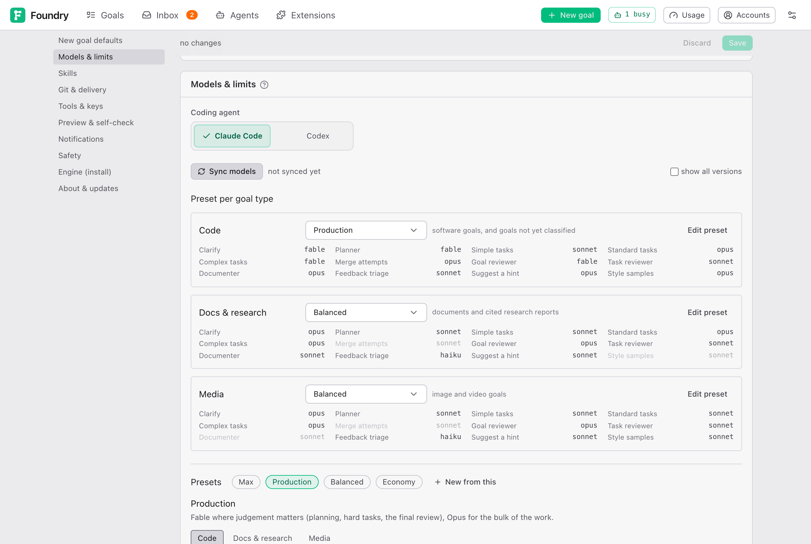
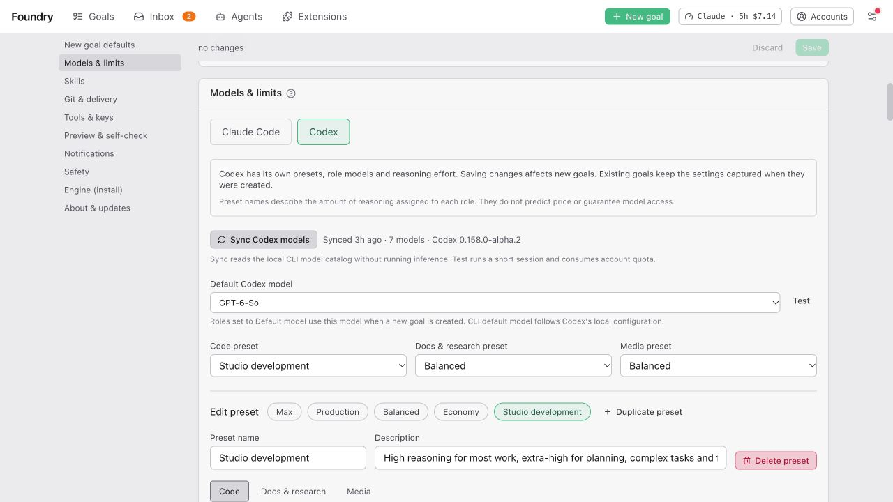
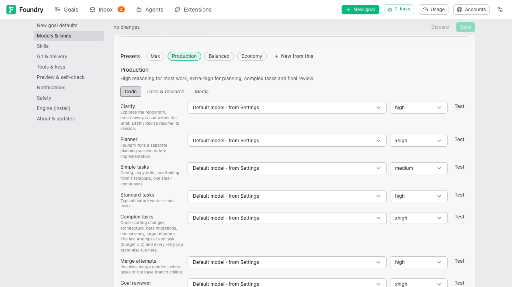
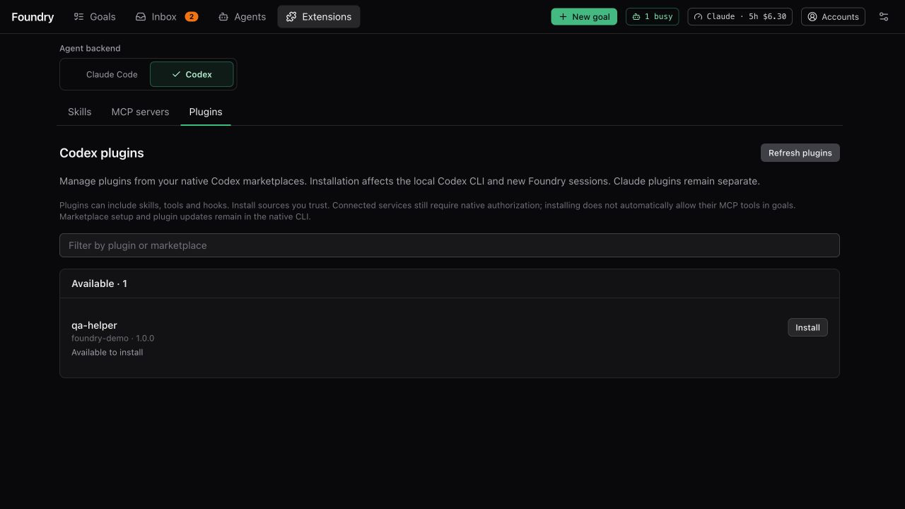
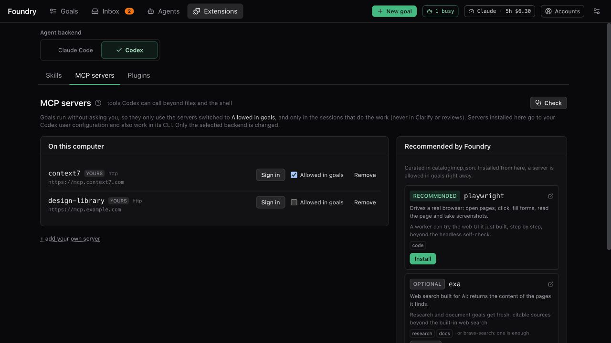

# 设置说明

## 两种编码智能体

**Models & limits** 使用统一的 **Coding agent**（编码智能体） 控件选择 **Claude Code** 或 **Codex**，各自拥有独立的预设和模型选项。Codex 任务在创建时保存各角色模型、推理强度和备用模型顺序；修改设置只影响新任务。**Claude cost cap per session (USD)** 只适用于 Claude。**Concurrent agent sessions** 是两种编码智能体共用的总并发上限。

**Engine (install)** 显示两种 CLI 路径和配置目录。**Default coding agent** 在启动时选择，不限制新建任务的编码智能体选择。打开旧数据目录时保留原启动配置，以正确识别历史记录。现有分开的数据目录不会自动合并。

**Setup** 和 **Extensions** 都可独立选择 **Claude Code** 或 **Codex**，不再跟随启动配置。安装、更新、回收站、OAuth 和 MCP 权限都操作所选编码智能体。Codex 使用自己的技能目录和共享 `.agents/skills`；autoskills 会把项目技能安装到 `.agents/skills` 并复制到任务 worktree，不进入提交。原生插件的安装和移除改在 **Extensions → Codex → Plugins** 管理。Codex 技能调用记录不可用，审核依据成果，不能据此判定没有使用技能。

> [English](./settings.md) · 中文

打开顶栏右侧的 ⚙ 菜单，选 **Settings**。各个部分列在左侧；本页按顺序介绍，用大白话讲你可能想动的控件，以及什么时候动。确切的键名、默认值和环境变量在运维参考 [configuration.md](../operate/configuration.md) 里。

## Settings 怎么用

- 改你想改的，然后按顶部栏里的 **Save**（它会显示 **N unsaved**）。**Discard** 放弃你的改动。有一个例外：在 [Skills](#skills) 下选择 skill 包，一点就立即保存。
- 大多数改动立即生效。少数标着 **restart**：Foundry 重启后才生效。
- 每个设置都有个小标记：**default**（从没改过）、**saved**（你在这里改过）或 **env**（由安装 Foundry 的人设定）。已保存的值旁边的 ↺ 箭头会忘掉它，回到默认值。

## New goal defaults

新 goal 一开始用什么。大多数都可以在 New goal 表单里针对单个 goal 修改。

| 设置 | 默认 | 作用 |
|---|---|---|
| **Default goal view** | expert | goal 打开时用哪个视图：simple 或 expert。 |
| **Pace for new goals** | thorough | **thorough — engine reviews the work** 或 **fast — approved checks only**。图片和视频 goal 总是以 fast 开始。 |
| **Interview before the Brief** | auto | **auto** 只在有值得问的事时才问；**always** 至少问一轮；**never** 直接写 Brief。 |
| **Effort for new goals** | Role preset / CLI default | 从 **low** 到 **max** 的全任务覆盖。默认使用 Codex 各角色预设，或 Claude CLI 默认值。 |
| **TDD for new Expert goals** | required | 测试先行：**required**、**preferred** 或 **off**。 |
| **Goal-level fix cycles** | 1 | 最终审查在问你之前，最多可以派几轮修复任务。只用于 thorough 节奏。 |
| **Small goal (diff lines)** | 400 | 改动行数不超过这个数的 goal，最终审查更轻、更便宜。0 = 从不。 |
| **Review every task** | on | 对每个任务做一次简短审查，即使 Brief 没要求。只用于 thorough 节奏。 |

在 **Delivery — what happens to the branch when a goal finishes** 下：**Mode for new goals**（local only）、**Granularity**（one PR per goal）和 **Remote**（origin）。见 [拿到结果](./getting-the-result.zh.md)。

值得知道：New goal 表单就从这些默认值开始。**Default goal view**、**Pace**、**TDD**、**Effort**，以及交付的 **Mode for new goals** 和 **Granularity** 都从这里填入；项目里有这里写的 **Remote** 时，表单也会选它。你在表单上改过的字段，会为这个 goal 保留你的选择。**Interview** 和模型预设只要在表单上保持默认，就跟随 Settings。Codex 主动选择 **Default** effort 则明确使用各角色的预设强度。表单自己会在这个浏览器里记住 goal 类型、预算，以及更细的交付选项（比如合并方式）。

什么时候改：喜欢被提问的话，把 **Interview before the Brief** 设为 **always**；大多数 goal 都很小的话，调低 **Effort**；如果你宁愿自己看没通过的审查，把 **Goal-level fix cycles** 降到 0。

## Models & limits

这一部分决定哪个模型做哪件事。先在 **Coding agent** 选择 **Claude Code** 或 **Codex**；两者的预设和模型目录互相独立。会话限制位于所选编码智能体的模型设置下方。

### Codex 预设与模型

在 **Coding agent → Codex**，分别选择 **Code preset**、**Docs & research preset** 和 **Media preset**。代码默认 Production，其他类型默认 Balanced。这些名字与 Claude 的预设互相独立：

| 预设 | 推理强度分配 |
|---|---|
| **Max** | 所有角色使用 `xhigh`；需要模型支持。 |
| **Production** | 大部分使用 `high`；Planner、Complex tasks、Goal reviewer 使用 `xhigh`，Simple tasks、Feedback triage 使用 `medium`，Housekeeping 使用 `low`。 |
| **Balanced** | 大部分使用 `medium`；Planner、Complex tasks、Goal reviewer 使用 `high`，Housekeeping 使用 `low`。 |
| **Economy** | 所有角色使用 `low`。 |

这些预设初始都使用 **Default model · from Settings**。**Default Codex model** 决定新任务如何解析这个默认模型；仍选 **CLI default model** 就跟随本机 Codex 配置，填写明确 ID 则固定模型。实际速度、额度消耗和可用性取决于模型与账户；Foundry 不会根据预设名称推算美元费用。

Auto 类型任务选择 Default 预设时，会在创建时保存三种任务类型的默认表。分类阶段先用 Code 表，判定类型后再使用对应的已保存表。明确选择某个预设，则各种任务类型始终使用该预设。

在 **Edit preset** 选择预设，再选 **Code**、**Docs & research** 或 **Media** 表。每个角色都有模型下拉框和 **Reasoning effort**。Codex 的 **Housekeeping** 也由预设控制。**Planner** 使用独立的 Foundry 规划会话。已同步的模型资料会限制可选推理强度；**CLI default** 不指定强度，交给 Codex。**Custom model ID…** 可输入目录中尚未出现的新模型或私有模型。

**Duplicate preset** 复制当前预设，随后可编辑 **Preset name** 和 **Description**。修改内置预设后会显示 **modified**；**Reset to built-in** 恢复出厂表格。**Delete preset** 删除自定义预设，使用它的任务类型会回到内置默认值。按 **Save** 后只影响新 Codex 任务。已有任务保留创建时的设置，即使原预设后来改名或删除，也不会被改变。

**Sync Codex models** 读取本机 CLI 模型目录，不运行推理。出现在目录中不代表当前账户一定能用。**Test** 会明确运行一次简短会话，检查所选模型和推理强度；它消耗账户额度。结果显示可用性，美元费用显示不可用。选择或保存模型不会自动执行 Test。

在 **Fallback models, in order**，用 **Add fallback**、上下箭头和移除按钮设置备用模型顺序。这里的 **CLI default model** 跟随本机 Codex 配置，不使用 Settings 中的基础模型。新任务会保存这个顺序。只有模型不可用时才切换备用模型；登录、额度或不支持的推理强度错误不会静默切换模型。没有备用模型时，模型不可用会请求你处理。

### Presets

以下预设说明对应 **Coding agent → Claude Code**；已有模型配置和行为保留不变。

预设是一张表：每项工作由哪个模型来做。这些工作是：

| 工作 | 是什么 |
|---|---|
| **Clarify** | 读你的项目、访谈你、写 Brief。 |
| **Planner** | 在澄清阶段把 goal 拆成任务。 |
| **Simple tasks**, **Standard tasks**, **Complex tasks** | 干活的 worker，按 Brief 上设的难度区分。 |
| **Merge attempts** | 合并两个改了同一段代码的任务；基础分支有了新进展而产生冲突时，也由它来解决。 |
| **Goal reviewer** | 对整个结果的最终审查。单个会话里最贵的一个。 |
| **Task reviewer** | 对每个任务的简短审查。 |
| **Documenter** | 写完成文档。 |
| **Feedback triage** | 把你在里程碑时写的内容变成计划。 |
| **Suggest a hint** | 对 Inbox 里 blocked 任务的 AI 诊断。 |
| **Style samples** | Brief 上的样图。 |

Foundry 自带四个预设：

| 预设 | 简介 | Code 表 |
|---|---|---|
| **Max** | 所有地方都用最强的模型（Fable）。效果最好，费用最高。 | 全部用 Fable。 |
| **Production** | 需要判断力的地方用 Fable（规划、难的任务、最终审查），大部分工作用 Opus。 | Fable：Clarify、Planner、Complex tasks、Goal reviewer。Sonnet：Simple tasks、Task reviewer、Feedback triage。Opus：其余。 |
| **Balanced** | 规划和难的任务用 Opus，大部分工作和审查用 Sonnet，小检查用 Haiku。 | Opus：Clarify、Planner、Complex tasks。Haiku：Task reviewer、Feedback triage。Sonnet：其余。 |
| **Economy** | 规划和大部分工作用 Sonnet，简单任务和小检查用 Haiku。费用最低。 | Haiku：Simple tasks、Task reviewer、Feedback triage。Sonnet：其余。 |

每个预设有三张表，每种 goal 一张：**Code**、**Docs & research** 和 **Media**（图片和视频）。它们略有不同；Settings 里每张都能看到。预设用的是系列名（Fable、Opus、Sonnet、Haiku），所以新模型发布时会自动跟上。

### Preset per goal type

在 **Preset per goal type** 下，你为每种 goal 选用哪个预设：

| goal 类型 | 用于 | 默认 |
|---|---|---|
| **Code** | 软件类 goal，以及还没分类的 goal | Production |
| **Docs & research** | 文档和带引用的调研报告 | Balanced |
| **Media** | 图片和视频 goal | Balanced |

每个选项下面有一张预览表：每项工作和它将用的模型。灰掉的行是这类 goal 很少运行的工作。单个 goal 可以用别的预设：就是 New goal 表单上的 **Models** 选项。

什么时候改：想少花钱，就给 Code 选 **Economy** 或 **Balanced**（见 [费用与用量](./costs-and-usage.zh.md#怎样少花钱)）；质量比费用更重要时选 **Max**。

### 编辑预设

按某个 goal 类型旁边的 **Edit preset**，或者在 **Presets** 下点一个预设的名字，就能打开编辑器。

- 选 **Code**、**Docs & research** 或 **Media**，然后修改任意一项工作的模型。圆点 • 标记你改过的格子；鼠标悬停可以看到出厂值。
- **编辑内置预设**（Max、Production、Balanced、Economy）会把它标成 **modified**，编辑器和下拉菜单里都会显示。**Reset** 恢复 Foundry 自带的设置。如果 Foundry 之后为你改过的预设推出了更好的默认值，会显示 **newer default available**。
- **New from this** 创建你自己的预设，一开始是当前显示的那个的副本（"Production copy"）。给它起一个 **Name**，写一段描述。
- **你自己的预设**随时可以在 **Name** 字段里改名，用 **Delete** 删除。还在用已删除预设运行的 goal，会改用它所属 goal 类型的预设继续；原来用它的 goal 类型会回到默认。

按 **Save** 后改动生效：对新 goal 生效，对运行中的 goal 从下一个会话开始生效。

### Sync models

**Sync models** 询问你的 Claude Code 知道哪些模型（免费），并检查 Fable、Opus、Sonnet 和 Haiku 目前各指哪个模型，每个用一个很小的会话（总共约 $0.04）。旁边一行显示上次运行的时间、用的 Claude Code 版本，以及找到了多少个模型。

Foundry 启动时，如果发现 Claude Code 自上次同步后更新过，也会自己运行一次。更新 Claude Code 后想马上看到新模型，就自己按一下。

### 模型下拉菜单

预设编辑器里每个模型选项都提供：

- **Latest of each family**：Fable、Opus、Sonnet、Haiku。箭头显示每个名字目前指向的确切模型，比如 `Opus → claude-opus-…`。这些会跟着新版本走。大多数人留在这里就好。
- **Pinned (newest found)**：同步时找到的每个系列最新的确切版本。选一个，即使出了更新的版本，也会停留在这个版本上。
- **Older versions**：只有勾选了 **show all versions**（在 **Sync models** 旁边）时才出现。
- **custom id…**：输入 Claude Code 接受的任何模型名。

### Housekeeping model

**Housekeeping model**（默认 Haiku）做 Foundry 自己的一行小杂活：判断 goal 属于哪一类、总结日志、查看你的用量上限。每个 goal 只花几美分。它是唯一不由预设决定的模型。**Test** 运行一个很小的会话，确认模型可用，并显示它解析到哪个模型。

### Fallbacks

**Fallbacks (in order)**（默认 `opus, sonnet, haiku`）：当某个模型不可用时（已下线、名字打错、不在你的套餐里），Foundry 会用这个列表里的下一个重跑那个会话，并在这个 goal 里记住这个替代。只有全部都失败时才会问你。发生这种情况时，goal 的 Overview 会显示 **Model fallback** 卡片。

### 最后一次尝试换用 Complex tasks 模型

默认开启。一个任务允许两次或更多尝试时，它的最后一次尝试，以及你从 Inbox 额外给的每一次尝试，都用预设里 **Complex tasks** 的模型运行。在较便宜模型上失败的任务，回到你手上之前还能在最强的模型上再试一次。发生时 Activity 标签会说明。只有费用比完成更重要时才关掉它。

### Limits

**Limits — what one session may spend before the engine stops it**：

| 设置 | 默认 | 作用 |
|---|---|---|
| **Claude cost cap per session (USD)** | 10 | Claude worker 花到这个数就停（也不会超过 goal 剩余预算）。Codex 没有美元上限。 |
| **Attempt timeout (minutes)** | 20 | 运行超过这个时间的会话会被停止。它已提交的内容会保留；Foundry 会续接或重试。 |
| **Continuations per attempt** | 2 | 被停止的会话在开始新尝试之前最多续接几次（续接更便宜，会保留它读过的内容）。 |
| **Turn cap per session** | 150 | Claude 的模型轮数；Codex 的工具调用次数。设宽松一点。 |
| **Concurrent agent sessions** | 3 | 两种编码智能体的所有 goal 加起来同时运行的会话总数。 |

什么时候改：如果大任务总是被中途截断，调高超时或 Claude 费用上限；如果你经常碰到套餐的用量上限，调低 **Concurrent agent sessions**。

## Skills

skill 是所选编码智能体可以遵循的打包指令。在这里选择 Foundry 把哪些交给它的会话。

- **Profile**：**mattpocock (mandated + observed)**（默认）告诉 worker 要遵循哪种工作方法（功能先写测试，bug 先诊断），并记录它们有没有照做。**plain (hint only)** 只是提一下。
- **Setting sources**（仅 Claude）：会话加载哪些 Claude Code 设置。留空。
- **autoskills per goal**（开）：你批准 Brief 后，把匹配你项目技术栈（React、Tailwind……）的 skill 加到 goal 的文件夹里。它们不会进入你的提交。
- **Design skills**、**Image skills**、**Video skills**：每类选一个包；只有这个包会交给前端、图片或视频任务。每个包显示 **installed** 或 **N missing**，并带一个 **Install** 按钮。选包会立即保存。图片包只有在 [Tools & keys](#tools--keys) 里有 key 时，才能生成真正的图片。已安装的技能缺少它需要的 key 时，它的卡片上会显示 **⚠ key missing**，写明是哪个 key、缺了它会少什么；点它就会跳到 **Tools & keys**。

顶栏上的 **Extensions** 页面放着 skill、MCP server 和原生 Codex 插件。下述技能更新状态及整包卸载细节适用于 Claude。Codex 的 **Skills** 清单显示独立的原生及共享技能，插件包另在 **Plugins** 显示。共享技能（在 `~/.agents/skills`，其他智能体也会读取）可以在这里卸载，包括手动安装的；卸载后进入回收站，恢复时回到原来的文件夹。如果 Claude Code 也通过它自己技能目录里的链接使用某个共享技能，就不能在这里卸载：请先在 **Claude Code** 那边卸载，免得 Claude Code 留下一个失效的链接。每个技能都有一个状态：**outdated**（有新版本 —— 按 **Update**）、**unreleased**（插件作者在上游改了它，但没有提高版本号，所以 CLI 暂时没有新东西可装）、**modified**（你的副本被改过）或 **up to date**（只有 README 或 changelog 不同不算）。像 ffmpeg 这样的命令行工具，只要找得到它的命令就算已安装。插件的技能只能一起删除，用 **Uninstall plugin**。你手动安装的副本，如果 Foundry 自己能安装这个技能，就会出现 **Adopt**：用一个由 Foundry 负责更新的副本替换它。你在那里发起的每次安装、更新、接管（adopt）或卸载，都会在页面底部的 **Operations** 栏里打开一个标签页，带着它自己的日志；几个操作可以同时进行。完成的标签页会一直留着，直到你关掉它；这个栏也可以收起成一行计数。

### Skill compatibility

兼容性取决于技能实际使用的工具及依赖，而不是作者。目录会按 **Coding agent** 选择安装方案；Claude 专属方案不会进入 Codex 的推荐目录或工作流提示。

| 技能 | Codex 下的行为 |
|---|---|
| Anthropic `frontend-design` / `webapp-testing` | 通用指令，可使用。网页测试另需 Python、Python Playwright 和 Chromium。 |
| `skill-creator` | 使用 OpenAI 版本。如果已有 Anthropic 旧副本，展开 **Catalog**，找到 `skill-creator` 并按 **Replace**；旧副本放入回收站。共享技能仍在原位置管理。 |
| `claude-api` | 给使用 Anthropic SDK 的项目参考，不会改变 Foundry 登录方式，也不要求由 Claude 执行；不会再自动推荐给所有 worker。 |
| Graphify / Impeccable | 分别使用 Codex 安装命令及原生技能目录。旧的 Foundry 管理的 Impeccable 副本需执行更新，以换成当前原生版本。 |
| gstack / Claude 插件安装方案 | 不在 Codex 技能目录推荐。上游 gstack 的 Codex 适配仍属实验性，外部评审需要 Claude CLI；Codex 原生插件使用独立的 **Plugins** 标签。 |
| 图片 / 视频技能 | 仍需渲染工具、项目依赖及相关服务凭据。ChatGPT 登录不会为后台会话提供图片 API key 或桌面应用的图片工具。 |

**installed** 表示找到了技能，不代表它需要的每个工具或服务都已配置。个人及共享技能仍然可见，不会因推荐目录改变被删除。若上游明确指定的技能路径消失，安装会指出缺失路径，不会改装另一种 agent 的同名技能。

### Codex plugins

选择 **Codex** 后打开 **Plugins**。**Installed** 和 **Available** 分别显示原生 marketplace 返回的已安装及可安装插件；可按插件或 marketplace 过滤，在 CLI 修改后按 **Refresh plugins** 刷新。**Install** 和 **Remove** 会先显示确认弹窗，再在 **Operations** 显示进度；完成后刷新清单，原生安装状态确认成功才会报告成功。

安装使用配置的 Codex 目录，与本机 CLI 共用；新会话加载已启用的组件。插件可以含 skills、工具和 hooks，请选择信任的来源。移除会删除原生用户安装及缓存包，需要恢复时从 marketplace 重新安装。Foundry 检测到有工作正在运行时会拒绝变更。Claude 插件保持独立。

**Installed · disabled by native configuration** 表示已安装但被原生配置停用；**Managed in Codex** 表示 marketplace 策略不允许此页面变更。Marketplace 设置、插件更新及启用／停用仍在原生 CLI 处理。外部服务仍须独立授权，安装不会自动授予 MCP 工具的 **Allowed in goals** 权限。CLI 不支持兼容的插件 JSON 命令时，页面显示 **Native plugin list unavailable**，可更新 CLI 后重试。

### MCP servers

先在 **Extensions** 选择编码智能体，再打开 **MCP servers**。Codex 使用原生配置；**Check** 建立新连接并发现工具，不运行推理。支持 stdio、streamable HTTP 及 HTTP OAuth 登录，不支持旧式 SSE。可在此新增、替换和移除原生用户级服务器。运行中的会话维持现有连接，新会话采用新配置。两种编码智能体各有独立的 **Allowed in goals** 清单，Codex 默认不允许任何服务器。以下连接器和插件细节适用于 Claude Code。

MCP server 让 Claude Code 能用文件和命令行以外的工具，比如最新的库文档、一个真的浏览器、网页搜索、你的邮箱。**Extensions** 页面有一个 **MCP servers** 标签页，列出 Claude Code 为你的账号加载的 server：你自己装的（**yours**）、插件带来的（**plugin**）和你的 claude.ai 连接器（**claude.ai**）。**Check** 会逐个连上去，看它能不能用；它不会自动运行，因为它会启动每一个 server。

有些 server 要先连上账号才能用。claude.ai 连接器（Gmail、Google Drive……）有一个 **Connect** 按钮：它会打开 claude.ai，你在那里用它该用的账号授权；Claude Code 和 Foundry 共用这个连接。通过 URL 访问的 server 有 **Sign in**：会在运行 Foundry 的电脑上打开浏览器；如果那里没有浏览器（Docker），你就自己打开链接，再把浏览器最后停在的地址贴回来。如果登录没法在 Foundry 里完成，窗口会给出一条在你自己终端里运行的命令（比如 `claude mcp login context7`），带复制按钮。按过 **Check** 之后，还需要这样做的 server 会显示 **needs auth** 和一个 **Set up** 按钮。

goal 运行时不会问你，所以只有勾上 **Allowed in goals** 的 server，它的工具才会被 goal 用到，而且只在真正干活的会话里，Clarify 和审查都不会用。你自己装的 server 和 claude.ai 连接器默认不勾：邮箱连接器可能会自己发邮件。

**Recommended by Foundry** 列出值得装的 server。**context7**（库的最新文档）和 **playwright**（一个真的浏览器）不需要 key，是推荐项；它们没装时 Setup 会提醒你。**exa** 和 **brave-search** 给调研类 goal 加上网页搜索，需要 key：按 **Install…**，贴上 key，再按 **Install**。两个装一个就够了。从这里装的 server 会直接允许 goal 使用。

**+ add your own server** 填一个名字和一个命令或 URL。命令类的 server 可以按 `NAME=value` 一行一个填 key；URL 类的 server 不填 key，而是在它那一行按 **Sign in** 登录。装好后默认不勾；已装的 server 那一行的 **Change key…** 可以换掉它的 key。server 是给你整个用户账号装的，所以你终端里的 Claude Code 也能用，**Remove** 也会把它从那里删掉。key 由 Claude Code 跟 server 一起保存，Foundry 不留副本。插件带来的 server 随插件一起删；claude.ai 连接器在 claude.ai 上管理。

如果某个任务因为某个 server 的工具被拒绝而失败，Inbox 会告诉你是哪个 server，并提供 **Allow this server and retry**。

## Git & delivery

Foundry 怎样跟上你项目的线上副本，以及交付要等多久。

- **Fetch the base branch before a goal starts**（开）：Foundry 规划前先看线上的最新版本。你自己的文件夹从不改动。
- **Where the goal branch starts**：**auto — remote tip when local is behind**（默认）在你的文件夹落后时，从更新的线上版本开始；**always the local branch** 完全从你文件夹里的内容开始。
- **Refresh between tasks**（关）：在繁忙项目里的长 goal 上，在任务之间把基础分支上的新工作并进来。默认关闭，因为 goal 中途的变化可能让 worker 措手不及。
- **Commit author**：Foundry 的提交写谁的名字。**you, with Foundry as co-author**（默认）用你的 git 身份 —— 项目的，没有就用全局的，再没有就用你的 GitHub 账号 —— 并加一行 `Co-authored-by: Foundry`；**you only** 不加这一行；**Foundry only** 用 `foundry` 作为作者。Vercel 团队这类部署集成会拒绝不是成员的作者的提交，所以如果你用了这类集成，就选带"you"的选项。只影响之后的新提交。
- **Update my local base branch after a merge**（开）：pull request 合并后，Foundry 在安全的时候把你自己的基础分支 fast-forward，然后删掉 goal 的进度文件夹、worktree 和本地分支。关掉：你自己 pull，文件夹一直留到你删除这个 goal。见 [拿到结果](./getting-the-result.zh.md#pull-request-合并之后)。
- **Delivery timings (advanced)**：Foundry 多久查看一次 pull request（**Poll interval (s)**，30），等 CI 出现要等多久（**Grace before "no checks" (s)**，90）、等它跑完要等多久（**Checks timeout (min)**，30），以及分支受保护时等 auto-merge 要等多久（**Auto-merge wait under branch protection (min)**，10）。如果你的 CI 要跑半小时以上，调高 **Checks timeout**。

## Tools & keys

- **Use graphify for relevant-file discovery**（开）：安装了这个工具时，用代码地图找相关文件。
以下媒体服务 key 与编码智能体登录无关。Codex 始终只用 ChatGPT 登录，填写图片 key 不会启用 API-key 推理。

- **OpenAI-compatible API key**：图片 goal 要生成真正的图片就需要它。没有它，图片任务只能退回到手绘的 SVG 渲染。**OpenAI-compatible base URL**：只在用代理或其它兼容服务商时需要。
- **Gemini API key**：某个图片包的替代选择。
- **Kimi (Moonshot) API key**：某个设计包的模型会用到，在 skill 调用它们的时候。
- **MiniMax API key**：通过 mmx 做视频和配音时用。如果你已经在这台电脑上用 `mmx auth login` 登录过，就留空；用 Docker 的话要填。
- **ElevenLabs API key** 和 **Groq API key**：视频包用到时，分别用于配音声音和视频字幕的语音转文字。
- **markitdown binary**：把附件文档转成文字的转换器。留空。

key 对下一个会话生效，不用重启。保存过的 key 不会再显示出来，连这个页面也拿不到：输入框里只显示 `saved: sk-p…9f3a — type to replace`。输入新的 key 就会替换它，按输入框旁边的 ↺ 就会删掉它。Notifications 里的 Telegram token 和 Discord webhook 也一样。更多见 [费用与用量](./costs-and-usage.zh.md#图片类-goal-需要图片-key)。

## Preview & self-check

预览就是运行中的 goal 结果，让你可以试用（见 [运行期间](./while-it-runs.zh.md#preview)）。

- **First port** 和 **Last port**（4200 到 4299）：预览使用这个范围内第一个空闲的端口。
- **Idle minutes**（60）：没人打开这么久的预览会被停止。里程碑在等你时从不停止。
- **Self-check new goals by default**（关）：为每个新 goal 打开自检。每个 goal 也有自己的开关，在 Brief 的 **How to run it** 部分和它的 Preview 卡片上。
- **Install Chromium**：自检需要一个隐藏的浏览器，下载一次（几百 MB）。装好后这一行显示 **Chromium installed**。

什么时候改：如果你的 goal 大多是 web 应用，就默认打开自检。

## Notifications

有事发生时，Foundry 可以在 Telegram 或 Discord 上给你发消息，这样你不用一直盯着页面。机器人或 webhook 的设置方法在 [notifications.md](../operate/notifications.md)；设好之后，按 **Send test message**。

**Link base URL**：你在手机上打开 Foundry 用的地址。设了它，消息里会带一个直达 goal 的链接。不设就没有链接。见 [remote-access.md](../operate/remote-access.md)。

六个开关，默认全开：

| 开关 | 什么时候收到消息 | 该做什么 |
|---|---|---|
| **Needs you** | 某个 goal 或任务在等你：一个失败的任务、一条被拦下的命令、预算用完、一个里程碑要看。 | 打开 Inbox 或 goal 回应。你回应之前，那一部分会一直等着。见 [Foundry 什么时候需要你](./when-foundry-needs-you.zh.md)。 |
| **Interview round** | Foundry 写 Brief 前问一轮问题。 | 回答它们；goal 在等你。 |
| **Goal finished** | 某个 goal 以 done、over-delivered 或 failed 结束。你自己取消的不会发。 | 看结果，或看哪里失败了。 |
| **Delivery** | 有 pull request 开出或合并了，或者交付失败了。 | 审查 pull request，或看 Delivery 标签。 |
| **Usage pause** | 某个编码智能体达到用量上限而暂停新会话，重新尝试时再通知；另一个编码智能体仍可继续。 | Foundry 自动重试；持续失败时检查 Accounts 和 Usage。 |
| **New version** | Foundry 出了新版本（每个版本一次）。 | 方便时更新，见 [About & updates](#about--updates)。 |

关掉你不想要的。这些开关对所有渠道都一样生效。

## Safety

- **Extra boundary patterns**：除了内置的那些（推送、pull request、发布版本、发布包、部署、云工具）之外，Foundry 绝不能让会话自己执行的命令，比如 `terraform apply|kubectl`。被拦下的命令会进入你的 Inbox 等你批准。
- **Folder browser roots**：**Select folder…** 选择器可以打开哪些文件夹。留空表示你的主文件夹和外接硬盘。

## Engine (install)

给安装 Foundry 的人用的设置。除非你清楚为什么，否则别动。

- **Port**（4111）和 **Host**（127.0.0.1）：在哪里访问 Foundry。除非你设置了远程访问，否则保持 127.0.0.1。需要重启。
- **claude binary** 和 **Claude Code home**：Claude Code 及其 skill 所在的位置。留空会自动找到。需要重启。
- **Codex binary** 和 **Codex home**：Codex 程序和原生账户／配置目录。留空使用 PATH 及 `CODEX_HOME` 或 `~/.codex`。需要重启。启动配置保持固定，每个 goal 的编码智能体在 New goal 选择。
- **Progress folders**：每个 goal 的文件夹在哪里创建。留空时放在你的项目旁边，即 `<project>-foundry/<goal>`。在这里填一个文件夹，就会变成 `<folder>/<project>/<goal>`。对今后创建的 goal 生效。

## About & updates

显示你运行的版本以及安装方式。**Check now** 查询是否有新版本（Foundry 每天也会自己查一次）。有新版本时，会出现 **Update to X** 按钮，附带更新内容，顶栏上也会出现一个标签。

更新对话框：

- **Update**：不再启动新会话，运行中的会话跑完，然后 Foundry 更新并重启。页面会自己重新加载。本机代码更新失败时会尝试恢复旧 checkout，这不等于数据库回退。升级混合编码智能体数据前先备份；要运行旧程序，必须恢复匹配的升级前备份。
- **Update immediately without waiting — interrupts running agents**：只有等不了时才勾选。
- **Not now** 关闭对话框。
- 如果这个安装没法自己更新，对话框会改为显示要运行的命令。

运维细节：[updates-and-backup.md](../operate/updates-and-backup.md)。
