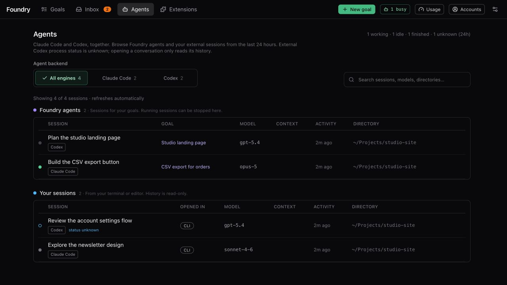

# While it runs

> English · [中文](./while-it-runs.zh.md)

## Provider-aware reporting

Codex task details and activity mark dollar costs, model-turn counts and skill telemetry as unavailable. Its live tool logs, saved transcripts and Foundry sessions remain visible. **Agents** also shows recent external Claude and Codex sessions, labelled by coding agent. External Codex history is read-only and bounded to recent records; **status unknown** means Foundry cannot verify that external process's liveness. It does not mean idle or finished. Native read failures appear as warnings, and external sessions cannot be stopped here.

A Codex goal's **Codex models** card shows the saved role table, goal-wide overrides and fallback order. Other captured goal-type tables can also be inspected. Later changes to Settings never rewrite this snapshot; legacy goals without a snapshot are labelled explicitly.


After you approve the Brief, Foundry works on its own. You can close the browser; the work continues on your computer. This page explains the goal page, so you can follow along when you want to.


## The goal page at a glance

Open a goal from **Goals** (the list in the top bar). At the top of its page:

- The title, a state badge (for example **running**, **have a look**, **reviewing**, **done**), and a **fast** chip if the goal runs in fast mode.
- The project folder (with **copy** for its path), the goal's coding agent (**Claude Code** or **Codex**) and the branches: the one the goal started from → the goal's own branch. The **Goals** list shows the same coding agent next to each project path. Each of its rows stacks related facts: title, coding agent and folder; state and task counts; cost and time against their limits; last update and creation date. It shows 10 goals per page by default, newest first, with the count and the page at the bottom; choose 20 or 50 per page there (remembered in this browser). The page number is kept in the address.
- **Time** in minutes against the limit; Claude also shows **cost** against its USD budget. Codex dollar cost is unavailable.
- **Open ▾**: open the project or the progress folder on your computer (see [The progress folder](#the-progress-folder)).
- One main button that changes with the state: **Review brief →** while the Brief waits, **Cancel** while it runs, **Deliver…**, **Delivering…** or **Delivery** when it is done.
- **⋯** (More actions): **Restart…**, **Re-run Clarify**, **Cancel goal**, **Delete goal…**, whichever apply.

Below that, cards appear only when they matter: the milestone card when the goal waits for your look, the interview while Foundry asks questions, and **Goal review…** with a live log while the final review runs.

If a coding agent reaches its usage limit, the banner identifies it and the retry time. Only that coding agent’s new sessions pause. Without a reported reset, Foundry retries after a delay; the retry does not guarantee recovered quota. See [Costs and usage](./costs-and-usage.md).

## Simple view: progress

In Simple view the goal page shows:

- One sentence about what is happening, for example "Working." or "Paused — something needs you (see below)."
- **Needs you**: anything waiting for you, with the buttons to answer it.
- **Progress**: a bar with **N/M pieces** done, and the tasks in progress right now: **in progress**, **checking**, or **combining with the rest**.
- Elapsed time and applicable limits. Claude shows estimated cost; Codex does not show an enforceable USD cap.
- **Result**, when the goal is done: where the work is, **Open ▾**, and **Deliver…**.

**Simple | Expert** in the goal's header switches views; it stays in the same place in both. **Expert** shows everything else.


## Expert view tabs

| Tab | What it shows |
|---|---|
| **Overview** | Where the goal stands, what needs you, the progress folder, the preview, acceptance checks. A number on the tab means something waits for you. |
| **Tasks** | The task graph with each task's state. Shows **done/total · N running**. |
| **Activity** | Everything that happened, newest first. |
| **Diff** | Every change compared with where the goal started. |
| **Delivery** | What happens to the result, and its progress. See [Getting the result](./getting-the-result.md#the-delivery-tab). |

## Overview


From top to bottom:

- **The timeline**: **Clarify → Brief → Run → Review → Done** (or **Over-delivered**), plus **Deliver · mode** if the goal pushes or opens a pull request. The current stage pulses. Click a stage to jump to where its work is shown.
- **Brief**: one line under the timeline, for example **Brief APPROVED · 36 tasks · 11/11 assumptions accepted · 9/12 questions answered · est. $380 / 1500 min**. Click it to open the Brief, where the Understanding and everything else the Clarifier wrote are.
- **What needs you**: the same cards as in the Inbox, with their buttons.
- **goal**: your original description. **Open full**, the icon with two diagonal arrows in its corner, reads it in a larger window.
- **Goal review**: right under the goal once the final review ran: one line with the verdict (**passed**, **over-delivered** or **failed**) and the start of the reviewer's notes; **reviewer notes** unfolds them.
- **Attachments**: right under the goal, as on the New goal form. You can add more at any time; new sessions receive them.
- **Workspace & preview**: where the goal's work is, and starting it to try it. See [The progress folder](#the-progress-folder) and [Preview](#preview).
- **Milestones**: when the goal has milestones, one row each, the latest first: what to look at, when it landed, whether the goal paused for it or went on, and your answer. Click a row to watch its recording and screenshots again (a screenshot opens large).
- **Model fallback**: only if a model was unavailable and Foundry switched to another one.
- **Project skills**: skills Foundry added for your project's technology, grouped as Frontend, Backend, Database, Testing and Tooling, with how many there are. They never reach your commits.
- **Completion**: one row each for the documents, the graph refresh and media files, with how it went. See [Completion extras](./getting-the-result.md#completion-extras).
- **Acceptance** (on the right): every **must** and **stretch** check with its latest result, for example **3/4 passing**. Click a check to open it in a window: what it checks (the command, or the reviewer's rubric), the output of its latest run with **Show the whole output** when it was cut, and every run it had, newest first; click a run to see its output. Below them, the **Self-check** switch and its latest result (see [Self-check](#self-check)), and **Have a look: pause at milestones** when the goal has milestones (see [Milestones](#milestones)).

## Tasks

The **Tasks** tab draws the plan as a graph. Each card is a task with its state, its attempts so far out of those allowed (for example 2/3) what the task has cost so far, all attempts together, its difficulty (**simple**, **standard** or **complex**, which picks the model from the preset) and the model its latest attempt ran on. Arrows show which task waits for which. On a phone the graph becomes a list.


### Task states

A task moves from **pending** (waiting for other tasks) to **ready**, **running**, **observing** (its checks and review run), **merging** (joining the goal's branch) and **done**. A task can also be **blocked** (it needs you), **failed** or **skipped**.

What each state and message means, and which ones need nothing from you, is in [When Foundry needs you](./when-foundry-needs-you.md#task-states).

### Inside a task


Click a task to open it over the goal page (Escape, × or a click beside it closes it). The panel always fills the window's height; on a wide screen the left column and the attempt beside it scroll separately, so a long list of files never scrolls the live log away. You see:

- Its title, state, tags and, once done, its commit. Click the commit line to read the whole commit message.
- **Task total**: attempts, cost (split into worker and reviewer), turns and minutes so far.
- **spec** and, if you gave one, the **human hint** right under it (the **Open full** icon reads either in a larger window), its **Checks** with their latest result, and **Relevant files** (click one to open it; a grey one exists nowhere yet, usually a file the plan meant the task to create).
- **Files**: what the task added or changed (**Files so far** while it runs). Images show as thumbnails. Click any file to see it in the page: pictures, PDFs, video and audio play right there, and code (coloured by language, with line numbers), Markdown and JSON are shown formatted. You need no editor on the computer Foundry runs on, so this works from a phone or over [remote access](../operate/remote-access.md) too. A finished task's files are read from its commit in your repository, so they stay after delivery removes the task's folders; images and video of an image or video goal, which are never committed, are listed with the task that made them.
- **This task is waiting for you**, if it is blocked, with the buttons to answer.
- One chip per attempt: **#1**, **#2** … with its result and cost. **↻1** means the session was resumed once instead of starting over, preserving its context.
- For the chosen attempt: the result, the worker model, turns, cost, start time, duration, and which skills it used, then every session that ran for it.
- Buttons: **Restart from here** (this task and everything after it run again), **Open worktree** (the task's own folder while it runs), and **Resolve manually** if a merge conflict needs you.

### Live logs

Inside a task, **Live log** shows what the worker is doing right now: what it says, the tools it uses (⚙), their results, and a line per session. At the end of a session, the `■` line also shows the worker's final message.

Every entry is one line, cut off at the edge of the box. Click a line (or Tab to it and press Enter) to read the whole message in a window. **Preview** shows it formatted and **Raw** shows the exact text; **Copy** copies all of it. Messages and thinking open as **Preview**; tool calls, tool results and errors open as **Raw**. The log itself shortens long thinking and tool results, so the window reads the full text from the session's saved transcript.

A tool call, and any result that is JSON, opens as a **Tree**: every object and list folds, **Expand all** and **Collapse all** open or close them all, and the search box marks every key and value that contains your words and opens the branches that hold them. **Text** shows it as plain text. A file path in the tree has an **open** button: the file opens in the same viewer as a task's **Files**. After a task merged, its own folder is removed, so the file is shown as it is now in the progress folder; once delivery has removed that folder too, it is read from the task's commit. The window says which.


**Observation** shows the summary handed to the next attempt. **Prompt** shows exactly what the worker was told.

The meaning of the lines you will see (`●`, `■ error_max_turns`, `⏱ sub-agent still working` …) is in [When Foundry needs you](./when-foundry-needs-you.md#in-a-tasks-live-log). Most of them need nothing from you.

## The progress folder

Foundry never works in your own project folder. It works in a separate folder next to it:

```
Projects/
  my-app/                 ← your folder, never touched
  my-app-foundry/
    Add dark mode-a1b2c3/ ← the progress folder of one goal
```

The progress folder is named after the goal's title (up to its first punctuation mark, at most 40 characters) plus the last 6 characters of the goal's id. It contains your whole project with the goal's work so far: the goal's branch, checked out. Open it, run it, read it, at any time. Tasks that run in parallel work in their own hidden folders and are merged in here when their checks pass. You can move where progress folders are created in [Settings → Engine (install)](./settings.md#engine-install).

The top of the **Workspace & preview** card on the Overview tab says which branch the workers commit to and the latest commit, with **Open ▾**. **Run it yourself** unfolds ready-to-copy commands to open a terminal there and start the project. Once the folder is cleaned up after a merge, this part disappears and the preview line below says where the preview runs instead.

Note: because this folder *is* the goal's branch, you cannot also switch to that branch in your own folder. To get the result into your folder, see [Getting the result](./getting-the-result.md#getting-the-result-into-your-own-folder).

### The Open menu

**Open ▾** (on the goal page and on the Workspace & preview card) lists two places: **Repository** (your own folder) and **Goal workspace** (the progress folder). For each it offers the editors, file managers and terminals it found on your computer, for example VS Code, Cursor, Finder, Terminal. Click one to open that place in it. **path** copies the path.

## Preview

The lower part of the **Workspace & preview** card starts the result so you can try it in your browser.

- **Start preview** runs the project's start command in the progress folder. The card shows which command, and whether it comes from the Brief's **How to run it** or from `package.json`. If the project's dependencies are not installed yet (a `package.json` without `node_modules`), Foundry installs them first; the output shows the install too.
- **Running on port N**, then **Open preview** opens it. **Stop** stops it. Other servers the command started appear under **Also serving** (see [Where it runs](#where-it-runs)).
- **▸ server output** shows what the server prints.

If the card says **Nothing to run yet**, there is no start command yet. It appears once a task adds one, or you can set one on the Brief under **How to run it**.

### Several apps

A repository can hold several apps you run side by side, for example a web app, an admin and an API. Foundry finds them in the workspaces of `package.json`, or the Brief lists them under **How to run it**. The card then shows one row per app, the first one at the top:

- a dot (green: answering, amber: starting, red: the last run failed, grey: stopped), the app's name and its folder;
- **Open** while it runs, and its own **Start** or **Stop**;
- **▸ output** shows what that app prints.

**Start all** starts every app that is not running; **Stop all** stops them all. Each app gets its own port, and the addresses of the other apps in its environment as `FOUNDRY_APP_<KEY>_URL`, for example `FOUNDRY_APP_API_URL`, so the web app can find the API.

An app keeps the port it uses when you run it yourself, while that port is free, so the addresses your `.env` files name still reach it. Foundry reads that port from the start script (`next dev -p 3001`), `PORT` in the app's `.env` files, a default in its server code (`process.env.PORT ?? 4000`) or the framework's default (Next 3000, Vite 5173). When the port is taken (your own dev server is on it, say), the app gets one from **Settings → Preview** instead, and every variable that points at `localhost:<usual port>` is pointed at the new port in the apps' environment; your files are not changed. The app's row says so: **Usually on port 3000, which was taken; runs on 4200**, and **Pointed at the ports the apps got** with the variable names. In Docker the apps always get ports from the range, since only it is published, and the variables are pointed there.

### Services

If the repository has a Docker Compose file with services the apps need (a database such as Postgres, file storage such as MinIO), the card shows a **Services** section with each service, its ports and its state. Starting the preview starts the services first. **Start services** and **Stop services** act on all of them; each service also has its own **Start** or **Stop**.

- Services are shared by every goal of the same repository, so two goals never start two databases on the same port.
- If a service's port is already in use on your computer (your own Postgres, for example), it shows **in use elsewhere**: Foundry does not start it, and the apps use the one that is already running.
- Services keep running when the preview stops, so their data is kept. **Stop services** stops them; the data is still kept.
- Docker must be installed. Without it, or when Foundry itself runs inside Docker, the card shows the command to start the services yourself, with **copy**.

Foundry also starts the preview by itself at a milestone, restarts it after each task lands if it is running, and stops it when nobody opened it for a while (60 minutes by default). When the goal ends, Foundry stops the previews it started itself; one you started, for example to look at a finished goal, keeps running until it is idle. The card then says why Foundry stopped it.

### Where it runs

The top of the card says which branch runs and where. While the goal is being worked on, the preview runs the goal's own copy of the repository (its progress folder, on the goal's branch), **not your checkout**, so you see the goal's work, not what is in your own folder. **copy** copies that folder's path.

Once the goal is finished, the branch is a menu, with a line under it saying what the chosen branch is (the goal's folder, the base branch with the merged work…). Pick the goal branch, the base branch (for example `main`) or another local branch of yours; stop the preview first to change it. After a merge Foundry cleans up the goal's folder and deletes its branch; the preview then runs the base branch, which holds the merged work, and an amber line says so.

Beside the branch, a second menu picks where a branch other than the goal's runs:

- **(auto)**, the default: in your checkout when it is on that branch already, so its installed dependencies and `.env` files are used; otherwise in Foundry's preview folder, and a line says which branch your checkout is on.
- **your checkout**: your own folder as it is, on whatever branch it is on, including changes you have not committed. The branch menu goes away.
- **Foundry's preview folder**: Foundry's own folder, checked out at the branch's latest commit.

Foundry never switches, resets or pulls your checkout for a preview. Stop the preview before changing either menu.

When the start command launches more servers than the one Foundry gave a port to (a demo script that starts the web app, an admin and an API, or `turbo dev`), Foundry finds the ports they listen on and lists the ones that answer web requests under **Also serving**, each named after its package (or the folder it runs in), with its own link. Every port it uses is kept away from other goals' previews.

### When it fails

If an app stops on its own, the card says **The last run failed** with the reason (for example `exited with code 1`) and the last lines the app printed, such as the error message, without opening the output. If it runs but does not answer within 90 seconds, an amber line says so: it may still be starting, or its command ignores the port Foundry gave it (`{port}` in the Brief's **How to run it** fixes that). If installing dependencies failed, that shows too.

### Environment

Apps often need settings and keys, such as an API key or a bot token, that a project keeps in `.env` files outside git, so the goal's folder does not have them. The **Environment** line of the card says how many are set and how many example files ask for; **Edit…** opens them in a window, one row per variable, name on the left, value on the right:

- Under each name, a note says what it is and where to get it: the comment written for it in the example file (such as `.env.example`), a hint for names many projects use (a database address, a bot token from @BotFather, an API key from a dashboard), the example value, and the files that read it. For a secret any random string will do, **Generate** fills one in.
- **Set for this repository** lists the saved variables. Saved values are never shown again: the field says **saved · type to replace**. Leave it empty to keep the value; type to replace it; **×** removes the variable. To rename one, remove it and add it again with its value.
- **Listed in example files, not set** lists what example files mention but nothing provides, those without an example value first. Fill in the ones you need; empty ones are not saved. Not every one is needed: example files list optional settings too, and some start scripts write their own.
- **Add variable** adds one by name. **Save** stores them for the repository, so every goal of it gets them; apps get them the next time they start.
- If your own repository folder has `.env` files that git ignores (`.env`, `.env.development`, `.env.local`, `.env.development.local`), **Import from your checkout** copies the variables that are not set here yet. Nothing is read from your folder unless you press it.

The values stay on this computer. They are passed to the preview's processes only, never written into the goal's folder where the coding agents work, and hidden as `••••` in the preview's output and the self-check's report. The preview runs the goal's code, so that code can still read them. They take precedence over the project's own `.env` files. Foundry's own `PORT` and `FOUNDRY_APP_<KEY>_URL` always win.

### Self-check

**Self-check after each task** is a switch in the Overview's **Acceptance** card, below the checks, and on the Brief's **How to run it** section before you approve. When on, after every task lands Foundry opens the preview in a hidden browser, takes a screenshot and checks for errors. Errors fail a must check, so they get fixed. The card shows the latest run: passed or failed, how many errors (the first few listed), and a link to the screenshot. No AI is involved, so it costs nothing.

It only helps goals whose result runs in a browser, and it needs a one-time download (**Install Chromium** in [Settings → Preview & self-check](./settings.md#preview--self-check)). It is off by default.

It is not the same as a milestone's look: the self-check is a quick automatic smoke test after every task, of the first page only, that never shows you anything or pauses; a failure makes Foundry fix the errors, which is where any cost comes from. **Have a look** is for you: at a milestone Foundry records a walkthrough of what to look at and, if the switch is on, waits for you.

## Milestones

**Have a look: pause at milestones** decides whether a goal stops at its milestones. It is on by default ([Settings](./settings.md)); each goal has its own switch on the Brief's **How to run it** section and in the Overview's **Acceptance** card, which applies from the next milestone. With it off, the goal goes on, and the note below and its recording are sent to your notification channels instead.

When a milestone task lands, the goal pauses. Its badge reads **have a look**, the Inbox shows **Have a look**, and at the top of the goal page appears a card: **Have a look — task name**.


The card shows:

- What to look at, as written in the Brief.
- **What Foundry saw**: a recording of the preview and screenshots, so you can look without starting anything. While the card opens it says **Recording a walkthrough of the preview…**: a small model plans a few steps from what to look at and the page's controls (clicking, filling in sample values, opening pages; never signing in, paying or deleting), and a hidden browser follows them, recording a video and taking a screenshot at each point worth seeing. A step that cannot be done is skipped; when no walkthrough can be planned, one screenshot of the page is kept, and an amber line says why. It needs Playwright's Chromium, the same as the self-check.
- The preview, already starting, with **Open preview**.
- **What the self-check saw**: its latest screenshots, if the self-check is on.
- **Artifacts**: images and files produced so far, for media goals.
- The code so far is on the **Diff** tab; the folder is under **Open ▾**.

Then either press **Continue**, or write what you saw and press **Turn into a plan**. How that works, step by step, is in [When Foundry needs you](./when-foundry-needs-you.md#a-milestone-is-ready-to-look-at).

The same screenshots and video are sent to your notification channels in a second message, **📸 What the milestone looks like**, whether or not the goal pauses, and stay in the Overview's **Milestones** card to watch again later. A video too large for the channel (50 MB on Telegram, 10 MB on Discord) stays on the goal page, and the message says so.

## Activity

Everything that happened to the goal, newest first, one line each: stages, tasks starting and finishing, checks, decisions, delivery steps. **important only** hides routine lines; **show bookkeeping events** shows even more. A line ending in **…** shows only the start of a longer text, such as a worker message, a check result or a note; click it to read all of it.


## Diff

Every file the goal changed compared with where it started, with how many lines it added and removed. This is exactly what would go into a pull request.

Click a file to open its changes in a window: the code coloured by language, added lines green (+) and removed ones red (−), with their line numbers in the old and the new file. **Whole file** shows the file as it is now with the goal's lines tinted (while the goal's folder exists). The arrows at the top, or ← and →, move to the previous or next file.


## Cancelling, restarting, deleting

| You want to | Do this |
|---|---|
| Stop the goal now | **Cancel** at the top. Running sessions stop. The work done so far stays on the goal's branch. |
| Run it again after it stopped | **⋯ → Restart…**. Pick **All tasks from the beginning** or one task; that task and everything after it run again with fresh attempts. Earlier tasks keep their results, and restarted tasks build on the work already there. Available once a goal is blocked, done, over-delivered, failed or cancelled. |
| Redo one task | Open it on the **Tasks** tab and press **Restart from here**. |
| Plan again before approving | **⋯ → Re-run Clarify** (also on the Brief page). |
| Remove the goal | **⋯ → Delete goal…**. Running sessions stop. The progress folder, the task folders and the goal's stacked delivery branches are deleted for good; attachments go to the trash. The goal leaves the list; its event history is kept. Tick **Also delete the branch** to delete the goal's branch too; if you never pushed it, that work is gone. |

## The Agents page



Use **All agents**, **Claude Code** or **Codex** to filter the list. Counts beside each coding agent refer to the loaded last-24-hour inventory. **Search sessions** matches titles, goal names, models, directories and session IDs within that coding agent. The list refreshes automatically; external sessions remain read-only.

**Agents** combines Foundry-owned sessions with recent native Claude Code and Codex history. Each row identifies its coding agent; retrieval is bounded, so this is not an inventory of every conversation ever created.

- **Foundry agents**: sessions Foundry started for your goals, grouped by goal. Each group's heading shows the goal, its coding agent, its project folder, how many sessions it has and how many are working; **Open goal →** goes to the goal page. Click a heading to collapse or expand the group. A group starts expanded while one of its sessions is working or idle (or when it is the only goal); Foundry remembers your choice in this browser, and a search expands every group. Running sessions can be stopped with the ■ button. A row names the task the session worked on, with a **work** or **merge** chip and its attempt number; **merge** sessions bring a branch up to date during integration or delivery.
- **Your sessions**: sessions you opened yourself (in a terminal, in VS Code). Foundry only watches them, never touches them.

Each row stacks what the session is (its title, and for your own sessions its folder and branch), what runs it (the coding agent's icon — orange for Claude Code, blue for Codex — the model and context usage when available) and when (last activity, and how long it ran or where it was opened). Helper agents appear indented under the session that started them, each with its description, type, status, model, context usage, last activity and how long it ran. Click a row to follow its conversation: like a task's live log, every message is one line, and clicking a line opens the whole message in a window. The header counts sessions **working**, **idle**, **finished** and **unknown** in the last 24 hours. External Codex sessions and their children have unknown process status; they do not increase the known-busy count. While any session is working, a small **N busy** pill in the top bar says how many.

A session that is **idle** for a long time while its goal says running is worth a look; the task's live log usually says why.
