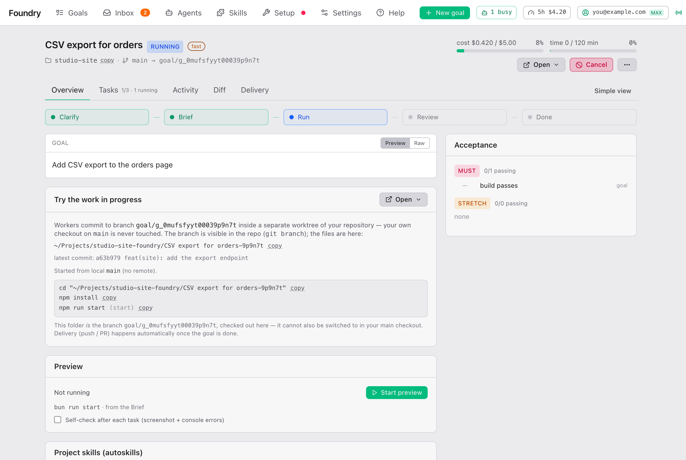
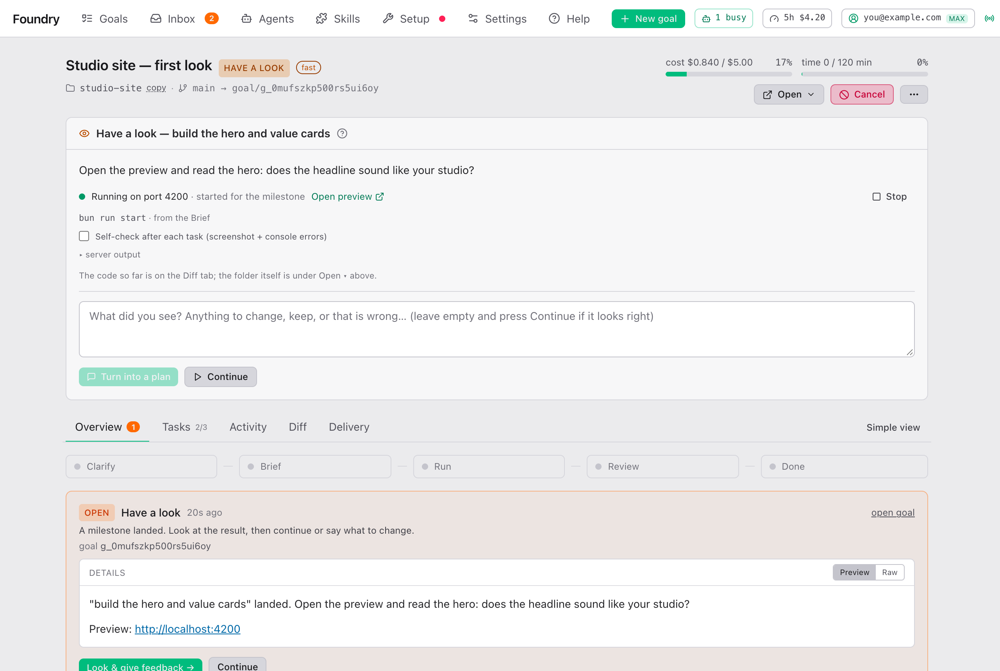

# 运行期间

> [English](./while-it-runs.md) · 中文

Brief 批准后，Foundry 就自己干活。你可以关掉浏览器，工作会在你的电脑上继续。本页讲解 goal 页面，方便你想看的时候跟上进度。



## goal 页面一览

从 **Goals**（顶栏上的列表）打开一个 goal。页面顶部有：

- 标题、状态标记（比如 **running**、**have a look**、**reviewing**、**done**）；goal 以 fast 模式运行时还有一个 **fast** 标签。
- 项目文件夹（**copy** 复制它的路径）和分支：goal 起步的分支 → goal 自己的分支。
- 两个计量条：**cost** 是已花的费用对比预算，**time** 是已用的分钟数对比时间上限。
- **Open ▾**：在你的电脑上打开项目或进度文件夹（见 [进度文件夹](#进度文件夹)）。
- 一个随状态变化的主按钮：Brief 等你时是 **Review brief →**，运行时是 **Cancel**，完成后是 **Deliver…**、**Delivering…** 或 **Delivery**。
- **⋯**（More actions）：**Restart…**、**Re-run Clarify**、**Cancel goal**、**Delete goal…**，视情况出现。

再往下，卡片只在需要时出现：goal 等你查看时的里程碑卡片，Foundry 提问时的访谈，以及最终审查运行时带实时日志的 **Goal review…**。

如果你的 Claude 套餐用量到了上限，会出现黄色横幅 **Usage limit reached — paused until …**。一切会自己恢复。见 [费用与用量](./costs-and-usage.zh.md)。

## Simple view：进度

在 Simple view 里，goal 页面显示：

- 一句话说明正在发生什么，比如 "Working." 或 "Paused — something needs you (see below)."
- **Needs you**：所有等你处理的事，并附有用来回应的按钮。
- **Progress**：一个进度条，显示完成了 **N/M pieces**，以及此刻进行中的任务：**in progress**、**checking** 或 **combining with the rest**。
- **Cost**：目前花了多少、上限是多少，以及已经运行了多久。
- **Result**（goal 完成时）：工作在哪里、**Open ▾** 和 **Deliver…**。

右上角的 **Expert view** 显示其余所有内容。标签栏上的 **Simple view** 切换回来。

## Expert view 的标签页

| 标签 | 显示什么 |
|---|---|
| **Overview** | goal 进行到哪了、什么需要你、进度文件夹、预览、验收检查。标签上有数字表示有事等你。 |
| **Tasks** | 任务图和每个任务的状态。显示 **done/total · N running**。 |
| **Activity** | 发生过的所有事，最新的在前。 |
| **Diff** | 相对 goal 起点的全部改动。 |
| **Delivery** | 结果会怎样处理，以及进度。见 [拿到结果](./getting-the-result.zh.md#the-delivery-tab)。 |

## Overview

从上到下：

- **时间线**：**Clarify → Brief → Run → Review → Done**（或 **Over-delivered**）；goal 要推送或开 pull request 时还有 **Deliver · mode**。当前阶段会闪动。点一个阶段，就跳到显示它工作内容的地方。
- **What needs you**：和 Inbox 里一样的卡片，带按钮。
- **goal**：你最初的描述。
- **Try the work in progress**：进度文件夹。见 [下文](#进度文件夹)。
- **Preview**：启动并打开运行中的结果。见 [Preview](#preview)。
- **Model fallback**：只在某个模型不可用、Foundry 换了另一个模型时出现。
- **Project skills (autoskills)**：Foundry 为你项目的技术栈添加的 skill。它们不会进入你的提交。
- **Completion**：你在 Brief 上选的文档和知识图谱刷新，以及它们的状态。
- **Attachments**：随时可以再加；新的会话会收到。
- **Brief**：你批准的内容摘要，按 **open** 看全文。
- **Goal review**：最终审查员的结论和意见（运行过之后才有）。
- **Acceptance**（右侧）：每个 **must** 和 **stretch** 检查及其最新结果，比如 **3/4 passing**。点一个检查可以看它的输出。

## Tasks

**Tasks** 标签把计划画成一张图。每张卡片是一个任务，显示状态、已用的尝试次数和允许的次数（比如 2/3），以及最近一次尝试的费用。箭头表示哪个任务在等哪个。在手机上，这张图会变成列表。

### 任务状态

任务从 **pending**（等其它任务）依次到 **ready**、**running**、**observing**（跑检查和审查）、**merging**（并入 goal 的分支）和 **done**。任务也可能是 **blocked**（需要你）、**failed** 或 **skipped**。

每个状态和消息是什么意思，以及哪些不需要你做什么，见 [Foundry 什么时候需要你](./when-foundry-needs-you.zh.md#任务状态)。

### 任务内部

点一个任务，会全屏打开（Escape 或 × 关闭）。你会看到：

- 标题、状态、标签，完成后还有它的提交。
- **Task total**：到目前为止的尝试次数、费用（分成 worker 和 reviewer）、轮数和分钟数。
- **spec**、它的 **Checks** 及最新结果，以及 **Relevant files**。
- **This task is waiting for you**（任务 blocked 时出现），并附有用来回应的按钮。
- 每次尝试一个标签：**#1**、**#2** …… 带结果和费用。**↻1** 表示会话被续接了一次，而不是从头开始，这样更便宜。
- 选中的那次尝试：结果、worker 模型、轮数、费用、开始时间、时长、用了哪些 skill，然后是为它运行过的每个会话。
- 按钮：**Restart from here**（这个任务和之后的所有任务重新运行）、**Open worktree**（任务运行时它自己的文件夹），以及合并冲突需要你时的 **Resolve manually**。

### 实时日志

在任务里，**Live log** 显示 worker 此刻在做什么：它说的话、用的工具（⚙）、工具的结果，以及每个会话一行。**Observation** 显示交给下一次尝试的摘要。**Prompt** 显示 worker 收到的原话。

你会看到的那些行（`●`、`■ error_max_turns`、`⏱ sub-agent still working` ……）是什么意思，见 [Foundry 什么时候需要你](./when-foundry-needs-you.zh.md#任务的实时日志)。大多数都不需要你做什么。

## 进度文件夹

Foundry 从不在你自己的项目文件夹里工作。它在旁边一个单独的文件夹里工作：

```
Projects/
  my-app/                 ← your folder, never touched
  my-app-foundry/
    Add dark mode-a1b2c3/ ← the progress folder of one goal
```

进度文件夹以 goal 的标题（到第一个标点为止，最多 40 个字符）加上 goal id 的最后 6 个字符命名。里面是你的整个项目加上 goal 目前的工作：也就是 goal 的分支，已经检出。随时都可以打开、运行、阅读。并行运行的任务在各自隐藏的文件夹里工作，检查通过后再合并到这里。你可以在 [Settings → Engine (install)](./settings.zh.md#engine-install) 里改变进度文件夹的创建位置。

Overview 标签上的 **Try the work in progress** 卡片显示文件夹路径（带 **copy**）、最新提交，以及现成可复制的命令：在那里打开终端并启动项目。

注意：因为这个文件夹*就是* goal 的分支，你没法在自己的文件夹里也切换到这个分支。要把结果放进你的文件夹，见 [拿到结果](./getting-the-result.zh.md#把结果放进你自己的文件夹)。

### The Open menu

**Open ▾**（在 goal 页面和 Try the work in progress 卡片上）列出两个地方：**Repository**（你自己的文件夹）和 **Goal workspace**（进度文件夹）。每个地方都提供它在你电脑上找到的编辑器、文件管理器和终端，比如 VS Code、Cursor、Finder、Terminal。点一个，就用它打开那个地方。**path** 复制路径。

## Preview

**Preview** 卡片启动结果，让你在浏览器里试用。

- **Start preview** 在进度文件夹里运行项目的启动命令。卡片会显示是哪条命令，以及它来自 Brief 的 **How to run it** 还是 `package.json`。
- 出现 **Running on port N** 后，按 **Open preview** 打开。**Stop** 停止它。
- **▸ server output** 显示服务器打印的内容。

如果卡片显示 **Nothing to run yet**，说明还没有启动命令。等某个任务加上一条就会出现，或者你可以在 Brief 的 **How to run it** 下设一条。

Foundry 也会在里程碑时自己启动预览；预览在运行时，每个任务并入后都会重启它；一段时间没人打开（默认 60 分钟）或 goal 结束时，它会停止预览。

### Self-check

**Self-check after each task (screenshot + console errors)** 是 Preview 卡片上的一个开关。打开后，每个任务并入后 Foundry 都会在隐藏的浏览器里打开预览，截图并检查错误。有错误就会让一个 must 检查失败，所以错误会被修掉。整个过程不用 AI，所以不花钱。

它只对结果在浏览器里运行的 goal 有用，而且需要下载一次（在 [Settings → Preview & self-check](./settings.zh.md#preview--self-check) 里按 **Install Chromium**）。默认关闭。

## Milestones

里程碑任务并入后，goal 会暂停。它的状态标记显示 **have a look**，Inbox 显示 **Have a look**，goal 页面顶部出现一张卡片：**Have a look — task name**。



卡片显示：

- 要看什么，按 Brief 里写的。
- 预览，已经在启动，带 **Open preview**。
- **What the self-check saw**：自检开着时的最新截图。
- **Artifacts**：媒体类 goal 目前产出的图片和文件。
- 目前的代码在 **Diff** 标签上；文件夹在 **Open ▾** 里。

然后要么按 **Continue**，要么写下你看到的，按 **Turn into a plan**。具体怎么运作，一步步写在 [Foundry 什么时候需要你](./when-foundry-needs-you.zh.md#里程碑可以看了)。

## Activity

goal 发生过的所有事，最新的在前，每件一行：阶段、任务开始和结束、检查、决定、交付步骤。**important only** 隐藏常规的行；**show bookkeeping events** 显示更多。

## Diff

goal 相对起点改过的每个文件，标出新增的行（绿色，+）和删除的行（红色，−）。点一个文件展开或收起；**expand all** 全部展开。这正是会进入 pull request 的内容。

## 取消、重启、删除

| 你想 | 这样做 |
|---|---|
| 立刻停止 goal | 顶部的 **Cancel**。运行中的会话会停止。已完成的工作留在 goal 的分支上。 |
| 停止后再运行一次 | **⋯ → Restart…**。选 **All tasks from the beginning** 或某一个任务；那个任务和之后的所有任务会用新的尝试重新运行。之前的任务保留结果，重启的任务在已有工作的基础上继续。goal 处于 blocked、done、over-delivered、failed 或 cancelled 时可用。 |
| 重做一个任务 | 在 **Tasks** 标签打开它，按 **Restart from here**。 |
| 批准前重新规划 | **⋯ → Re-run Clarify**（Brief 页面上也有）。 |
| 删除 goal | **⋯ → Delete goal…**。运行中的会话停止。进度文件夹、任务文件夹和 goal 的分层交付分支会被永久删除；附件移到废纸篓。goal 从列表中消失，它的事件历史会保留。勾选 **Also delete the branch** 会连 goal 的分支一起删除；如果你从没推送过，这些工作就没了。 |

## The Agents page

顶栏上的 **Agents** 实时显示这台电脑上的每个 Claude Code 会话，不管是 Foundry 启动的还是你启动的。

- **Foundry agents**：Foundry 为你的 goal 启动的会话，带所属的 goal。可以用 ■ 按钮停止。
- **Your sessions**：你自己打开的会话（在终端里、在 VS Code 里）。Foundry 只看着，从不碰它们。

每一行显示模型、上下文用了多少、最后活跃时间和所在文件夹。助手 agent 缩进显示在启动它们的会话下面。点一行可以跟看它的对话。标题栏统计过去 24 小时内 **working**、**idle** 和 **finished** 的会话数。有会话在工作时，顶栏上一个小的 **N busy** 标签显示有几个。

如果某个会话长时间 **idle**，而它的 goal 显示正在运行，就值得看一眼；任务的实时日志通常会说明原因。
