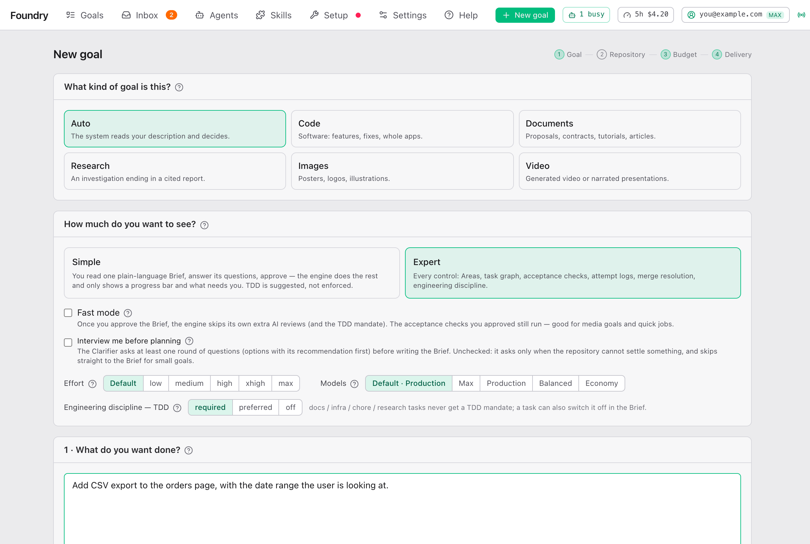

# 你的第一个 goal

> [English](./your-first-goal.md) · 中文

本页从上到下带你过一遍 **New goal** 表单。大多数字段保持原样就行。你必须填的只有两样：想做什么，以及项目文件夹。

## 开始之前

### 检查 Setup 页面

打开顶栏上的 **Setup**。Foundry 会检查它在这台电脑上需要的东西，每一项显示一行绿色或红色：

| 检查项 | 是什么 | 如果是红色 |
|---|---|---|
| **Claude Code CLI** | Foundry 驱动的程序。 | 复制显示的安装命令并运行，或者找帮你安装 Foundry 的人。 |
| **Claude login** | 你的 Claude 账户。 | 按 **Sign in**。 |
| **git** | 保存你文件的每一个版本。 | 复制显示的命令。 |
| **Bun runtime** | Foundry 自己运行所需的环境。 | 复制显示的命令。 |
| **Required: …** | Foundry 的会话需要的技能（skills）。 | 按 **Install**。 |
| **GitHub CLI (optional)** | 只有想让 Foundry 替你开 pull request 时才需要。 | 保持黄色也没关系。 |

需要的东西都齐了，页面会显示 **Everything is in place**，并提供 **Create your first goal →**。**Re-run** 会再检查一次。之后如果缺了什么，会出现红色横幅 **Setup incomplete**，上面有 **Fix in Setup →**。

**Development workflow — Matt Pocock's engineering skills** 这张卡片列出 Foundry 的执行者遵循的技能（比如先写测试）。如果缺了一些，按 **Install N missing**。

### 选一个仓库文件夹

Foundry 在一个*仓库*（repository）里工作：也就是由 git 保存历史的项目文件夹。你不需要懂 git。要紧的是：

- 任何文件夹都行。如果它还不是仓库，Foundry 会提供 **Initialize git here**，替你搞定。
- Foundry 干活时从不改动你文件夹里的文件。它在旁边的一个副本里干活，也就是进度文件夹（见 [运行期间](./while-it-runs.zh.md#进度文件夹)）。
- 如果文件夹里有还没保存进 git 的改动（"uncommitted changes"），没关系。Brief 会问你怎么处理。

## The New goal form

按顶栏上的 **New goal**。右上角的四个编号步骤（**Goal**、**Repository**、**Budget**、**Delivery**）会随着你填表逐个变绿。表单开头是两张选项卡片，后面是编号 **1** 到 **4** 的卡片。

### What kind of goal is this

选这个 goal 要产出什么。拿不准就留在 **Auto**。

| 选项 | 适用于 |
|---|---|
| **Auto** | Foundry 读你的描述后自己决定。 |
| **Code** | 软件：功能、修复、整个应用。 |
| **Documents** | 提案、合同、教程、文章。 |
| **Research** | 一次调查，最后给出一份带来源的报告。 |
| **Images** | 海报、logo、插画。 |
| **Video** | 生成的视频或带旁白的演示。 |

选 **Documents**、**Research**、**Images** 或 **Video** 会把视图切到 **Simple**。选 **Images** 或 **Video** 还会勾上 **Fast mode**，除非你已经自己改过它。

选 **Images** 和 **Video** 时会多出一个字段：**Output folder**。goal 完成后，做好的文件会复制到那里。按 **Choose…** 选一个文件夹。这是可选的；不选的话文件就留在进度文件夹里。图片类 goal 还需要图片 key，见 [费用与用量](./costs-and-usage.zh.md#图片类-goal-需要图片-key)。

### How much do you want to see

| 视图 | 你会看到 |
|---|---|
| **Simple** | 一份大白话写的 Brief。你回答它的问题，然后批准。之后你会看到一个进度条，以及需要你处理的事。 |
| **Expert** | 所有控制项：Area、任务图、验收检查、每次尝试的日志、合并处理。 |

底层做的工作是一样的。任何 goal 之后都能一键切到另一种视图。本指南两种都会讲。

### Fast mode

勾上：你批准 Brief 后，Foundry 会跳过它自己额外的 AI 审查。你批准的验收检查照常运行。适合图片、视频和快活儿，也更省钱。

不勾（代码类的默认）：除了你的检查，Foundry 还会审查每个任务和整体结果，并且可以追加修复任务。

### Interview me before planning

勾上：Foundry 写 Brief 之前，至少会问你一轮问题。

不勾：只有项目本身回答不了某件事时它才会问；小 goal 会直接写 Brief。这个默认值可以在 Settings 里改（见 [设置说明](./settings.zh.md#new-goal-defaults)）。更多内容见 [回答访谈](./answering-the-interview.zh.md)。

### Effort

这个 goal 的每个 Claude 会话思考得有多用力。点其中一个按钮；鼠标停在按钮上会有简短说明。

| 选项 | 什么时候用 |
|---|---|
| **Default** | 大多数时候。使用 Settings 里设的 effort。 |
| **low** | 小而明显的改动。快，也便宜。 |
| **medium**、**high** | 介于两者之间。 |
| **xhigh**、**max** | 牵涉项目很多部分的难活。更慢，也更贵。 |

### Models

这个 goal 用哪个 [模型预设](./settings.zh.md#presets)。**Default** 使用 Settings 为代码、文档或媒体类 goal 选定的预设；后面的名字就是那个预设，例如 **Default · Production**。换 goal 类型时它会跟着变。选 **Max**、**Production**、**Balanced**、**Economy**（或者你自己建的预设），就只对这个 goal 覆盖默认值。便宜的预设只要 Max 的一小部分。

### Engineering discipline (TDD)

只在 Expert 视图里有。TDD 的意思是先写测试，再写让测试通过的代码。

| 选项 | 意思 |
|---|---|
| **required** | 执行者必须遵守；没遵守时审查员会被告知。这是默认。 |
| **preferred** | 只是建议。Simple 视图的 goal 总是用这个。 |
| **off** | 完全不提。 |

文档、环境搭建和调研类任务从来不加 TDD 规则；单个任务也可以在 Brief 里关掉它。勾上 **Fast mode** 时，TDD 是关闭的。

### What do you want done

大文本框 **1 · What do you want done?**。像跟一位资深同事说话那样描述 goal：你想要什么、给谁用、有什么必须发生或绝不能发生。Foundry 会把它变成验收检查和计划交给你批准，所以你不用写得面面俱到。

### Attachments

文本框下面：**Attach screenshots, PDFs, files or links — or drop / paste them here.** 用 **Files** 选文件，或者用 **Link** 加一个网址，然后按 **Add**。你也可以直接把截图粘贴到页面上。

这个 goal 的每个会话都能读到这些附件。它们永远不会被加进你的项目。文档会在后台转成文本，转好后会显示一个小标签。之后你还可以在 goal 页面上继续添加附件。

### Title

可选。不填的话，描述的第一行就是标题。标题也会用来给进度文件夹命名。

### Repository

**2 · Repository.** 按 **Select folder…** 选项目文件夹，或者直接输入路径。

然后 Foundry 会显示它发现的情况：分支、有没有 uncommitted changes、最后保存的版本、线上副本（remote，如果有的话），以及提交会以谁的名义做出。如果线上副本比你的文件夹有更新的工作，卡片会说明 goal 从哪里开始（通常是更新的那份），而 **pull into my checkout** 会把你自己的文件夹也更新到最新。

如果文件夹还不是仓库，按 **Initialize git here**。如果你选的是某个仓库里面的子文件夹，Foundry 会改为提供这个仓库的顶层文件夹。

### Budget

**3 · Budget.** goal 运行时不能超过的上限。碰到上限时，goal 会暂停并问你；它从不悄无声息地失败。

| 预设 | 上限 |
|---|---|
| **Auto**（默认） | Foundry 规划期间没有上限。Brief 会估算费用和时间，并提议一个预算；你批准时确认它。 |
| **Quick** | $3 · 30 分钟 · 2 个并行 · 每个任务 2 次尝试。适合小修复或关于代码的提问。 |
| **Thorough** | $25 · 8 小时 · 3 个并行 · 每个任务 4 次尝试。一个带测试和审查的功能。 |
| **Unlimited** | 没有费用和时间上限。每个任务的尝试次数和并行会话数仍然有效。 |
| **Custom** | 自己设 **Max cost (USD est.)**、**Max minutes**、**Parallel sessions** 和 **Attempts per task**。 |

拿不准就保持 **Auto**。更多内容见 [费用与用量](./costs-and-usage.zh.md)。

### Delivery

**4 · Delivery — what may the engine do with the result?** 默认的 **Local only** 把工作留在你的电脑上。其它选项允许 Foundry 在 goal 完成后推送代码或开 pull request。这方面的一切都在 [拿到结果](./getting-the-result.zh.md)。之后你也可以在 goal 页面上改。

### Advanced: skip Clarify

表单下方的一个链接。它把 goal 当作一个任务来跑，用你自己输入的命令检查（比如 `bun test`），没有访谈，也没有 Brief。适合清楚知道用哪些命令能证明工作已完成的人。你可以不管它。

### 表单上没有的：自检

自检（Foundry 在一个隐藏的浏览器里打开运行中的结果并截图）在 [Settings → Preview & self-check](./settings.zh.md#preview--self-check) 里设置，也可以在 goal 页面上为单个 goal 打开。见 [运行期间](./while-it-runs.zh.md#self-check)。

## 按下创建按钮之后

按钮上写的是 **Create & clarify**（如果你跳过了 Clarify，就是 **Create & run**）。如果按钮是灰的，旁边的文字会说明原因：**Describe the goal**、**Select a repository folder** 或 **Repository is not ready (see above)**。

Foundry 会在这个浏览器里记住你对 goal 类型、视图、节奏、TDD、预算和交付方式的选择，下一个 goal 就从这些选择开始。

然后你会进入 goal 的 Brief 页面，Foundry 开始读你的项目：

- 如果它有问题，你会看到 **Round 1 — N questions**。回答它们：[回答访谈](./answering-the-interview.zh.md)。
- 如果没有，你会看到 **Clarifying…**，下面是它正在读什么的实时日志。通常要几分钟。Brief 准备好后页面会自己更新。

然后阅读并批准 Brief：[批准 Brief](./approving-the-brief.zh.md)。你批准之前，什么都不会开始做。
